# ORD Primer: A Practical Guide to Open Resource Discovery

> This primer offers an alternative introduction to ORD, focusing on practical concepts and visual explanations. For the official introduction, see [ORD Introduction](./introduction.mdx).

## What is ORD? A Real-World Analogy

Imagine you move to a new city. You need to know:
- What services are available (restaurants, hospitals, gyms)
- Where to find them (addresses)
- How to access them (opening hours, contact info)
- How they relate to each other (which gym is near which hospital)

Now imagine each business had its own unique way of publishing this information - some use websites, others use paper flyers, some use mobile apps. Finding everything would be a nightmare!

**This is exactly the problem ORD solves for software systems.**

Open Resource Discovery (ORD) is a standard protocol that allows applications and services to describe themselves in a consistent, machine-readable way. Just like a city directory helps you discover local services, ORD helps you discover APIs, Events, and other resources exposed by software systems.

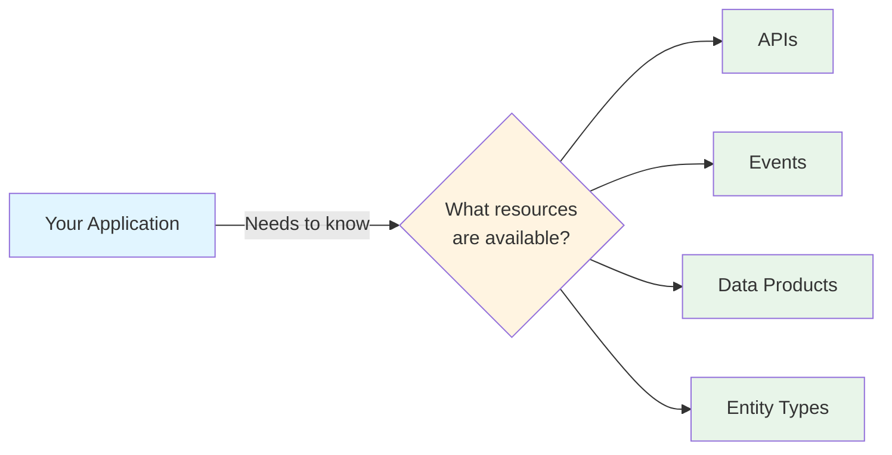

## The Core Problem ORD Solves

### Before ORD: The Integration Chaos

Without a unified standard, every system describes its resources differently, leading to:

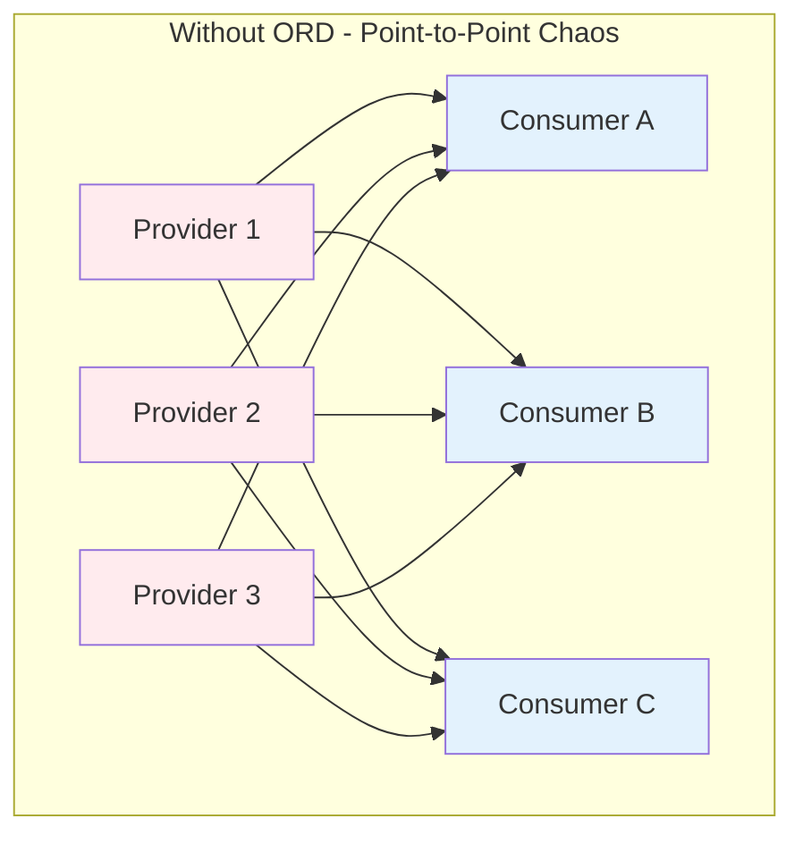

**Problems:**
- Each integration uses a different format and protocol
- Consumers must learn multiple discovery mechanisms
- Providers must maintain multiple integration points
- Changes require updating many integrations
- No holistic view of the system landscape

### After ORD: Unified Discovery

With ORD, systems describe themselves in a standard way, and aggregators bring it all together:

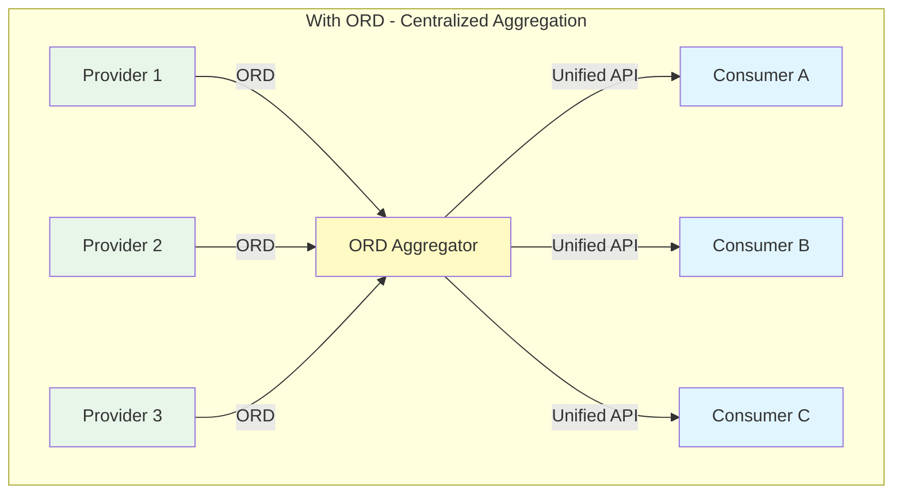

**Benefits:**
- One standard format for all systems
- Single entry point for discovery
- Providers implement ORD once, serve many consumers
- Consumers query one aggregator, not many providers
- Complete system landscape visibility

## The Three Key Players

ORD defines three roles that systems can play:

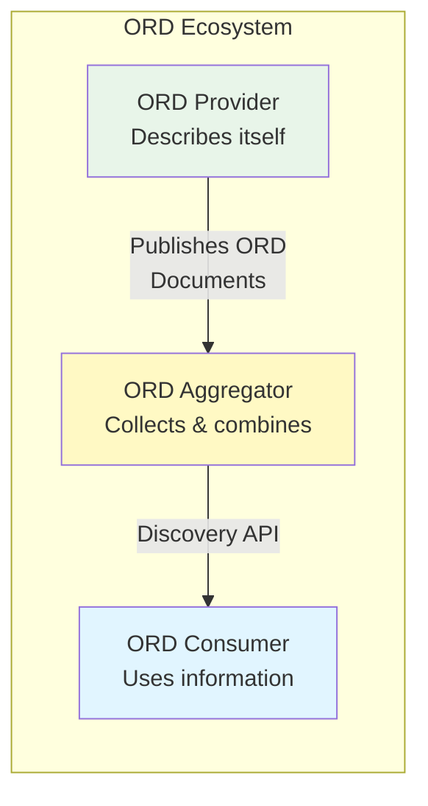

### 1. ORD Provider: The Self-Describing System

An ORD Provider is any system that describes its own resources using ORD.

**Key Responsibilities:**
- Implement a standard REST API with ORD documents
- Describe available APIs, Events, and other resources
- Keep information up-to-date
- Provide a single entry point (well-known endpoint)

**Example:** Your e-commerce application describes its Product API, Order Events, and Customer Data Products.

### 2. ORD Aggregator: The Information Hub

An ORD Aggregator collects ORD information from multiple providers and makes it available through a better API.

**Key Responsibilities:**
- Crawl ORD providers periodically
- Validate and merge information
- Resolve references between resources
- Provide high-quality discovery API to consumers
- Handle authentication and access control

**Example:** SAP Business Accelerator Hub aggregates static documentation from all SAP products.

### 3. ORD Consumer: The Information User

An ORD Consumer retrieves and uses ORD information for various purposes.

**Key Responsibilities:**
- Query ORD aggregators (or providers directly)
- Process ORD information for specific use cases
- Respect access control and visibility settings

**Example:** A development tool that auto-generates API clients based on discovered APIs.

## How ORD Works: The Discovery Flow

Let's walk through how a consumer discovers resources from a provider:

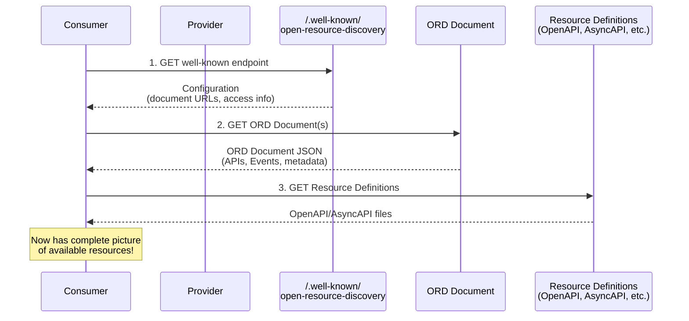

### Step 1: Discovery Entry Point

Every ORD provider exposes a well-known endpoint:

```
GET https://example.com/.well-known/open-resource-discovery
```

Response:
```json
{
  "openResourceDiscoveryVersion": "1.12",
  "documents": [
    {
      "url": "/ord/documents/main.json",
      "accessStrategies": [{"type": "open"}]
    }
  ]
}
```

### Step 2: Fetch ORD Documents

The configuration tells you where to find the actual ORD documents:

```
GET https://example.com/ord/documents/main.json
```

This returns comprehensive metadata about resources, packages, products, and more.

### Step 3: Get Resource Definitions

The ORD document references detailed specifications:

```json
{
  "apiResources": [{
    "ordId": "sap.foo:apiResource:products:v1",
    "title": "Products API",
    "resourceDefinitions": [{
      "type": "openapi-v3",
      "url": "/openapi/products-v1.json"
    }]
  }]
}
```

Now fetch the OpenAPI definition for the full API contract.

## What Can ORD Describe?

ORD supports describing various types of resources:

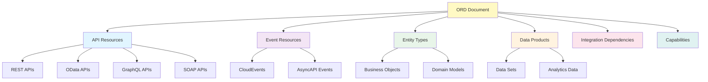

### API Resources

Describe any type of API your system exposes:

- **REST APIs** - Plain HTTP/REST APIs
- **OData** - SAP's OData protocol APIs
- **GraphQL** - GraphQL endpoints
- **SOAP** - Legacy SOAP web services

**What ORD provides:**
- API protocol and version
- Entry points (URLs)
- Resource definitions (OpenAPI, WSDL, etc.)
- Release status (beta, active, deprecated)
- Visibility (public, internal, private)
- Related entity types
- Access strategies

### Event Resources

Describe asynchronous events your system produces:

- **CloudEvents** - CNCF CloudEvents format
- **AsyncAPI** - AsyncAPI specification
- **Custom protocols** - SAP Event Mesh, Kafka, etc.

**What ORD provides:**
- Event protocol and version
- Event definitions (AsyncAPI)
- Release status and visibility
- Related entity types
- Change types (created, updated, deleted)

### Entity Types

Describe business objects and domain models:

- Customer, Product, Order, Invoice
- Conceptual models and terms
- Internal application models

**What ORD provides:**
- Entity structure and semantics
- Relationships between entities
- Which APIs/Events expose this entity
- Versioning of entity models

### Data Products (BETA)

Describe data sets exposed for consumption:

- Analytics data
- Reporting data sets
- Data exports

**What ORD provides:**
- Data product type and category
- Output ports (how to access data)
- Responsible party
- Entity types included

### Integration Dependencies

Describe external resources your system uses:

- Required external APIs
- Event subscriptions
- Mandatory integrations

**What ORD provides:**
- What external resources you depend on
- Aspects of dependency (APIs, Events)
- Whether dependency is optional or mandatory

### Capabilities

Describe anything not covered by standard concepts:

- Custom functionality
- Platform-specific features
- Extensibility points

## Organizing Resources: Grouping & Bundling

ORD provides several ways to organize and group resources:

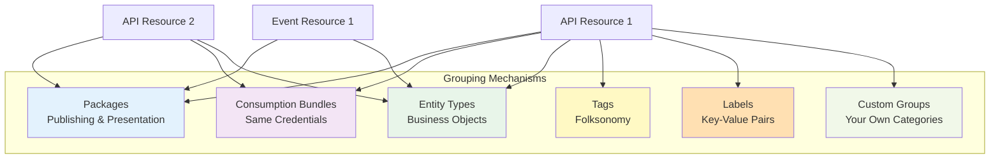

### Packages (Mandatory)

Every resource MUST belong to exactly one package.

**Purpose:** Publishing and catalog presentation

**Use cases:**
- Group resources published together
- Define vendor and licensing
- Set documentation and support info
- Inherit common properties

### Consumption Bundles

Group APIs/Events accessible with the same credentials.

**Purpose:** Technical access grouping

**Use cases:**
- All APIs using the same OAuth client
- Resources sharing authentication
- Credential management guidance

### Entity Types

Group resources by the business object they operate on.

**Purpose:** Semantic grouping

**Use cases:**
- Find all APIs that work with "Customer" entity
- Discover events related to "Order" entity
- Navigate related resources by business concept

## Perspectives: Static vs. Dynamic

One of ORD's powerful features is supporting two perspectives:

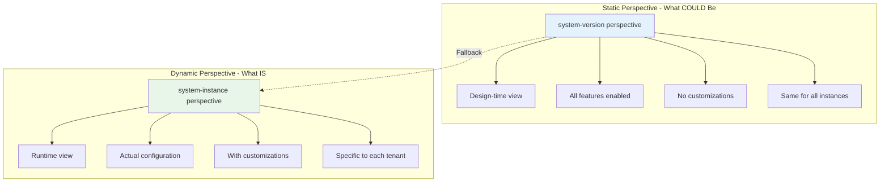

### Static Perspective (system-version)

Describes how a system **generically looks** at design-time.

**Characteristics:**
- Same for all system instances of the same version
- Describes all pre-delivered capabilities
- Known at design-time or deploy-time
- No tenant-specific information
- Used for "what could I use if I buy this product?"

**Example:** SAP Business Accelerator Hub shows static documentation

### Dynamic Perspective (system-instance)

Describes how a specific system instance **actually looks** at runtime.

**Characteristics:**
- Different per system instance (tenant)
- Reflects actual configuration
- Includes customizations and extensions
- Shows activated/deactivated features
- Used for "what can I use in my specific tenant?"

**Example:** Unified Customer Landscape shows actual tenant state

### Perspective Fallback

Aggregators implement smart fallback logic:

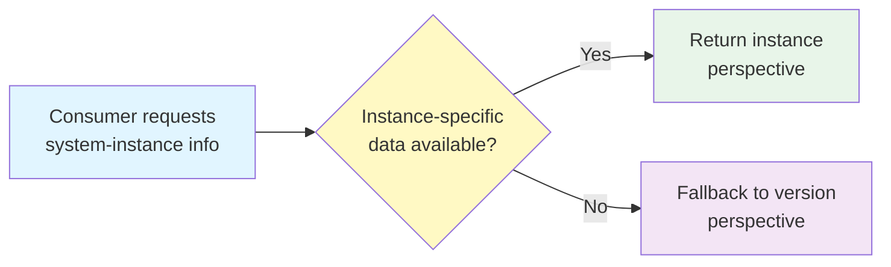

If a provider only publishes static metadata, the aggregator will still serve it when consumers ask about a specific instance.

## ORD IDs: Globally Unique Identifiers

ORD uses structured, globally unique IDs for all resources:

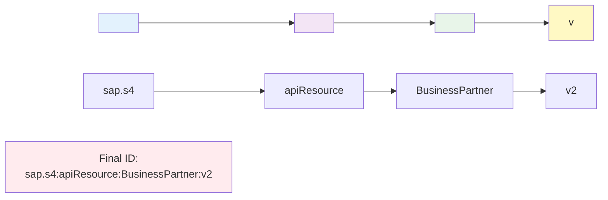

### ORD ID Structure

```
<namespace>:<conceptName>:<resourceName>:v<majorVersion>
```

**Example:**
```
sap.s4:apiResource:BusinessPartner:v2
```

### Components

1. **Namespace** - Globally unique identifier
   - `sap.s4` = SAP S/4HANA system
   - `customer.myapp` = Customer extension
   - Hierarchical with dots

2. **Concept Name** - Type of resource
   - `apiResource` - An API
   - `eventResource` - An Event
   - `package` - A Package
   - `entityType` - An Entity Type

3. **Resource Name** - Specific resource identifier
   - Human-readable
   - SEO-friendly
   - Stable across versions

4. **Major Version** - Breaking change indicator
   - `v1`, `v2`, `v3`, etc.
   - Increments on breaking changes
   - Aligns with semantic versioning

### Namespace Hierarchy

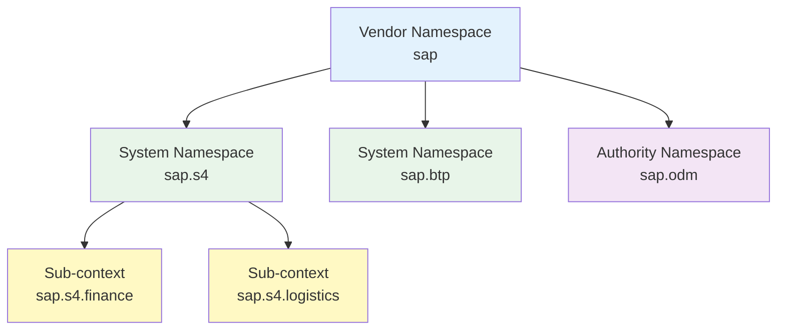

## Version and Lifecycle Management

ORD provides comprehensive lifecycle management:

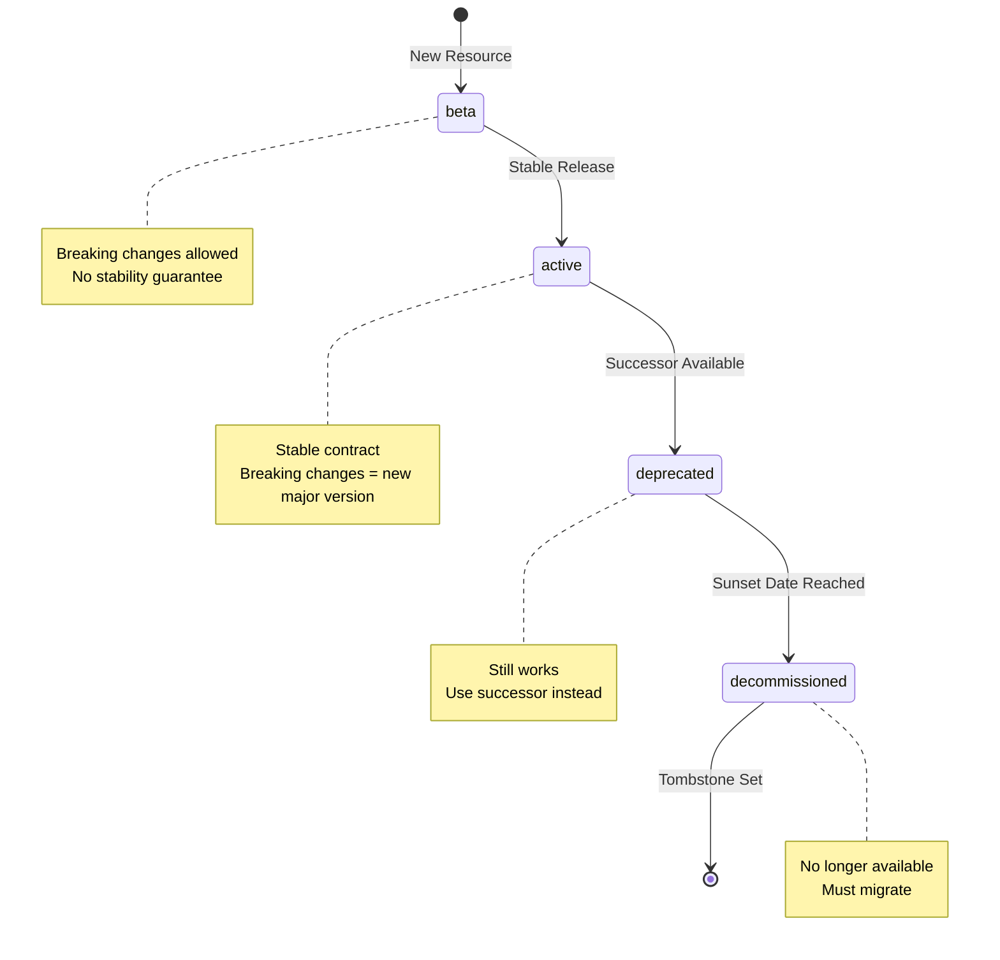

### Release Statuses

- **beta** - Under development, may change
- **active** - Stable and production-ready
- **deprecated** - Still works, but use successor
- **decommissioned** - No longer available

### Version Properties

**version** - Full semantic version (e.g., "2.3.1")
- Major: Breaking changes → new ORD ID
- Minor: New features, backward compatible
- Patch: Bug fixes

**lastUpdate** - Timestamp of last change

**sunsetDate** - When resource will be decommissioned

**successors** - IDs of replacement resources

### Managing Breaking Changes

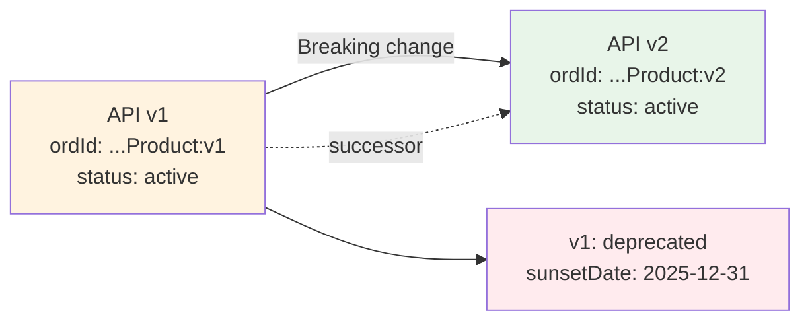

When introducing breaking changes:
1. Create new resource with incremented major version
2. Update ORD ID: `v1` → `v2`
3. Mark old version as `deprecated`
4. Set `successor` on old version
5. Optionally set `sunsetDate`
6. Eventually set `Tombstone` when removed

## Real-World Examples

### Example 1: Astronomy Reference App

A simple app exposing constellation data:

```mermaid
graph TB
    APP[Astronomy App]

    APP --> WK[/.well-known/<br/>open-resource-discovery]
    APP --> DOC[/ord/documents/1]
    APP --> API1[/astronomy/v1<br/>REST API]
    APP --> OAS[/openapi/astronomy-v1.json]

    DOC --> PKG[Package:<br/>Astronomy Service]
    DOC --> API_META[API Resource:<br/>Astronomy API v1]
    DOC --> EVENT[Event Resource:<br/>Constellation Updated]

    API_META --> API1
    API_META --> OAS

    style APP fill:#e1f5ff
    style WK fill:#e8f5e9
    style DOC fill:#fff9c4
    style PKG fill:#f3e5f5
```

**What it describes:**
- Astronomy REST API (v1)
- OpenAPI 3 definition
- Constellation entity type
- Public visibility
- No authentication required

**ORD Document snippet:**
```json
{
  "apiResources": [{
    "ordId": "sap.foo:apiResource:astronomy:v1",
    "title": "Astronomy API",
    "version": "1.0.3",
    "apiProtocol": "rest",
    "resourceDefinitions": [{
      "type": "openapi-v3",
      "url": "/openapi/astronomy-v1.json"
    }],
    "entryPoints": ["/astronomy/v1"]
  }]
}
```

### Example 2: E-Commerce Platform

A complex system with multiple resources:

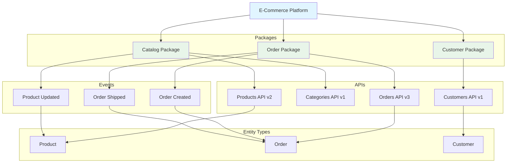

**What it describes:**
- 3 packages organizing related resources
- 4 APIs at different versions
- 3 event types
- 3 core entity types
- Relationships between them all

### Example 3: SAP Business Accelerator Hub

A real-world static aggregator:

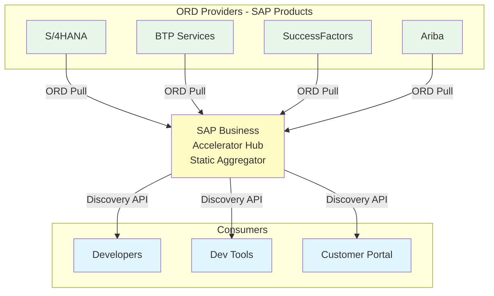

**What it provides:**
- Unified catalog of all SAP APIs
- Static documentation (system-version perspective)
- Search and navigation
- API definitions and examples
- Pre-provisioning documentation

### Example 4: Unified Customer Landscape

A dynamic aggregator showing actual tenant state:

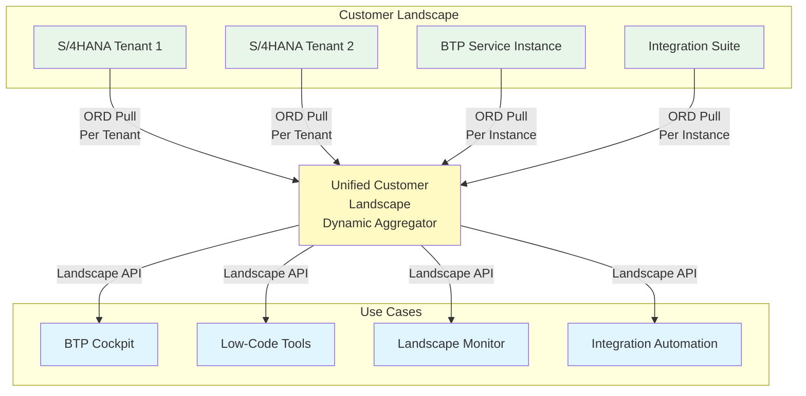

**What it provides:**
- Actual tenant configurations
- Customizations and extensions
- Real system landscape view
- Formation management
- Integration lifecycle management

## Getting Started as an ORD Provider

Want to make your system discoverable via ORD? Here's the path:

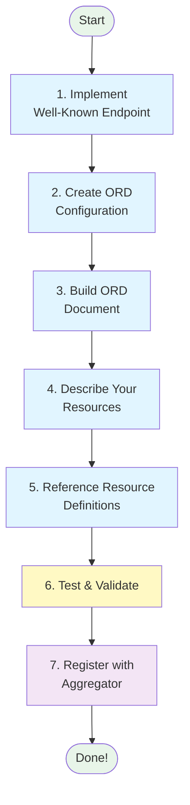

### Step 1: Implement Well-Known Endpoint

Create the entry point at `/.well-known/open-resource-discovery`:

```http
GET /.well-known/open-resource-discovery HTTP/1.1
Host: your-app.example.com
```

Response:
```json
{
  "openResourceDiscoveryVersion": "1.12",
  "documents": [{
    "url": "/ord/documents/main.json",
    "accessStrategies": [
      {"type": "open"}
    ]
  }]
}
```

### Step 2: Create ORD Configuration

The configuration tells consumers:
- Which ORD version you support
- Where to find ORD documents
- How to access them (authentication)

### Step 3: Build ORD Document

Create a JSON document describing your system:

```json
{
  "$schema": "https://open-resource-discovery.github.io/specification/spec-v1/interfaces/Document.schema.json",
  "openResourceDiscovery": "1.12",
  "describedSystemType": {
    "systemNamespace": "your.app"
  },
  "products": [...],
  "packages": [...],
  "apiResources": [...],
  "eventResources": [...]
}
```

### Step 4: Describe Your Resources

For each API, Event, or other resource:

```json
{
  "apiResources": [{
    "ordId": "your.app:apiResource:products:v1",
    "title": "Products API",
    "shortDescription": "Manage product catalog",
    "version": "1.2.0",
    "apiProtocol": "rest",
    "partOfPackage": "your.app:package:main:v1",
    "resourceDefinitions": [{
      "type": "openapi-v3",
      "url": "/openapi/products.json"
    }],
    "entryPoints": ["/api/products"]
  }]
}
```

### Step 5: Reference Resource Definitions

Link to detailed specifications (OpenAPI, AsyncAPI, etc.):

- Host the definition files
- Reference them in ORD document
- Ensure they're accessible with the same auth

### Step 6: Test & Validate

- Use ORD schema validation
- Test the well-known endpoint
- Verify JSON syntax
- Check all links are accessible
- Use API Metadata Validator (if available)

### Step 7: Register with Aggregator

- Contact your ORD aggregator
- Provide your base URL
- Configure authentication
- Verify crawling works
- Monitor aggregation status

## Common Use Cases

ORD enables various use cases across the development lifecycle:

```mermaid
graph TB
    ORD[ORD Information]

    ORD --> CAT[API Catalogs]
    ORD --> DEV[Developer Tools]
    ORD --> MONITOR[Landscape Monitoring]
    ORD --> AUTO[Integration Automation]
    ORD --> AI[AI & Analytics]
    ORD --> GOV[Governance & Compliance]

    CAT --> CAT1[Documentation Sites]
    CAT --> CAT2[Internal Dev Portal]

    DEV --> DEV1[API Client Generation]
    DEV --> DEV2[IDE Integration]
    DEV --> DEV3[Testing Tools]

    MONITOR --> MON1[System Inventory]
    MONITOR --> MON2[Capability Overview]
    MONITOR --> MON3[Health Monitoring]

    AUTO --> AUTO1[Credential Management]
    AUTO --> AUTO2[Trust Setup]
    AUTO --> AUTO3[Formation Management]

    AI --> AI1[Semantic Search]
    AI --> AI2[AI Training Data]
    AI --> AI3[Analytics Dashboards]

    GOV --> GOV1[Policy Enforcement]
    GOV --> GOV2[Compliance Checks]
    GOV --> GOV3[Audit Trails]

    style ORD fill:#fff9c4
    style CAT fill:#e3f2fd
    style DEV fill:#e8f5e9
    style MONITOR fill:#f3e5f5
    style AUTO fill:#fff3e0
    style AI fill:#fce4ec
    style GOV fill:#f1f8e9
```

### 1. API & Event Catalogs

**Problem:** Developers can't find available APIs

**Solution:** ORD-powered catalog with search and navigation

**Examples:**
- SAP Business Accelerator Hub
- Internal developer portals
- Partner ecosystem catalogs

### 2. Developer Tools

**Problem:** Manual API client creation is tedious

**Solution:** Auto-generate clients from ORD metadata

**Examples:**
- IDE plugins that discover APIs
- CLI tools that generate code
- Testing frameworks that auto-configure

### 3. Landscape Monitoring

**Problem:** No visibility into actual system landscape

**Solution:** Real-time inventory of all systems and capabilities

**Examples:**
- BTP Cockpit System Landscape view
- Inventory dashboards
- Capability matrices

### 4. Integration Automation

**Problem:** Manual integration setup is error-prone

**Solution:** Automated trust, credential, and connectivity setup

**Examples:**
- Formation-based integration
- Automatic credential rotation
- Service binding automation

### 5. AI & Analytics

**Problem:** AI needs consistent metadata to function

**Solution:** Standardized metadata for training and grounding

**Examples:**
- Semantic search across APIs
- AI-powered discovery
- Business analytics on API usage

### 6. Governance & Compliance

**Problem:** Hard to enforce policies across many systems

**Solution:** Automated policy validation and compliance checking

**Examples:**
- Security policy enforcement
- API versioning compliance
- Documentation completeness checks

## Advanced Concepts

### Transport Modes

How ORD information travels from providers to consumers:

```mermaid
graph TB
    subgraph "Pull Transport - Currently Standardized"
        PULL_PROV[Provider<br/>Hosts REST API]
        PULL_AGG[Aggregator<br/>Periodically Pulls]

        PULL_PROV -->|HTTP GET| PULL_AGG
    end

    subgraph "Push Transport - Future"
        PUSH_PROV[Provider<br/>Pushes Updates]
        PUSH_AGG[Aggregator<br/>Receives Updates]

        PUSH_PROV -->|HTTP POST/Webhook| PUSH_AGG
    end

    subgraph "Event Transport - Future"
        EVENT_PROV[Provider<br/>Publishes Events]
        EVENT_BUS[Event Bus]
        EVENT_AGG[Aggregator<br/>Subscribes to Events]

        EVENT_PROV -->|Publish| EVENT_BUS
        EVENT_BUS -->|Subscribe| EVENT_AGG
    end

    style PULL_PROV fill:#e8f5e9
    style PUSH_PROV fill:#fff3e0
    style EVENT_PROV fill:#fff3e0
    style PULL_AGG fill:#e1f5ff
    style PUSH_AGG fill:#e1f5ff
    style EVENT_AGG fill:#e1f5ff
```

**Pull Transport** (Current Standard)
- Aggregator crawls providers periodically
- Simple REST API
- Provider doesn't need to know aggregators
- Uses caching and ETags for efficiency

**Push Transport** (Future)
- Provider pushes updates immediately
- Faster propagation
- Requires knowing aggregator endpoints

**Event-Driven** (Future)
- Pub/sub pattern
- Maximum decoupling
- Real-time updates

### Access Strategies

How to authenticate and access ORD information:

```mermaid
graph LR
    RESOURCE[ORD Resource]

    RESOURCE --> OPEN[Open<br/>No Auth]
    RESOURCE --> OAUTH[OAuth 2.0]
    RESOURCE --> SAML[SAML]
    RESOURCE --> CUSTOM[Custom Strategy]

    style RESOURCE fill:#fff9c4
    style OPEN fill:#e8f5e9
    style OAUTH fill:#e1f5ff
    style SAML fill:#e1f5ff
    style CUSTOM fill:#f3e5f5
```

Access strategies describe how to obtain access:

- **open** - Public, no authentication
- **sap:cmp-mtls:v1** - Mutual TLS
- **sap.businesshub:basic-auth:v1** - Basic auth
- **sap:saml-assertion:v1** - SAML bearer
- Custom strategies with specification IDs

### Content Enrichment

Aggregators add value by enriching ORD information:

```mermaid
graph TB
    PROV[Provider ORD]
    AGG[Aggregator Processing]
    ENRICHED[Enriched ORD]

    PROV --> AGG

    AGG --> E1[Apply Inheritance<br/>Package → Resources]
    AGG --> E2[Resolve References<br/>Between Resources]
    AGG --> E3[Convert Relative URLs<br/>to Absolute]
    AGG --> E4[Add System Instance<br/>Context]
    AGG --> E5[Validate & Check<br/>Consistency]
    AGG --> E6[Keep Version<br/>History]

    E1 & E2 & E3 & E4 & E5 & E6 --> ENRICHED

    style PROV fill:#e8f5e9
    style AGG fill:#fff9c4
    style ENRICHED fill:#e1f5ff
```

Aggregators:
- Apply package-level property inheritance
- Resolve dangling references
- Convert relative to absolute URLs
- Add system instance metadata
- Validate for consistency
- Maintain version history

### Extensibility

ORD is extensible at multiple levels:

```mermaid
graph TB
    BASE[Standard ORD]

    BASE --> EXT1[Custom Properties<br/>extension object]
    BASE --> EXT2[Custom Types<br/>custom + customType]
    BASE --> EXT3[Labels<br/>key-value pairs]
    BASE --> EXT4[Policy Levels<br/>additional constraints]
    BASE --> EXT5[Capabilities<br/>arbitrary features]

    style BASE fill:#e3f2fd
    style EXT1 fill:#e8f5e9
    style EXT2 fill:#e8f5e9
    style EXT3 fill:#e8f5e9
    style EXT4 fill:#e8f5e9
    style EXT5 fill:#e8f5e9
```

**Extension Points:**

1. **Custom Properties** - Add vendor-specific fields
2. **Custom Types** - Define your own resource types
3. **Labels** - Arbitrary key-value metadata
4. **Policy Levels** - Additional validation rules
5. **Capabilities** - Describe unique features

## Best Practices

### For ORD Providers

✅ **DO:**
- Keep ORD documents under 2MB (split if needed)
- Update `lastUpdate` timestamp on changes
- Use semantic versioning correctly
- Provide comprehensive descriptions
- Test well-known endpoint accessibility
- Implement proper caching headers
- Use meaningful ORD IDs (avoid UUIDs)
- Document breaking changes clearly

❌ **DON'T:**
- Duplicate information across documents
- Change ORD IDs after publishing
- Skip validation before publishing
- Leak sensitive info in public ORD data
- Forget to set tombstones when removing resources
- Use sub-namespaces just for grouping

### For ORD Consumers

✅ **DO:**
- Always fetch from aggregators when possible
- Respect cache headers and ETags
- Handle both perspectives (static/dynamic)
- Implement fallback logic
- Validate received ORD data
- Respect visibility settings

❌ **DON'T:**
- Assume ORD document URLs are fixed
- Bypass aggregators unnecessarily
- Ignore `systemInstanceAware` flag
- Hard-code ORD IDs in your application
- Poll providers too frequently

### For ORD Aggregators

✅ **DO:**
- Implement all merging rules correctly
- Apply inheritance and enrichment
- Validate all incoming ORD data
- Provide good error messages
- Implement perspective fallback
- Host referenced resource definitions
- Support efficient caching
- Monitor provider health

❌ **DON'T:**
- Expose private data to unauthorized consumers
- Skip validation steps
- Ignore duplicate resource warnings
- Forget to update lastUpdate when providers don't

## Comparison with Other Standards

Understanding how ORD relates to other standards:

### ORD vs. OpenAPI

```mermaid
graph LR
    subgraph "OpenAPI Scope"
        OA1[API Contract]
        OA2[Endpoints]
        OA3[Request/Response]
        OA4[Data Models]
    end

    subgraph "ORD Scope"
        ORD1[Discovery]
        ORD2[High-level Context]
        ORD3[Relationships]
        ORD4[Taxonomy]
        ORD5[Multiple APIs]
        ORD6[Events & More]
    end

    ORD1 -.->|References| OA1

    style OA1 fill:#e3f2fd
    style OA2 fill:#e3f2fd
    style OA3 fill:#e3f2fd
    style OA4 fill:#e3f2fd
    style ORD1 fill:#e8f5e9
    style ORD2 fill:#e8f5e9
    style ORD3 fill:#e8f5e9
    style ORD4 fill:#e8f5e9
    style ORD5 fill:#e8f5e9
    style ORD6 fill:#e8f5e9
```

**OpenAPI:**
- Describes a single API in detail
- Defines endpoints, parameters, responses
- Not about discovery

**ORD:**
- Discovers APIs and other resources
- Provides high-level context
- References OpenAPI for details
- Describes relationships between resources

**They complement each other!**

### ORD vs. AsyncAPI

Similar relationship as with OpenAPI:

**AsyncAPI:**
- Describes event schemas and channels
- Defines message formats
- Documents event-driven architectures

**ORD:**
- Discovers event resources
- Provides context and taxonomy
- References AsyncAPI for details
- Relates events to APIs and entities

### ORD vs. Service Mesh

**Service Mesh:**
- Runtime traffic management
- Network-level concerns
- Service-to-service communication
- Infrastructure focus

**ORD:**
- Metadata and documentation
- Application-level concerns
- Discovery and understanding
- Developer and consumer focus

**Different layers, different purposes!**

## Frequently Asked Questions

### Why not just use OpenAPI for everything?

OpenAPI describes individual APIs brilliantly, but:
- How do you discover which OpenAPI files exist?
- How do you group related APIs?
- How do you describe events?
- How do you show relationships between resources?
- How do you handle multiple definition formats?

ORD solves discovery and context; OpenAPI solves API definition.

### Is ORD only for SAP?

No! ORD is an open standard governed by Linux Foundation/NeoNephos. While currently used primarily in the SAP ecosystem, it's designed to be generic. To use outside SAP, you need:
- Namespace registry
- ORD aggregator(s)
- Adoption by providers and consumers

### Do I need to describe both static and dynamic perspectives?

It depends:
- **Only static metadata?** → Use `system-version` only
- **Dynamic metadata?** → Provide both if possible
- Aggregators handle fallback automatically

### What if my ORD document exceeds 2MB?

Split it into multiple documents:
- By ownership/team boundaries
- By domain/bounded context
- By lifecycle
- Reference multiple documents from the configuration

### Can I describe APIs I consume (not provide)?

Yes! Use **Integration Dependencies** to describe:
- External APIs you require
- Events you subscribe to
- Mandatory integrations

### How often should aggregators pull ORD data?

Depends on use case:
- Static catalogs: Daily or weekly
- Dynamic landscapes: Hourly or on-demand
- Use caching and ETags to minimize load

### What's the difference between Packages and Consumption Bundles?

- **Packages** = Publishing and presentation grouping
- **Consumption Bundles** = Technical access grouping (same credentials)

One is about "what's published together," the other about "what's accessed together."

### Can I add custom properties to ORD?

Yes, through multiple mechanisms:
- `extensible` object for custom properties
- `labels` for key-value pairs
- Custom types with `customType`
- Policy levels for standardizing custom extensions

### How do I version my ORD documents?

ORD documents themselves aren't versioned. Instead:
- Version the **resources** inside them
- Use `version` property (semantic versioning)
- Increment major version in ORD ID for breaking changes
- Set `lastUpdate` timestamp

### What happens when a resource is deleted?

1. Set `Tombstone` in ORD document
2. Aggregator keeps it for grace period (31 days)
3. After grace period, aggregator removes it
4. Consumers learn resource is gone

## Next Steps

Ready to dive deeper? Here are your next steps:

```mermaid
graph TB
    START[You Are Here:<br/>PrimerV2]

    START --> PATH1{What's your role?}

    PATH1 -->|Provider| PROV[Provider Path]
    PATH1 -->|Consumer| CONS[Consumer Path]
    PATH1 -->|Aggregator| AGG[Aggregator Path]

    PROV --> PROV1[Read Provider FAQ]
    PROV1 --> PROV2[Study Examples]
    PROV2 --> PROV3[Implement ORD API]
    PROV3 --> PROV4[Validate & Test]

    CONS --> CONS1[Read Full Spec]
    CONS1 --> CONS2[Study ORD Discovery API]
    CONS2 --> CONS3[Build Integration]

    AGG --> AGG1[Read Aggregation Rules]
    AGG1 --> AGG2[Study Validation Rules]
    AGG2 --> AGG3[Implement Aggregator]

    style START fill:#fff9c4
    style PATH1 fill:#e1f5ff
    style PROV fill:#e8f5e9
    style CONS fill:#e3f2fd
    style AGG fill:#f3e5f5
```

### Resources

**Documentation:**
- [Official ORD Introduction](./introduction.mdx)
- [Full ORD Specification](./spec-v1/index.md)
- [ORD Document Interface](./spec-v1/interfaces/Document.md)
- [ORD Configuration Interface](./spec-v1/interfaces/Configuration.md)
- [Concepts Documentation](./spec-v1/concepts/index.mdx)

**Examples:**
- [ORD Reference Application](https://ord-reference-application.cfapps.sap.hana.ondemand.com/)
- [Example ORD Documents](../examples/)
- [Document Examples](./spec-v1/examples/index.md)

**Tools:**
- [ORD Schema Definitions](https://open-resource-discovery.github.io/specification/spec-v1/interfaces/Document.schema.json)
- API Metadata Validator (coming soon)

**Help:**
- [FAQ](./help/faq/index.md)
- [Videos](./help/videos/index.mdx)
- [GitHub Issues](https://github.com/open-resource-discovery/specification/issues)

### Key Takeaways

1. **ORD enables discovery** - Find APIs, Events, and other resources systematically
2. **Three roles** - Provider, Aggregator, Consumer
3. **Two perspectives** - Static (design-time) and Dynamic (runtime)
4. **Complements existing standards** - Works with OpenAPI, AsyncAPI, etc.
5. **Globally unique IDs** - Structured identifiers for all resources
6. **Extensible and flexible** - Adapt to your specific needs
7. **Real-world adoption** - Used by SAP and growing ecosystem

## Glossary

Quick reference for key terms:

| Term | Definition |
|------|------------|
| **ORD Provider** | System that describes itself via ORD |
| **ORD Aggregator** | System that collects and combines ORD info from providers |
| **ORD Consumer** | System or user that retrieves and uses ORD information |
| **ORD Document** | JSON document containing ORD metadata |
| **ORD ID** | Globally unique identifier for ORD resources |
| **Namespace** | Hierarchical identifier ensuring uniqueness |
| **Package** | Mandatory grouping for publishing/presentation |
| **Consumption Bundle** | Grouping by shared credentials/access |
| **Entity Type** | Business object or domain model |
| **Static Perspective** | Design-time, generic view (system-version) |
| **Dynamic Perspective** | Runtime, tenant-specific view (system-instance) |
| **System Instance** | Running instance of a system (often a tenant) |
| **System Type** | Abstract type of an application/service |
| **Resource Definition** | Detailed specification (OpenAPI, AsyncAPI, etc.) |
| **Tombstone** | Marker indicating a resource has been removed |
| **Well-Known Endpoint** | Standard entry point: `/.well-known/open-resource-discovery` |

---

**Congratulations!** You now have a solid understanding of Open Resource Discovery. Whether you're building an ORD provider, consuming ORD data, or just exploring the ecosystem, you're ready to leverage the power of standardized resource discovery.

For questions, feedback, or contributions, visit the [ORD GitHub repository](https://github.com/open-resource-discovery/specification).
