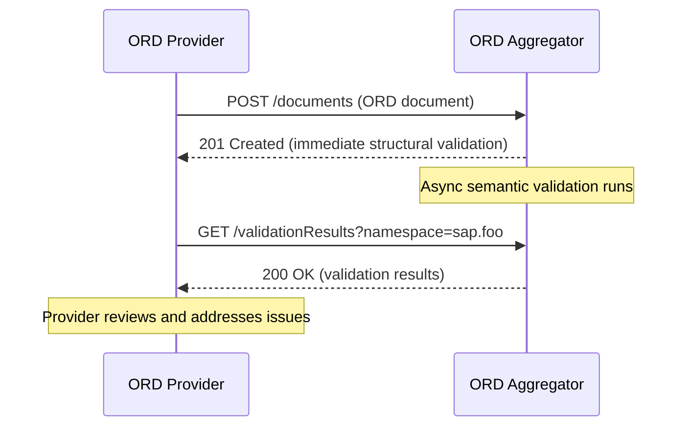
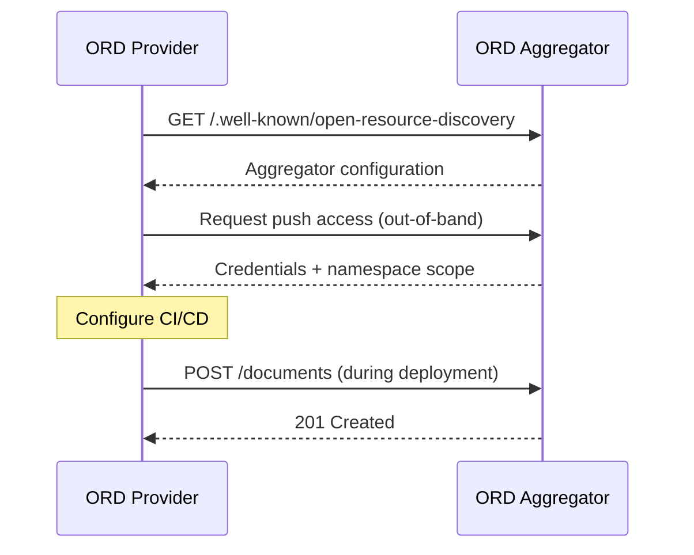

# ORD Aggregator Configuration

> **Status**: Draft Proposal (WIP)
>
> This document describes a forward-looking proposal for how ORD Aggregators could advertise their capabilities.
> It is NOT yet part of the official ORD specification.

## Overview

Just as ORD Providers use the `.well-known/open-resource-discovery` endpoint to advertise their ORD documents and access strategies, ORD Aggregators could use the same mechanism to advertise their capabilities to providers.

This creates a symmetric discovery pattern:

| Actor | Purpose of `.well-known` Configuration |
|-------|---------------------------------------|
| ORD Provider | "Here's where to find my ORD documents" |
| ORD Aggregator | "Here's how to push ORD documents to me" |

## Motivation

When implementing [push transport](./index.md#push-transport), ORD providers need to know:

1. **Which ORD versions** does the aggregator support?
2. **Where** should documents be pushed to?
3. **How** should the provider authenticate?
4. **Where** can validation results be retrieved?

Rather than relying on out-of-band communication or hard-coded endpoints, aggregators can expose this information via a standardized configuration endpoint.

## Proposed Structure

```json
{
  "openResourceDiscoveryAggregator": {
    "supportedVersions": ["1.14", "1.15"],
    "supportedTransportModes": {
      "pull": {
        "accessStrategies": [
          {
            "type": "sap:cmp-mtls:v1",
            "parameters": {
              "certIssuer": "...",
              "certSubject": "..."
            }
          }
        ]
      },
      "push": {
        "publishDocumentEndpoint": "/ord-publishing-api/v1/documents",
        "validationResultsEndpoint": "/ord-publishing-api/v1/validationResults",
        "accessStrategies": [
          {
            "type": "sap:oauth-client-credentials:v1",
            "description": "Request OAuth credentials by contacting ord-support@example.com.",
            "documentationLink": "https://help.example.com/ord-aggregator/push-onboarding"
          }
        ]
      }
    }
  }
}
```

## Key Properties

### `supportedVersions`

Lists the ORD specification versions that the aggregator can process. Providers should ensure their documents conform to one of these versions.

### `supportedTransportModes`

Describes which transport modes the aggregator supports:

- **`pull`**: The aggregator will pull from the provider's ORD endpoints
- **`push`**: Providers can push documents to the aggregator

### `push.publishDocumentEndpoint`

The URL where providers should POST their ORD documents. This endpoint accepts:

- Content-Type: `application/json;charset=UTF-8`
- Body: Complete ORD document with optional inline `definitions`

### `push.validationResultsEndpoint`

The URL where providers can retrieve validation results. See [Validation Results API](#validation-results-api) below.

### Access Strategy Fields

Each access strategy in `accessStrategies` can include:

| Field | Description |
|-------|-------------|
| `type` | The access strategy identifier (e.g., `sap:oauth-client-credentials:v1`) |
| `description` | Human-readable explanation of how to use this strategy and obtain credentials |
| `documentationLink` | URL to detailed onboarding documentation |
| `parameters` | Strategy-specific parameters (e.g., certificate details for mTLS) |

The `description` and `documentationLink` fields are particularly important for aggregators to communicate how providers should onboard and obtain credentials for push access.

## Validation Results API

> This is a conceptual proposal for how aggregators could provide validation feedback.

### Motivation

When pushing ORD documents, some validations can only be performed after the aggregator has received and processed all related documents:

- **Cross-document references**: An API references a package in another document
- **Namespace consistency**: All resources use consistent namespace prefixes
- **Aggregated constraints**: Policy level requirements across multiple packages

Immediate HTTP response validation can catch structural errors, but semantic validation requires a separate retrieval mechanism.

### Proposed Endpoint

```
GET /ord-publishing-api/v1/validationResults
```

#### Query Parameters

| Parameter | Type | Description |
|-----------|------|-------------|
| `namespace` | string | Filter results by ORD namespace (e.g., `sap.s4`) |
| `package` | string | Filter results by package ORD ID |

#### Response Structure

```json
{
  "value": [
    {
      "severity": "error",
      "code": "INVALID_REFERENCE",
      "message": "API 'sap.foo:apiResource:myApi:v1' references non-existent package 'sap.foo:package:missing:v1'",
      "target": "sap.foo:apiResource:myApi:v1",
      "timestamp": "2026-02-19T10:30:00Z"
    },
    {
      "severity": "warning",
      "code": "DEPRECATED_FIELD",
      "message": "Field 'customType' is deprecated, use specification ID pattern in 'type' instead",
      "target": "/apiResources/0/resourceDefinitions/0/accessStrategies/0",
      "timestamp": "2026-02-19T10:30:00Z"
    }
  ]
}
```

#### Severity Levels

| Level | Description |
|-------|-------------|
| `error` | Critical issue preventing proper processing |
| `warning` | Non-critical issue that should be addressed |
| `info` | Informational message or suggestion |

### Workflow



### Benefits

1. **Deferred validation**: Complex validations don't block the push request
2. **Aggregated feedback**: See all issues across multiple pushed documents
3. **Continuous monitoring**: Providers can poll for issues periodically
4. **Scoped queries**: Filter results by namespace or package

## Onboarding Flow

Before a provider can push to an aggregator, an onboarding process is typically needed:

1. **Discovery**: Provider reads aggregator's `.well-known/open-resource-discovery`
2. **Access Request**: Provider requests credentials for the push access strategy
3. **Scoping**: Access may be scoped to specific namespaces or system installations
4. **Credential Exchange**: Aggregator provides necessary credentials (OAuth, mTLS certs, etc.)
5. **Integration**: Provider configures CI/CD pipeline to push on deployment



## Schema

See [AggregatorConfiguration.schema.yaml](../../spec/v1/AggregatorConfiguration.schema.yaml) for the draft JSON Schema definition.

## Open Questions

- Should the aggregator configuration use a different well-known key (e.g., `openResourceDiscoveryAggregator`) to distinguish from provider configuration?
- How should namespace/scope restrictions be communicated to the provider?
- Should there be a standardized "health check" or "capabilities" endpoint?
- How should versioning of the aggregator API itself be handled?
