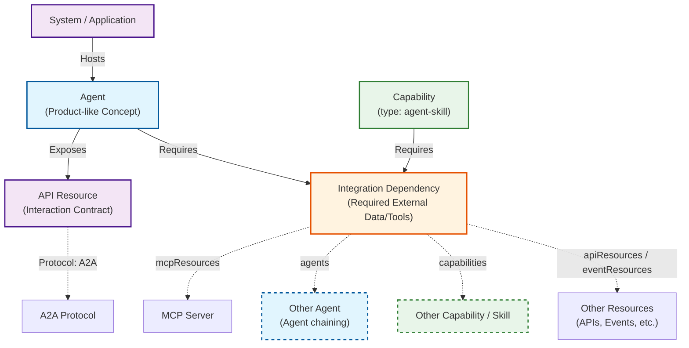

# AI Agents and Protocols

> 🚧 Please note that the [Agents](../interfaces/Document#agent) concept is still in development and contains <span className="feature-status-beta">BETA</span> properties and will get further extended.

## Agents

> An [Agent](../interfaces/Document#agent) is an **autonomous software entity** capable of task execution, described through high quality **metadata** that can be accessed through a central catalog ([ORD Aggregator](../#ord-aggregator)).

To understand how Agents fit into the ORD landscape, it is helpful to distinguish between their abstract definition and their technical realization.

In ORD, an **Agent** is primarily a conceptual, "product-like" entity, similar to a [Data Product](./data-product.md).
It represents a distinct capability or functional unit that can be discovered, understood, and managed independent of its specific deployment or invocation mechanism.

### Key Characteristics

-   **Generic vs. AI Agents:** ORD defines a generic Agent resource type representing any autonomous software entity capable of task execution.
    An Agent in ORD is not necessarily an AI Agent; the concept is broad enough to cover rule-based automation, legacy bots, and other autonomous systems.
-   **Primary Use Case:** The design focus is currently on **AI Agents**—intelligent systems often integrated with Large Language Models (LLMs) that can interpret natural language, reason about complex scenarios, and operate in conversational mode or automated workflows.
-   **Metadata Focus:** The Agent resource focuses on high-level metadata: ownership, intended use cases (e.g., "Financial Dispute Resolution"), constraints, and capabilities.
-   **Separation of Concerns:** A key design principle is the clear separation between agent planning or existence and API exposure / implementation.
    This allows modeling agents that are currently planned, or exist and act within a system but may not expose an external API.

### Technical Realization

From a technical perspective, an Agent is simply a specialized type of application logic running within a **[System](../index.md#system-instance)**.

-   **Deployment:** An Agent is deployed as a [system](../index.md#system-instance), or as part of a system.
    A single system can host one or multiple agents.
-   **Instantiation:** While the "Agent Resource" describes the *type* or *class* of the agent (Design Time), the running software represents an *instance* of that agent (Runtime).
    -   *See [System Landscape Model](./system-landscape-model.md) for more on the distinction between Systems, Tenants, and Resources.*

<div className="img-box" style={{aspectRatio: "512/378"}}>


</div>

## Agent Example

The following example shows how an Agent is described in an ORD Document:

```json
{
  "agents": [
    {
      "ordId": "sap.foo:agent:disputeAgent:v1",
      "title": "Dispute Resolution Agent",
      "shortDescription": "AI agent specialized in financial dispute case resolution",
      "description": "A longer description of this Agent with **markdown**...",
      "version": "1.0.3",
      "visibility": "public",
      "releaseStatus": "active",
      "partOfPackage": "sap.foo:package:ord-reference-app:v1",
      "partOfProducts": ["sap:product:S4HANA_OD:"],

      // Which Entity Types does the agent work with?
      "relatedEntityTypes": [
        "sap.foo:entityType:DisputeCase:v1",
        "sap.foo:entityType:DisputeResolution:v1"
      ],

      // What API(s) can be used to interact with the agent?
      "exposedApiResources": [
        {"ordId": "sap.foo:apiResource:DisputeResolutionAgent:v1"}
      ],

      // What external resources does the agent depend on?
      "integrationDependencies": [
        "sap.foo:integrationDependency:DisputeCaseManagement:v1"
      ],

      // Assigning the agent to Groups / Taxonomy (e.g., LLM Model used) with more structure and governance
      "partOfGroups": ["sap.aicore:llmModel:sap.aicore:anthropic--claude-3.7-sonnet"],

      // Extensible properties via labels
      "labels": {
        "interactionMode": ["conversational", "system-triggered"]
      },
      "tags": ["finance", "billing", "dispute-resolution", "ai-agent"],
      // ...
    }
  ]
}
```

Key aspects of this example:
- **`ordId`**: A globally unique identifier for the agent
- **`exposedApiResources`**: Links to the API(s) through which the agent can be invoked (e.g., an A2A API)
- **`integrationDependencies`**: Declares what external resources the agent requires to function
- **`relatedEntityTypes`**: Documents which domain business entities the agent operates on
- **`labels`**: Extensible key-value pairs for additional metadata like LLM models used

## Connectivity & Protocols

The ORD Agent resource acts as a central hub that connects to other ORD concepts to define how to interact with it and what it needs to function.

ORD supports the discovery of **AI-Native Protocols**.
These are API protocols specifically designed for simple consumption by LLMs and AI Agents, well-supported by the emerging AI ecosystem, and optimized for this use case.



Both Agents and Capabilities (notably `agent-skill` capabilities) can declare `integrationDependencies`, and they use the identical mechanism — each Integration Dependency groups one or more aspects referencing APIs, MCP tools, other agents, or other skills.

### Exposing Capabilities (Interaction)

Once an agent is implemented, there must be a defined contract for interacting with it.
In ORD, this is modeled by linking the Agent to an **[API Resource](../interfaces/Document#api-resource)**.

-   **A2A (Agent-to-Agent):** While ORD is protocol-agnostic, the [Agent2Agent (A2A) Protocol](https://a2a-protocol.org/latest/) is the primary AI-Native Protocol for this purpose.
    It enables seamless communication and collaboration between AI agents through standardized agent card definitions.
-   **Discovery:** This link allows consumers to find the technical interface (e.g., the A2A JSON schema or OpenAPI spec) required to send messages to the agent.

Here's an example of an A2A API Resource linked to an agent:

```json
{
  "apiResources": [
    {
      "ordId": "sap.foo:apiResource:DisputeResolutionAgent:v1",
      "title": "Dispute Resolution Agent",
      "apiProtocol": "a2a",  // Indicates this is an A2A protocol API
      "resourceDefinitions": [
        {
          "type": "a2a-agent-card",
          "mediaType": "application/json",
          "url": "/definitions/DisputeResolutionAgentcard.json",
          "accessStrategies": [{ "type": "open" }]
        }
      ],
      // Which Entity Types does this agent API expose?
      "exposedEntityTypes": [
        { "ordId": "sap.foo:entityType:DisputeCase:v1" },
        { "ordId": "sap.foo:entityType:DisputeResolution:v1" }
      ],
      // ...
    }
  ]
}
```

The `resourceDefinitions` with type `a2a-agent-card` points to the full A2A Agent Card, which contains detailed capability information like skills, input/output modes, and security schemes.

### Consuming Capabilities (Dependencies)

Agents rarely work in isolation.
They often need to access real-world data, invoke business functions, delegate to other agents, or load reusable skills.
ORD models these requirements with [Integration Dependencies](../interfaces/Document#integration-dependency). Each Integration Dependency contains one or more aspects, which are logical groupings of dependencies that can be marked mandatory or optional. An aspect can be marked mandatory or optional and reference one or more of the following resource types: 

-   **MCP Servers (`mcpResources`):** Reference an [MCP Server](https://modelcontextprotocol.io/docs/getting-started/intro) when the agent's LLM needs to invoke tools, fetch context, or use prompts through the MCP protocol. Declaring this requirement allows the runtime environment to provision the necessary connections.
    When only a subset of tools is needed, the `subset` field on an `apiResources` reference narrows the dependency to the exact operations required (using the tool `name` from the MCP server card as `operationId`). This keeps LLM context lean by loading only the relevant tool descriptions, and scopes permission grants to the minimal required surface area.
-   **Other Agents (`agents`):** Reference another Agent when the agent orchestrates or delegates subtasks to specialized agents, enabling agent chaining and multi-agent workflows. Making the dependency explicit lets the system landscape model and reason about agent-to-agent relationships.
-   **Skills (`capabilities`):** Reference a [Capability](../interfaces/Document#capability) of type `agent-skill` when the agent depends on an [Agent Skill](#agent-skills-as-capabilities). Agent Skills are discrete, reusable capability packages that contain instructions, scripts, and resources and can be shared across multiple agents.
-   **Other Resources (`apiResources` / `eventResources`):** Reference any other [ORD resource](../index.md#ord-resource), such as **[API Resources](../interfaces/Document#api-resource)** (REST, OData, GraphQL) or **[Event Resources](../interfaces/Document#event-resource)**, when the Agent interact with existing business systems. Agent dependencies are not limited to AI-native protocols.

Here's an example of an Integration Dependency that covers all four dependency types.
Without `subset` on an `apiResources` reference, the dependency implies access to all operations of the referenced resource:

```json
{
  "integrationDependencies": [
    {
      "ordId": "foo.app1:integrationDependency:DisputeAgent-mcpDeps:v1",
      "title": "MCP Tool Dependencies for Dispute Agent",
      "shortDescription": "MCP tools required by the Dispute Agent at runtime.",
      "mandatory": true,
      "releaseStatus": "active",
      "partOfPackage": "sap.foo:package:MyPackage:v1",
      "aspects": [
        {
          "apiResources": [
            {
              "ordId": "foo.app2:apiResource:DisputeToolsMCPServer:v1",
              "subset": [
                { "operationId": "searchDisputeCases" },
                { "operationId": "getDisputeDetails" },
                { "operationId": "updateDisputeStatus" }
              ]
            }
          ]
        },
        {
          "title": "Case Data via MCP",
          "description": "MCP Server providing live dispute case data as LLM context",
          "mandatory": false,
          "mcpResources": [
            { "ordId": "sap.bar:mcpResource:DisputeCaseMCP:v1" }
          ]
        },
        {
          "title": "Escalation Agent",
          "description": "Delegates complex cases to a specialized escalation agent",
          "mandatory": false,
          "agents": [
            { "ordId": "sap.bar:agent:escalationAgent:v1" }
          ]
        },
        {
          "title": "Document Processing Skill",
          "description": "Reusable skill for extracting structured data from uploaded documents",
          "mandatory": false,
          "capabilities": [
            { "ordId": "sap.bar:capability:documentProcessing:v1" }
          ]
        }
      ]
    }
  ]
}
```

## AI Hints on ORD Resources

The following ORD resource types support an `aiHint` property: API Resources, Event Resources, Entity Types, Data Products, Agents, and Capabilities.

`aiHint` provides guidance specifically for AI consumers such as LLMs and agent orchestrators, and is intentionally separate from human-facing `description` and `shortDescription` fields so both can evolve independently.

```json
{
  "apiResources": [
    {
      "ordId": "sap.foo:apiResource:DisputeResolutionAgent:v1",
      "title": "Dispute Resolution Agent",
      "description": "Manages dispute cases in the system.",
      "aiHint": "Use this API to **retrieve** and **manage** dispute cases. Prefer structured JSON payloads over free-text fields when invoking tools. Do not call `DELETE /cases/{id}` unless the case status is `closed`."
    }
  ]
}
```

### Why a Separate Field?

Human-readable documentation (`description`, `shortDescription`) is written for end users and developers browsing a catalog. AI-targeted guidance has different concerns — it may include tool-use patterns, LLM-specific caveats, or instructions that would read as noise in standard docs. Keeping these separate lets both evolve independently.

### Best Practices

- **Markdown recommended**: The value SHOULD be written in [CommonMark](https://spec.commonmark.org/) Markdown.
- **Be action-oriented**: Describe *how* to use the resource (verbs, conditions, caveats), not just *what* it is — the `description` already covers that.
- **Keep it focused**: Aim for a short, dense paragraph rather than exhaustive documentation. Link to detailed docs via the `links` property.

## Use Cases

Describing agents in ORD enables several key scenarios:

-   **Dynamic Agent Discovery:** AI orchestrators can dynamically discover available agents in a system landscape to extend their capabilities.
-   **Agent Catalogs:** Central catalogs can index and display agents, enabling users to find and understand available AI capabilities.
-   **Landscape Planning:** Understand the agent landscape across systems, including which agents depend on which resources.
    Supports static catalogs (what is offered) and dynamic landscapes (what is actually running and available).
-   **Dependency Management:** Explicitly modeling what an agent requires (via Integration Dependencies) supports automatic provisioning and understanding of dependency relationships.
-   **Code-Based Agent Discovery:** Developers building code-based agents can discover and consume other agents programmatically.

## Current Status

The AI Agents concept in ORD is currently in **Beta status** and may undergo refinements based on community feedback.

### What's Included

- Core agent properties: identity, versioning, visibility, release status, ownership
- Relationships to API Resources via `exposedApiResources`
- Relationships to dependencies via `integrationDependencies`
- Links to related Entity Types via `relatedEntityTypes`
- Extensibility via `labels` and `tags` for evolving properties

### Extensibility Approach

Given the rapidly evolving AI ecosystem, ORD takes a conservative approach to adding new properties:

-   **[Groups](./grouping-and-bundling.md#groups):** The recommended mechanism for adding taxonomy to agents.
    Groups allow defining custom **Group Types** (e.g., "LLM Model", "Process Area") and assigning agents to specific groups.
    This approach is more structured and governed than labels, supporting both global taxonomies and application-specific groupings.
    For example, an agent could be assigned to an LLM model group like `sap.aicore:llmModel:sap.aicore:anthropic--claude-3.7-sonnet`.
-   **Labels:** For simpler key-value metadata that is still being validated, labels can be used.
    This allows for experimentation without committing to a stable schema.
-   **Tags:** Free-form tags for folksonomy-style categorization (e.g., `["finance", "billing", "ai-agent"]`).

### Agent Skills as Capabilities

[Agent skills](https://agentskills.io/home) are discrete, reusable capabilities that agents can perform—packaged as folders of instructions, scripts, and resources.
In ORD, these are modeled using the **[Capability](../interfaces/Document#capability)** resource type with `type: "agent-skill"`.

This enables:
- **Discovery:** Agents can discover and load skills on-demand through the catalog
- **Reusability:** Skills can be shared across multiple agents and systems
- **Dependency Management:** Both agents and skills can declare `integrationDependencies` on APIs, MCP tools, other agents, or other skills (see [Skill Dependencies](#skill-dependencies) below).

**Example agent skill:**

```json
{
  "capabilities": [
    {
      "ordId": "sap.foo:capability:disputeSummarization:v1",
      "title": "Dispute Summarization Skill",
      "shortDescription": "Summarizes dispute cases and their resolution history",
      "version": "1.0.0",
      "type": "agent-skill",
      "definitions": [
        {
          "type": "agent-skill-zip",
          "mediaType": "application/zip",
          "url": "/capabilities/disputeSummarization/skill.zip",
          "accessStrategies": [{ "type": "open" }]
        }
      ]
    }
  ]
}
```

**Consuming agent skills:**

Agents can depend on external skills through Integration Dependency aspects:

```json
{
  "integrationDependencies": [
    {
      "ordId": "sap.foo:integrationDependency:DisputeCaseManagement:v1",
      "aspects": [
        {
          "title": "Document Processing Skill Access",
          "description": "Uses an external agent skill for processing documents",
          "mandatory": false,
          "capabilities": [
            { "ordId": "sap.bar:capability:documentProcessing:v1" }
          ]
        }
      ]
    }
  ]
}
```

### Skill Dependencies

A Capability of type `agent-skill` can itself declare `integrationDependencies` — the same mechanism Agents use, and the direct analogue of `inputPorts` on [Data Products](./data-product.md): the artifact itself declares what it needs to run.

```json
{
  "capabilities": [
    {
      "ordId": "sap.foo:capability:disputeSummarization:v1",
      "type": "agent-skill",
      "title": "Dispute Summarization Skill",
      "version": "1.0.0",
      "releaseStatus": "active",
      "visibility": "public",
      "partOfPackage": "sap.foo:package:ord-reference-app:v1",
      // The skill itself depends on external resources to function
      "integrationDependencies": [
        "sap.foo:integrationDependency:DisputeCaseManagement:v1"
      ]
    }
  ]
}
```

The referenced Integration Dependency is structured exactly like the [example above](#consuming-capabilities-dependencies), and the [Connectivity & Protocols diagram](#connectivity--protocols) shows skills participating in the same dependency graph as agents.

## Example

A complete example with agent and capability definitions is available at [document-agents.json](../examples/document-agents).
