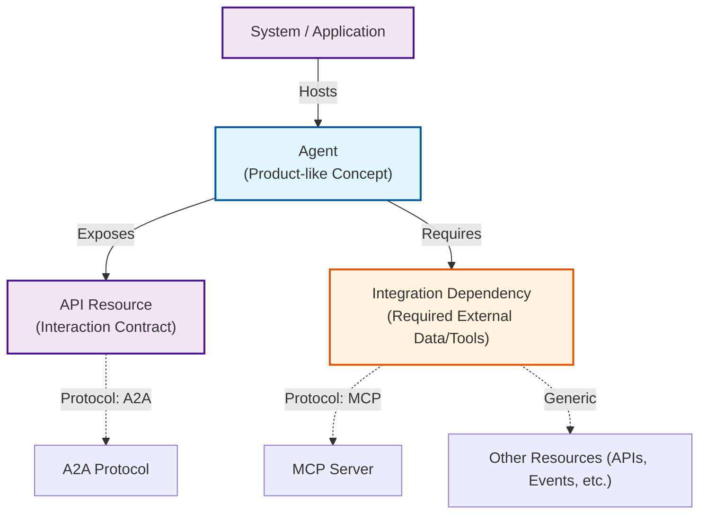

# AI Agents and Protocols

> 🚧 Please note that the [Agents](../interfaces/Document#agent) concept is still in development and contains BETA properties and will get further extended.

## Conceptual Model

To understand how Agents fit into the ORD landscape, it is helpful to distinguish between their abstract definition and their technical realization.

### Agent as a Product

In ORD, an **Agent** is primarily a conceptual, "product-like" entity, similar to a [Data Product](./data-product.md). It represents a distinct capability or functional unit that can be discovered, understood, and managed independent of its specific deployment.

*   **Generic vs. AI Agents:** ORD defines a generic Agent resource type representing any autonomous software entity capable of task execution. An Agent in ORD is not necessarily an AI Agent; the concept is broad enough to cover rule-based automation, legacy bots, and other autonomous systems.
*   **Primary Use Case:** The design focus is currently on **AI Agents**—intelligent systems often integrated with Large Language Models (LLMs) that can interpret natural language, reason about complex scenarios, and operate in conversational mode or automated workflows.
*   **Metadata Focus:** The Agent resource focuses on high-level metadata: ownership, intended use cases (e.g., "Financial Dispute Resolution"), constraints, and capabilities.

### Technical Realization

From a technical perspective, an Agent is simply a specialized type of application logic running within a **[System](../index.md#system-instance)**.

*   **Deployment:** An Agent is deployed as a system, or as part of a system. A single system can host one or multiple agents.
*   **Instantiation:** While the "Agent Resource" describes the *type* or *class* of the agent (Design Time), the running software represents an *instance* of that agent (Runtime).
    *   *See [System Landscape Model](./system-landscape-model.md) for more on the distinction between Systems, Tenants, and Resources.*

## Connectivity & Protocols

The Agent resource acts as a central hub that connects to other ORD concepts to define how to interact with it and what it needs to function.

ORD supports the discovery of **"AI Protocols"**. These are API protocols that are considered **"AI Native"**—specifically designed for simple consumption by LLMs and Agents, well-supported by the emerging AI ecosystem, and optimized for this use case.

### Exposing Capabilities (Interaction)

Once an agent is implemented, there must be a defined contract for interacting with it. In ORD, this is modeled by linking the Agent to an **[API Resource](../interfaces/Document#api-resource)**.

*   **A2A (Agent-to-Agent):** While ORD is protocol-agnostic, the [Agent2Agent (A2A) Protocol](https://a2a-protocol.org/latest/) is the primary "AI Protocol" for this purpose. It enables seamless communication and collaboration between AI agents through standardized agent card definitions.
*   **Discovery:** This link allows consumers to find the technical interface (e.g., the A2A JSON schema or OpenAPI spec) required to send messages to the agent.

### Consuming Capabilities (Dependencies)

Agents rarely work in isolation. They often need to access real-world data or invoke business functions. This is modeled using **[Integration Dependencies](../interfaces/Document#integration-dependency)**.

*   **MCP (Model Context Protocol):** A common pattern is for an Agent to depend on an [MCP Server](https://modelcontextprotocol.io/docs/getting-started/intro). The Integration Dependency declares this requirement, allowing the runtime environment to provision the necessary connections to data sources and tools.
*   **Other Resources:** Agents are not limited to AI-native protocols. They can also depend on any other ORD resource, such as **API Resources** (REST, OData, GraphQL) or **Event Resources**, to interact with existing business systems.
*   **Agent Chaining:** Agents can also have dependencies on other Agents, forming complex workflows.

## Current Status

The AI Agents concept in ORD is currently in **Beta status** and may undergo refinements based on community feedback. Example implementations are available in the ORD specification repository (see `examples/documents/document-agents.json` and `examples/definitions/DisputeResolutionAgentcard.json`).
