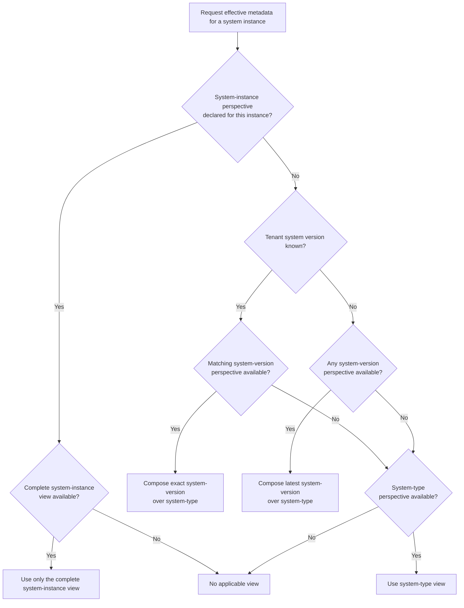

# Perspectives

> ⏩ The technical requirements of this are described in the [specification section on perspectives](../../spec-v1/index.md#perspectives).

## Overview

An application or service can be described both from a [static](../../spec-v1/index.md#static-perspective) or a [dynamic](../../spec-v1/index.md#dynamic-perspective) perspective. The configuration endpoint can point to different ORD documents that represent the information from the different perspectives.

### Static Perspective

The static perspective describes how an application or service looks like _in general_ at design-time.
This perspective is especially useful for customers, who haven't purchased a product yet and need to understand what technical capabilities they would get.
It also helps to understand the common baseline of what all systems of the same type provide and how it changes over time.

The static perspective has two sub-levels:

- **`system-version`**: Describes the metadata for a specific version of a [system type](../../spec-v1/index.md#system-type). Static metadata is known at design-time or deploy-time, when a new version of an application or service is developed or provisioned. Use this when the system has explicit versions.
- **`system-type`**: Describes version-independent metadata that applies no matter which [system version](../../spec-v1/index.md#system-version) or [system instance](../../spec-v1/index.md#system-instance) is used. Use this when the system is not versioned (continuous delivery) or resources do not relate to a specific system version.

A system type MAY publish both static perspectives when it has version-independent as well as version-specific resources.
Resources that apply to every version use `system-type`, while resources that depend on a system version use `system-version`.
When both perspectives describe the same resource, the more specific `system-version` representation takes precedence in an effective view.

For cloud software with continuous delivery, the version may not be explicit or of interest to the consumer.
But consider that also cloud software that is going through phased deployments therefore can have multiple versions active at the same time.

The static perspective describes the shared metadata of all system instances (tenants) of the same system version or version independent.
Either the metadata is always the same or it explicitly ignores the tenant-specific extensibility, configuration and any feature toggles - describing what's generic and shared.
The advantage of static metadata is that it is always available, there is no need to first provision tenants to get it. It is also a good integration contract for everything that is meant to work potentially with _any_ tenant.

At SAP, we have the [SAP Business Accelerator Hub](https://api.sap.com/) that documents the static perspective.

#### System Version Guidelines

Versions and Lifecycle is often difficult. Putting a version on a system is not always straightforward.
Here are some guidelines how to choose the correct version for the `system-version` perspective:

- If the system has explicit versions (e.g. "v1.0.1", "v2.0.0"), use these versions.
- If the system does not use SemVer, it has to be converted so that SemVer conventions apply (conservatively).
  - E.g. if the system uses simple incremental versions like "1", "2" or "2404, convert these to "1.0.0", "2.0.0", "2404.0.0" respectively.
  - E.g. if the system uses date-based versions like "2024-01-15", convert these to "2024.1.15".
- If the system is continuously delivered and does not have explicit versions at all, use the `system-type` perspective instead.
  - However, consider that you may still have different releases rolled out over time and on different stages. If this causes a problem, use `system-version` with below conventions.
  - Alternatively, use a fixed `1.0.0` version and overwrite it with every new release.

For the normative rules on choosing between `system-type` and `system-version`, see [Correct Use of Perspectives](../../spec-v1/index.md#correct-use-of-perspectives).

### Dynamic Perspective

The dynamic perspective describes an application or service as it really looks like, _at run-time_.
This is more precise than the static perspective, because it can reflect configuration, customization and extensions of the system instance (tenant).

In ORD, we describe this with `perspective`: `system-instance`.

The `system-instance` perspective is the correct choice, when the resource description or its metadata is actually different between system instances of the same system version.
When used, the perspective completely describes the running system instance as it is.
It is not a "diff" on the static perspective, for this we may consider introducing a specialized `system-instance-delta` perspective as optimization later.

Some examples when metadata can be dynamic:

- APIs or Events can be activated and deactivated per system instance / tenant.
- API or Event interfaces can be extended, e.g. through field extensibility.
- New resources can be created by the user of the application at run-time (typical situation for frameworks, platforms and extensible applications).
- Endpoint URLs may be dynamic

At SAP, the run-time discovery of dynamic metadata (system-instance) is handled by the [Unified Customer Landscape](../../introduction.mdx#unified-customer-landscape) in BTP.

### System Independent Perspective

Some ORD information like Taxonomies, Products and Vendors is not dependent on systems and can use the `system-independent` perspective.
They can be considered global, static content that can be shared by multiple systems.

Such content is of a "singleton" quality for the whole ORD aggregator and SHOULD not be republished by the individual systems.

> Note: Cross-system-type taxonomy, resources and contracts can be modeled either as system-scoped publications or as `system-independent` content.
> Cross-system-type resources and contracts still describe a system's capabilities and are published per system type/version/instance.
> System-independent content (Vendors, Products, global Entity Types, global Groups and Group Types) exists outside the system context entirely.
> See [Shared Taxonomy, Resources and Contracts](./shared-resources.md) for the distinction.

### How Perspectives Relate to Each Other

The dynamic perspective is a more precise description of the system instance than the static perspective, as it can contain its customizations.
If no dynamic perspective has been published for a system instance, the static perspective can be used as the fallback.

This is depicted in the following diagram:

The `system-instance` perspective is the most specific because it describes how a particular system instance or tenant looks at run-time.
All documents declared for the same perspective and scope are considered together.
For example, all `system-instance` documents for one tenant collectively form that tenant's complete dynamic view.

The two static perspectives compose as ordered layers.
The `system-type` perspective provides the version-independent base and the selected `system-version` overrides or adds version-specific resources.
Static resolution is performed independently for each ORD ID.
When the same ORD ID occurs in both static layers, the complete `system-version` representation takes precedence; properties from different representations are not merged.
A resource that is absent from the selected `system-version` is inherited from `system-type`.
To suppress an inherited resource, the `system-version` perspective MUST publish a `Tombstone` for its ORD ID.

The `system-instance` perspective does not participate in this static composition.
When a complete `system-instance` perspective is declared for a tenant, it replaces the effective static view for that tenant.
A resource omitted from that complete tenant view is not available on the tenant and MUST NOT be filled in from static metadata.
Only when no `system-instance` perspective is declared for the tenant may the aggregator fall back to the effective static view.

For a static request without a specific version, the aggregator SHOULD compose the `system-type` perspective with the latest `system-version`, when available (see [Static Perspective Resolution](#static-perspective-resolution) below).

A consumer can legitimately be interested in all three levels, but needs to provide a different context for each:

- If `system-instance` metadata is requested, the tenant / system instance ID needs to be specified.
- If `system-version` metadata is requested, the system type and system version must be specified.
- If `system-type` metadata is requested, only the system type must be specified. The aggregator resolves what to return (see [Static Perspective Resolution](#static-perspective-resolution)).

#### Effective System-Instance Resolution

An aggregator that serves tenant-aware requests MUST determine whether a complete `system-instance` perspective is declared before it filters for an individual ORD ID.
It MUST NOT use the absence of a requested ORD ID from a complete tenant view as a reason to continue to a static perspective.
An empty but successfully retrieved complete tenant view is still a valid description of that scope.

The resolution works as follows:

1. If a complete `system-instance` perspective is declared for the tenant and is available, use only that view.
2. If a complete `system-instance` perspective is declared but unavailable because of validation, authorization, transport, or another retrieval failure, report the tenant view as unavailable.
   Do not fall back to static metadata.
3. Only when no `system-instance` perspective is declared, construct the effective static view.
4. If the tenant's system version is known, compose that exact `system-version` over `system-type`.
   If the exact version is unavailable, use only version-independent `system-type` metadata when available and MUST NOT substitute another system version.
5. If the tenant's system version is unknown, compose the latest `system-version` over `system-type`.
6. For every ORD ID in the effective static view, return the complete representation from the selected `system-version` when present, otherwise fall through to `system-type`.
   A `Tombstone` in the selected `system-version` suppresses the same ORD ID from `system-type`.

After selecting the complete tenant view or constructing the effective static view, the aggregator may filter it for a requested ORD ID.
Filtering earlier is a valid optimization only when it produces the same result.

A declared `system-instance` perspective does not become absent merely because its latest retrieval fails validation, authorization, or transport.
The aggregator SHOULD retain the last valid tenant view with suitable staleness information or report the tenant view as unavailable.
It MUST NOT silently fall back to static metadata after such a failure because the static view may expose resources that are not available on the tenant.

The `system-independent` perspective is outside this resolution chain.
Consumers can retrieve that global content separately, but its presence does not indicate that a resource is available on a particular system or tenant.

Until an ORD Discovery API exposes the resolved effective tenant view, a consumer that implements this algorithm itself MUST determine perspective availability independently of any ORD ID filter.
A filtered query with no matching resources cannot distinguish an unavailable perspective from a complete perspective in which the resource is intentionally absent.
If the Discovery API does not expose that distinction, the consumer cannot safely perform tenant fallback and SHOULD request an aggregator-level resolution capability instead.
The target Discovery API behavior is to return the complete effective tenant view so consumers do not need to understand provider-side perspective selection or future transport optimizations.

### Relation to System-Instance-Aware

The `perspectives` attribute deprecates the `systemInstanceAware` attribute.

With `systemInstanceAware` it was already possible to define whether metadata was dynamic (different per system instance) or not.
But the concept did not allow to describe the same resource in different perspectives and also did not define how the perspectives build upon each other.

To migrate: replace `systemInstanceAware: true` with `perspective: "system-instance"` and split your ORD document so that static and dynamic metadata are in separate documents with their respective perspective set. See the [`perspective` property on the ORD Configuration](../../spec-v1/interfaces/Configuration.md) interface for details.

## ORD Provider Considerations

The following diagram gives an overview which perspectives need to be described by an ORD Provider:

A provider can publish version-independent static resources in `system-type` and version-specific static resources in `system-version`.
If the system has dynamic metadata, it should additionally describe the `system-instance` perspective completely, if possible.

If the `system-version` perspective is used, the described version MUST be provided via the ORD `describedSystemVersion`.`version` property.
For the `system-type` perspective, the version property is NOT required as this perspective is version-independent.
Ideally, ORD providers SHOULD define the `describedSystemVersion`.`version` property on both the `system-version` and `system-instance` perspectives.

The `version` becomes effectively the "join" criteria for how the dynamic metadata is associated to the version-specific static metadata.

> ⏩ See also: [Correct Use of Perspectives](../../spec-v1/index.md#correct-use-of-perspectives).

## ORD Aggregator Considerations

#### Static Aggregators

Static aggregators describe the `system-type` and/or `system-version` perspectives for a given system type.

- If both static and dynamic perspectives are described, they MUST only pick the static perspectives (`system-type` or `system-version`).
- If only `system-instance` (or unspecified) perspective is available, we assume this is a generic system instance which is meant to describe all system instances as a subsidiary.
- Static perspective resolution SHOULD follow the algorithm described [below](#static-perspective-resolution).

#### Dynamic Aggregators

If the aggregator supports both static and dynamic perspectives:

- The ORD aggregator MUST be able to aggregate and store all perspectives (`system-type`, `system-version`, and `system-instance`) at the same time.
- In its ORD Discovery API for consumers, it needs to implement the [effective system-instance resolution](#effective-system-instance-resolution) behavior.
  - When a complete `system-instance` perspective is declared for a tenant, return only that view.
  - Only when no `system-instance` perspective is declared, fall back to the effective static view.
  - Do not fall back merely because an ORD ID is absent from a complete tenant view.
  - Static perspective resolution (when `system-type` or `system-version` is requested) SHOULD follow the algorithm described [below](#static-perspective-resolution).

#### Static Perspective Resolution

When a consumer requests static metadata (i.e. `system-type` or `system-version` perspective) for a given system type, the aggregator SHOULD resolve what to return as follows (see also the [perspective relation diagram](#how-perspectives-relate-to-each-other)):

1. Select the exact `system-version` when a **specific system version is requested**.
2. If **no specific version is requested**, select the **latest `system-version`** when available.
   The aggregator MUST determine the latest version using [Semantic Versioning 2.0.0](https://semver.org/) precedence, not lexical ordering, publication time, or `lastUpdate`.
3. For each ORD ID, return the complete representation from the selected `system-version` when present.
4. If the ORD ID is absent from the selected `system-version`, fall through to its `system-type` representation when available.
5. A `Tombstone` in the selected `system-version` suppresses the same ORD ID from `system-type`.
6. If an exact version was requested but unavailable, do not substitute another system version.
   Version-independent `system-type` resources remain applicable.
7. If neither selected `system-version` nor `system-type` metadata is available, return no static view.

This resolution lets consumers retrieve the composed static description without having to know which resources are versioned or version-independent.

#### Tombstone Handling across Versions

An older version of an application / service can have a resource which has been decommissioned (via a `Tombstone`) in a newer version.
The inheritance / fallback logic MUST not fall back to the now removed resource.
A `Tombstone` in a more specific layer suppresses the same ORD ID from all less specific layers in the effective view.
A tombstone that suppresses an inherited `system-type` resource MUST remain published for as long as the less-specific perspective continues to publish that resource.

The `system-independent` perspective is outside static resolution.
Consumers can retrieve global content separately, but it does not serve as fallback evidence that a resource belongs to a system type or version.
