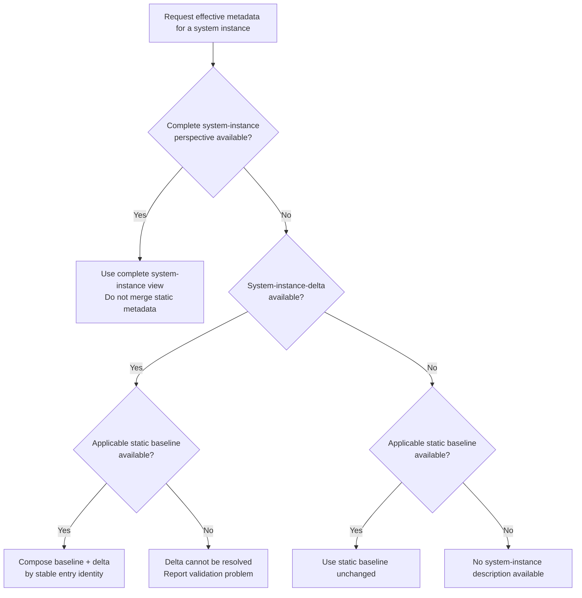
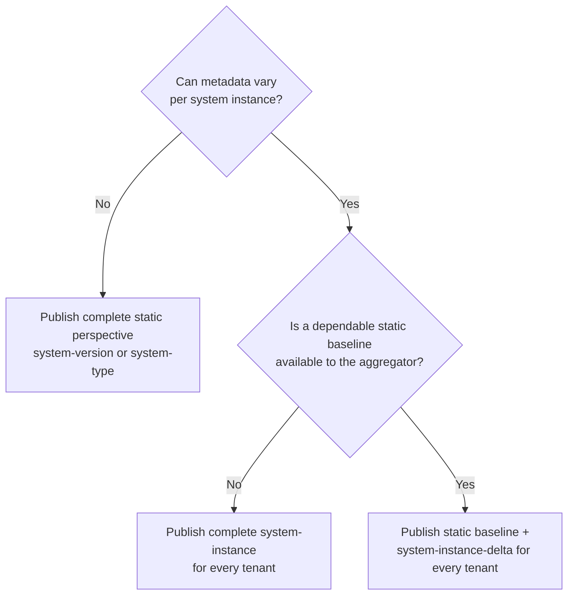

# Perspectives

> ⏩ The technical requirements are summarized in the [specification section on perspectives](../../spec-v1/index.md#perspectives).

## Overview

An application or service can be described from a [static](../../spec-v1/index.md#static-perspective) or a [dynamic](../../spec-v1/index.md#dynamic-perspective) perspective. The configuration endpoint can point to different ORD documents for each perspective.

| Perspective | Scope | Representation | Retrieval |
|---|---|---|---|
| `system-type` | A system type, independent of a version | Complete static baseline | Once per system type |
| `system-version` | One version of a system type | Complete static baseline | Once per system version |
| `system-instance` | One running system instance (tenant) | Complete dynamic description | Per system instance |
| `system-instance-delta` | One running system instance (tenant) | Baseline-relative set of complete changed entries | Per system instance |
| `system-independent` | Content outside any system context | Complete, global static content | Once per aggregator |

All ORD documents of one perspective and scope are considered together. A perspective can therefore be split across multiple documents for size, lifecycle, or ownership reasons.

## Static Perspective

The static perspective describes how an application or service looks _in general_ at design-time. It is useful before a customer has purchased or provisioned a system and provides the common baseline for systems of the same type or version.

The static perspective has two levels:

- **`system-version`** describes the complete metadata for a specific [system version](../../spec-v1/index.md#system-version). Static metadata is usually known when a new version is developed or deployed. Use this perspective when the system has explicit versions.
- **`system-type`** describes complete, version-independent metadata for a [system type](../../spec-v1/index.md#system-type). Use this perspective when the system is not versioned, is continuously delivered without meaningful versions, or its resources are not tied to a specific version.

A static baseline either is identical for its system instances or deliberately ignores tenant-specific configuration, extensibility, entitlements, and feature toggles. It is available without provisioning a tenant and acts as an integration contract for capabilities that systems of that type or version generally provide.

At SAP, the [SAP Business Accelerator Hub](https://api.sap.com/) documents the static perspective.

### System Version Guidelines

Choosing a system version is not always straightforward. Use these guidelines for the `system-version` perspective:

- If the system has explicit versions, such as `1.0.1` or `2.0.0`, use them.
- If the system does not use SemVer, convert its versions conservatively so that SemVer conventions apply.
  - Convert incremental versions such as `1`, `2`, or `2404` to `1.0.0`, `2.0.0`, or `2404.0.0`.
  - Convert date-based versions such as `2024-01-15` to `2024.1.15`.
- If the system is continuously delivered and has no explicit versions, use `system-type` instead.
  - Consider whether different releases can be active on different deployment stages at the same time. If that distinction matters, use `system-version`.
  - Alternatively, use a fixed `1.0.0` version and replace its static description with every release.

For the normative rules, see [Correct Use of Perspectives](../../spec-v1/index.md#correct-use-of-perspectives).

## Dynamic Perspective

The dynamic perspective describes an application or service as it really looks at run-time. It can reflect the configuration, customizations, extensions, entitlements, and feature toggles of one system instance.

ORD supports two dynamic representations. They are alternatives for describing the same effective system-instance view:

- [`system-instance`](#complete-system-instance) publishes the complete view.
- [`system-instance-delta`](#system-instance-delta) publishes complete entries that must be composed with a static baseline.

Examples of dynamic metadata include:

- APIs or events that are activated or deactivated per tenant
- API, event, or entity interfaces extended with custom fields
- resources created by an application user at run-time
- tenant-specific endpoint URLs
- resources unavailable because of tenant-specific entitlements

At SAP, run-time discovery is handled by the [Unified Customer Landscape](../../introduction.mdx#unified-customer-landscape) in BTP.

### Complete System Instance

`perspective: system-instance` is a complete description of one running system instance. All `system-instance` documents for that instance together MUST describe its entire ORD view, including unchanged resources that also exist in the static perspective.

It is not a delta or patch. The aggregator MUST NOT merge it with static metadata. When a complete `system-instance` perspective is available, it replaces the static perspective as the description of that tenant. Only when no complete `system-instance` perspective is available may the static perspective be used as the tenant description or as the baseline for `system-instance-delta`.

This completeness rule is intentional: a provider may know the tenant's effective state without knowing how that state differs from a separately maintained static baseline.

### System-Instance Delta

`perspective: system-instance-delta` is an optional publishing optimization. It describes a system instance relative to an applicable `system-version` or `system-type` baseline, so the provider does not need to republish unchanged metadata and resource definitions for every tenant.

Despite its name, a system-instance delta is **not** a diff file, JSON Patch, JSON Merge Patch, or property-level merge:

- An ORD entry is one complete item in an ORD document collection, such as an API Resource, Event Resource, Package, or Group.
- Every ORD entry in the delta MUST be a complete, schema-valid entry.
- A delta entry with the same stable identity as a baseline entry replaces the entire baseline entry. There is no recursive property merge.
- A delta entry whose identity is absent from the baseline is added to the effective system-instance view.
- A baseline entry that is absent from the delta is inherited unchanged.
- A baseline entry that does not exist in the system instance MUST be suppressed with a [`Tombstone`](../interfaces/Document.md#tombstone). Merely omitting it from the delta would mean that it is inherited.

For entries with an `ordId`, that ORD ID is the matching identity. Groups and Group Types use `groupId` and `groupTypeId`, respectively. `system-independent` content is outside the system baseline and MUST NOT be overridden by a delta.

| Static baseline | System-instance delta | Effective system-instance view |
|---|---|---|
| Resource A is unchanged | Resource A omitted | Resource A inherited from baseline |
| Resource B is extended | Complete Resource B with the same `ordId` | Baseline Resource B replaced |
| Resource C is not entitled | Tombstone for Resource C | Resource C absent |
| No Resource D | Complete tenant-created Resource D | Resource D added |

A tombstone in a `system-instance-delta` has ongoing suppression semantics rather than only announcing a historical decommissioning. The provider MUST keep it in the current delta for as long as the matching baseline entry is absent from that system instance. If the entry becomes available again, removing the tombstone from the current delta makes the baseline entry effective again. The usual 31-day tombstone expiry therefore does not apply while the baseline entry remains present and suppressed.
Its `removalDate` records when the entry became absent from that system instance, or when that absence was first known.

The delta is relative to a static baseline, not to the previous crawl or previous delta. Each retrieval MUST describe the current differences from that baseline. An aggregator can therefore rebuild the effective view from the current baseline and current delta without replaying change history.

#### Selecting the Baseline

The aggregator MUST select the applicable static baseline before processing a delta:

1. If the system instance identifies a system version and the matching `system-version` perspective is available, use that version. A delta based on a versioned baseline MUST provide `describedSystemVersion.version`.
2. Otherwise, use the explicit `system-type` perspective if available.
3. If no applicable static baseline is available, the delta cannot be resolved. The aggregator MUST report a validation problem and MUST NOT expose the delta as if it were a complete tenant description.

The provider MUST use the same stable identity for the same ORD entry in the static baseline and delta. The delta and baseline MUST describe the same system type, and a versioned delta MUST identify the matching version. `describedSystemInstance` supplies the tenant context for the effective view; document-envelope properties such as `perspective` and `baseUrl` are not entry-level overrides.

A provider MUST NOT mix `system-instance` and `system-instance-delta` as representation modes for the same system instance. If an aggregator nevertheless receives both, it MUST use the complete `system-instance` representation and MUST NOT apply the delta to it.

#### Composition Order

To produce the effective system-instance view, an aggregator MUST:

1. resolve the applicable complete static baseline;
2. normalize source-document concerns such as relative URLs and document-level inheritance in their original document context;
3. replace matching baseline entries with complete delta entries and add new delta entries;
4. apply delta tombstones to suppress matching entries; and
5. apply the remaining ORD enrichment and inheritance rules to the effective result.

The aggregator, not the ORD consumer, owns this composition. Its Discovery API MUST expose a complete effective system-instance view.

## System-Independent Perspective

Some ORD information, such as Vendors, Products, and global taxonomy, is not dependent on systems and can use the `system-independent` perspective. It is global, static content with an independent lifecycle and SHOULD not be republished by individual systems.

> Note: Cross-system-type taxonomy, resources, and contracts can be modeled either as system-scoped publications or as `system-independent` content. Cross-system-type resources and contracts still describe a system's capabilities and are published per system type, version, or instance. System-independent content exists outside the system context entirely. See [Shared Taxonomy, Resources and Contracts](./shared-resources.md) for the distinction.

## Perspective Resolution

The effective system-instance view is always complete, regardless of which representation the provider selected:

The important distinction is between fallback and composition:

- **Fallback** applies when no dynamic representation exists. The static baseline alone describes the tenant.
- **Composition** applies only to `system-instance-delta`. The static baseline and delta together describe the tenant.
- A complete `system-instance` representation never inherits or merges static entries.

“Available” in this resolution means that the provider declares the representation for that scope, not merely that the latest fetch succeeded. A temporary transport or validation failure MUST NOT cause an aggregator to silently replace an advertised dynamic representation with the static baseline, because that could expose an incorrect tenant view. The aggregator SHOULD retain the last valid effective view with suitable staleness information or report the instance view as unavailable.

A consumer can legitimately request different levels, with different context:

- A system-instance request identifies the tenant. The aggregator returns the complete effective view after applying the resolution above.
- A system-version request identifies the system type and version.
- A system-type request identifies only the system type and uses [static perspective resolution](#static-perspective-resolution).

## Relation to System-Instance-Aware

The `perspective` attribute deprecates `systemInstanceAware`. The old boolean distinguished dynamic metadata but could not say whether tenant metadata was complete or baseline-relative.

To migrate existing complete tenant metadata, replace `systemInstanceAware: true` with `perspective: system-instance` and keep the tenant representation complete. Choose `system-instance-delta` only when the provider and aggregator can satisfy the baseline and composition requirements described above. See the [`perspective` property on the ORD Configuration](../../spec-v1/interfaces/Configuration.md) for the interface value.

## ORD Provider Considerations

Choose a representation based on what the provider can reliably publish:

For `system-instance-delta`, providers can choose either of two strategies:

- **Conservative:** publish every complete entry that can vary, even when a particular tenant currently matches the baseline.
- **Exact:** when the provider knows which entries actually vary, publish only those complete entries.

The `extensible` property can help identify resources whose interfaces may vary, so non-extensible resources can often be inherited from the baseline. It is not a universal “can differ” flag: configuration, activation, entitlement, endpoint URL, and tenant-created resource differences still need to be considered separately.

Further provider requirements and trade-offs:

- Keep the static baseline complete. A delta without its applicable baseline is not independently usable.
- Keep the stable identities aligned across perspectives.
- Publish all tenant-scoped documents for one instance consistently as either `system-instance` or `system-instance-delta`.
- If a differing entry references a tenant-specific resource definition, publish and reference that definition from the complete delta entry. Inherited entries continue to use the baseline definitions.
- Prefer a version-specific baseline when versions are meaningful. A mutable `system-type` baseline makes every dependent tenant view change when that baseline changes.
- Use `disabled: true` when an entry exists for the tenant but is temporarily unavailable. Use a delta tombstone when the baseline entry does not exist for that tenant, for example because it is not entitled.

## ORD Aggregator Considerations

### Static Aggregators

Static aggregators describe `system-type` and/or `system-version` perspectives. They do not need to retrieve tenant-scoped `system-instance` or `system-instance-delta` documents. Static perspective resolution SHOULD follow the [algorithm below](#static-perspective-resolution).

### Dynamic Aggregators

A dynamic aggregator MUST support the following behavior:

- Aggregate and store static baselines, complete system-instance views, and system-instance deltas without conflating their scopes.
- Apply the [perspective resolution](#perspective-resolution) and [delta composition](#composition-order) rules before exposing an effective tenant view.
- Scope replacements and tombstones to the described system instance. A tenant delta MUST NOT mutate the stored static baseline or another tenant's view.
- Recompute every dependent effective tenant view when its static baseline changes, even if that tenant's delta and ETag did not change.
- Preserve enough source and baseline identity to rebuild and explain the effective result.
- Resolve relative URLs in the source document's context before composition, because the static and tenant documents can have different base URLs.
- Fetch tenant-specific resource definitions only for entries introduced or replaced by the delta; unchanged entries reuse the static definitions.
- Validate references and inheritance against the effective result so that replacements and tombstones cannot leave invalid references.
- Expose a complete result through the Discovery API so ORD consumers never need to understand fallback or delta composition.

This reduces provider payload and definition requests per tenant, at the cost of baseline dependency tracking, composition, cache invalidation, and validation in the aggregator.

### Static Perspective Resolution

When a consumer requests static metadata for a system type, the aggregator SHOULD resolve what to return as follows:

1. If a **specific system version is requested**, return the `system-version` perspective for that version.
2. If **no specific version is requested**, return the explicitly provided `system-type` perspective, if available. It takes precedence because it is explicitly maintained and version-independent.
3. If **no specific version is requested** and no explicit `system-type` perspective is available, derive the system-type representation from the **latest `system-version`** perspective.

This resolution lets consumers retrieve meaningful static metadata without needing to know whether the provider chose `system-type` or `system-version`.

### Tombstone Handling across Versions

An older application version can contain a resource that is decommissioned via a tombstone in a newer version. Static fallback MUST not reintroduce that removed resource.

For `system-instance-delta`, tombstones instead suppress entries inherited from the currently applicable baseline. They MUST remain in the current delta while that suppression is required, as described in [System-Instance Delta](#system-instance-delta).
