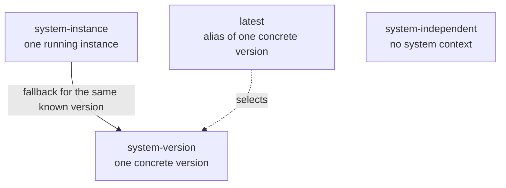

# Perspectives

An ORD perspective identifies the context for which metadata is valid.
It lets a provider distinguish the static description of a concrete system version from the runtime description of a particular system instance.
Content that has no system context uses the separate `system-independent` perspective.

Each ORD document describes one perspective.
An ORD configuration can reference multiple documents so that a provider can publish the relevant perspectives separately.

## Perspective Model

| Perspective | Context | Purpose |
| --- | --- | --- |
| `system-version` | A system type and concrete system version | Canonical static metadata shared by instances running that version |
| `system-instance` | A concrete running system instance | Dynamic metadata including tenant-specific configuration, customization, and extensions |
| `system-independent` | No system | Globally shared metadata with an independent lifecycle |
| `system-type` | A system type without a concrete version | Deprecated legacy static publication model |

The `latest` value is an alias of a concrete system version, not a perspective and not a system version itself.
It provides a default for an unversioned static request without weakening the concrete identity required for version and tenant resolution.

## System-Version Perspective

The `system-version` perspective is the canonical static publication model.
It describes how a concrete version of a system type generally looks, without tenant-specific configuration or extensions.
The metadata is normally known at design-time or deploy-time and can be used before a system instance is provisioned.

A `system-version` document MUST provide `describedSystemVersion.version`.
The version MUST be a concrete [Semantic Versioning 2.0.0](https://semver.org/) value.
It MUST NOT use `latest` as its version value.

The resolved static view for a version is complete rather than a delta on another perspective.
A consumer does not combine it with another static perspective to reconstruct that version.
An aggregator MAY combine multiple documents published for the same system type, version, and perspective, provided that they do not describe the same ORD information more than once.

### Continuously Delivered Systems

A continuously delivered system may not have a commercial release version.
It should nevertheless assign a concrete SemVer to every immutable publication or deployment state that must be distinguished for discovery.

Use the system's version when it already follows SemVer.
Convert an existing non-SemVer version conservatively when necessary.
For example, `2` can become `2.0.0`, `2404` can become `2404.0.0`, and `2024-01-15` can become `2024.1.15`.

The concrete version identifier must remain stable while any system instance identifies itself as running that version.
Phased deployments therefore publish every concurrently running version rather than overwriting one fixed version.

## The `latest` Alias

The `latest` alias identifies the default concrete system version for consumers that request static metadata without specifying a version.
It does not mean that the aliased version is the version of every running tenant.

The `aliases` property is optional.
Providers normally omit it, in which case the aggregator selects the greatest available version according to SemVer precedence.
The provider responsible for the described system identity MAY explicitly assign `latest` when the default should be a different version, for example during a rollback or staged release.
At most one version of a system type MUST carry the alias at a time.

An explicit alias selects the concrete version as a whole.
It therefore also selects metadata contributed for that same concrete version by delegated providers, even though those providers do not assign the alias themselves.

If no version has an explicit `latest` alias, an aggregator SHOULD automatically select the greatest available version according to SemVer precedence.
When two available versions have equal SemVer precedence, for example because they differ only in build metadata, the provider should assign `latest` explicitly to avoid an ambiguous default.

Moving `latest` changes only the result of future unversioned static requests.
It MUST NOT change the result of a request for a concrete version or the resolution of a system instance whose version is known.

## System-Instance Perspective

The `system-instance` perspective describes a concrete running system instance as it actually looks at runtime.
It is appropriate when metadata differs between instances of the same system version because of configuration, entitlements, customization, extensions, or user-created resources.

Examples include APIs or events activated for one tenant, extended interface definitions, and resources created at runtime.

A `system-instance` document is a complete description, not a patch over static metadata.
When it is available, it replaces the static description for the requested instance instead of being merged with it.
If it is unavailable and the instance's concrete version is known, an aggregator can fall back to the matching `system-version` metadata.
It MUST NOT substitute `latest` or another version for a known tenant version.

Providers SHOULD include `describedSystemVersion.version` in `system-instance` metadata.
The concrete version is the join criterion between the running instance and its static description.

## System-Independent Perspective

The `system-independent` perspective describes content with no system-version or system-instance lifecycle.
Examples include globally governed vendors, products, entity types, groups, and group types.
Such singleton content SHOULD not be republished by individual systems.

Shared content that still describes a system's capabilities remains system-scoped and is published for its system version or instance.
See [Shared Taxonomy, Resources and Contracts](./shared-resources.md) for this distinction.

## Resolution Rules

Perspectives do not form a merge stack.
Resolution selects one complete view for the requested context.

### System-Instance Request

1. Return the `system-instance` metadata for the requested instance when it exists.
2. Otherwise, return the `system-version` metadata for the concrete version that the instance runs.
3. If that exact version is unavailable, return no fallback view.

The resolver does not use `latest` for an instance with a known version.

## Static Perspective Resolution

### Request for a Concrete Version

1. Return the `system-version` metadata for that exact version.
2. If it is unavailable, return no static view.

The resolver does not substitute `latest`, a greater version, or legacy `system-type` metadata.

### Unversioned Static Request

1. Return the `system-version` metadata for the version carrying the explicit `latest` alias, if exactly one exists.
2. Otherwise, return the greatest available `system-version` according to SemVer precedence.
3. Only if no `system-version` metadata exists for the system type, return legacy `system-type` metadata when available.
4. If multiple versions explicitly carry `latest`, report a validation error and do not choose one silently.

## Provider Responsibilities

A provider publishing new static metadata SHOULD use `system-version` with a concrete version.
If dynamic metadata exists, the provider SHOULD also publish a complete `system-instance` perspective.
The two perspectives MUST use the same ORD IDs for the same resources and MUST NOT describe those resources inconsistently.

The provider responsible for onboarding and identifying a system type owns the concrete version model and the explicit `latest` assignment.
A delegated provider publishing metadata on behalf of that system type MUST use the same `system-version` perspective and concrete versions.
A delegated provider SHOULD NOT assign `latest` independently.

These rules ensure that metadata from multiple providers can be aggregated by system type and concrete version without requiring the aggregator to know which provider owns each resource.

## Legacy `system-type` Compatibility

The `system-type` perspective is deprecated.
It remains valid so existing documents can still be ingested during migration.
It represents a legacy current static view without a concrete version and is not a source of version-independent deltas.

An aggregator uses legacy `system-type` metadata as the implicit `latest` view only when no `system-version` metadata exists for that system type.
It does not merge `system-type` resources into a `system-version` view.

Consequently, an owning provider and all delegated providers must migrate a system type together.
Publishing any `system-version` metadata switches resolution to the versioned model, so remaining `system-type` contributions no longer appear in the resolved static view.

## Migration from `systemInstanceAware`

The `perspective` attribute supersedes the deprecated `systemInstanceAware` attribute.
Replace `systemInstanceAware: true` with `perspective: "system-instance"`.
Split static and dynamic metadata into separate, complete documents with their respective perspectives.
See the [`perspective` property on the ORD Configuration](../../spec-v1/interfaces/Configuration.md) interface for the configuration format.

## Tombstones Across Versions

An older version can contain a resource that is tombstoned in a newer version.
Resolution MUST NOT reintroduce the removed resource from another version.
Each resolved version remains a complete view with its own tombstone state.
