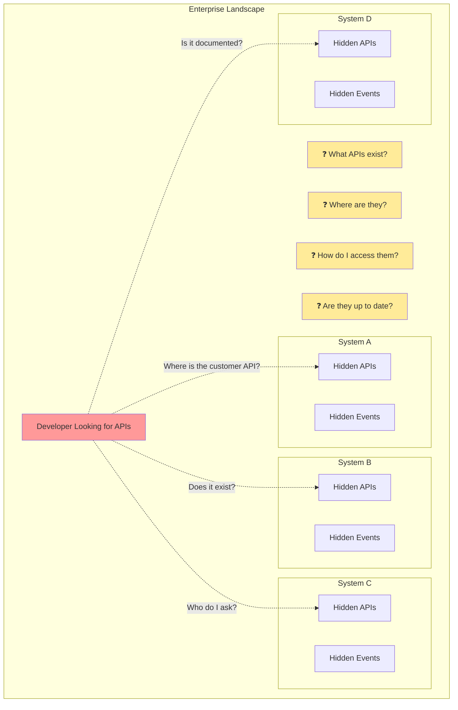
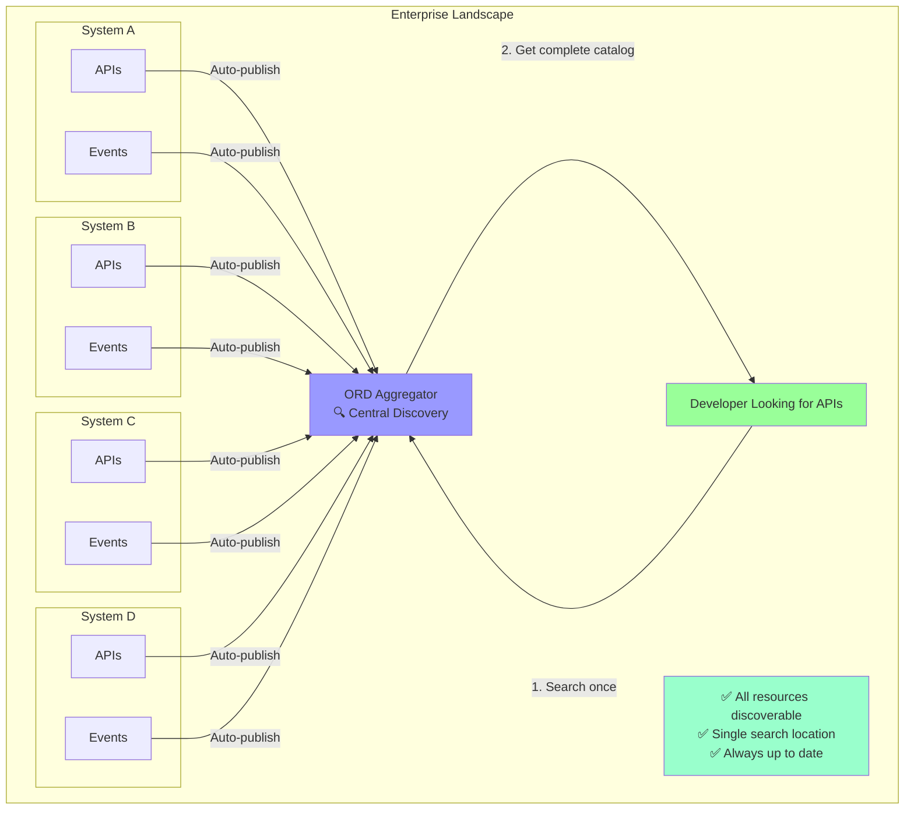

# Idea 1: The Lost API Problem

## Core Metaphor
"Finding a needle in a haystack" - Resources exist but are impossible to discover

## Visual Representation

### Mermaid Diagram: Before ORD



### Mermaid Diagram: After ORD



### Alternative SVG Visualization: The Discovery Journey

```svg
<svg viewBox="0 0 800 400" xmlns="http://www.w3.org/2000/svg">
  <!-- Title -->
  <text x="400" y="30" font-size="24" font-weight="bold" text-anchor="middle" fill="#333">
    The Lost API Problem
  </text>

  <!-- Before ORD (Left Side) -->
  <g id="before">
    <text x="200" y="60" font-size="18" font-weight="bold" text-anchor="middle" fill="#d9534f">
      WITHOUT ORD
    </text>

    <!-- Developer -->
    <circle cx="200" cy="100" r="20" fill="#ff9999"/>
    <text x="200" y="105" font-size="12" text-anchor="middle">👤</text>
    <text x="200" y="130" font-size="11" text-anchor="middle">Developer</text>

    <!-- Scattered Systems -->
    <rect x="50" y="160" width="80" height="50" rx="5" fill="#ddd" stroke="#666"/>
    <text x="90" y="190" font-size="10" text-anchor="middle">System A</text>
    <text x="90" y="203" font-size="9" text-anchor="middle">???</text>

    <rect x="160" y="160" width="80" height="50" rx="5" fill="#ddd" stroke="#666"/>
    <text x="200" y="190" font-size="10" text-anchor="middle">System B</text>
    <text x="200" y="203" font-size="9" text-anchor="middle">???</text>

    <rect x="270" y="160" width="80" height="50" rx="5" fill="#ddd" stroke="#666"/>
    <text x="310" y="190" font-size="10" text-anchor="middle">System C</text>
    <text x="310" y="203" font-size="9" text-anchor="middle">???</text>

    <!-- Question marks -->
    <text x="200" y="250" font-size="30" text-anchor="middle" fill="#ffa500">❓❓❓</text>

    <!-- Problems -->
    <text x="200" y="290" font-size="10" text-anchor="middle" fill="#d9534f">• Manual search</text>
    <text x="200" y="305" font-size="10" text-anchor="middle" fill="#d9534f">• Ask colleagues</text>
    <text x="200" y="320" font-size="10" text-anchor="middle" fill="#d9534f">• Outdated docs</text>
    <text x="200" y="335" font-size="10" text-anchor="middle" fill="#d9534f">• Wasted time</text>
  </g>

  <!-- Arrow -->
  <g id="arrow">
    <line x1="380" y1="200" x2="420" y2="200" stroke="#5cb85c" stroke-width="3" marker-end="url(#arrowhead)"/>
    <text x="400" y="195" font-size="12" text-anchor="middle" fill="#5cb85c" font-weight="bold">ORD</text>
    <defs>
      <marker id="arrowhead" markerWidth="10" markerHeight="10" refX="9" refY="3" orient="auto">
        <polygon points="0 0, 10 3, 0 6" fill="#5cb85c"/>
      </marker>
    </defs>
  </g>

  <!-- After ORD (Right Side) -->
  <g id="after">
    <text x="600" y="60" font-size="18" font-weight="bold" text-anchor="middle" fill="#5cb85c">
      WITH ORD
    </text>

    <!-- Developer -->
    <circle cx="600" cy="100" r="20" fill="#99ff99"/>
    <text x="600" y="105" font-size="12" text-anchor="middle">👤</text>
    <text x="600" y="130" font-size="11" text-anchor="middle">Developer</text>

    <!-- ORD Aggregator -->
    <rect x="540" y="160" width="120" height="60" rx="8" fill="#9999ff" stroke="#6666cc" stroke-width="2"/>
    <text x="600" y="185" font-size="12" font-weight="bold" text-anchor="middle" fill="white">ORD Aggregator</text>
    <text x="600" y="200" font-size="10" text-anchor="middle" fill="white">🔍 Central</text>
    <text x="600" y="212" font-size="10" text-anchor="middle" fill="white">Discovery</text>

    <!-- Organized Systems -->
    <rect x="480" y="250" width="60" height="35" rx="3" fill="#e6f3ff" stroke="#0066cc"/>
    <text x="510" y="272" font-size="8" text-anchor="middle">Sys A</text>

    <rect x="550" y="250" width="60" height="35" rx="3" fill="#e6f3ff" stroke="#0066cc"/>
    <text x="580" y="272" font-size="8" text-anchor="middle">Sys B</text>

    <rect x="620" y="250" width="60" height="35" rx="3" fill="#e6f3ff" stroke="#0066cc"/>
    <text x="650" y="272" font-size="8" text-anchor="middle">Sys C</text>

    <!-- Checkmarks -->
    <text x="600" y="315" font-size="30" text-anchor="middle" fill="#5cb85c">✓✓✓</text>

    <!-- Benefits -->
    <text x="600" y="340" font-size="10" text-anchor="middle" fill="#5cb85c">• One search location</text>
    <text x="600" y="355" font-size="10" text-anchor="middle" fill="#5cb85c">• Complete catalog</text>
    <text x="600" y="370" font-size="10" text-anchor="middle" fill="#5cb85c">• Always current</text>
    <text x="600" y="385" font-size="10" text-anchor="middle" fill="#5cb85c">• Self-service</text>
  </g>
</svg>
```

---

## Presentation Guide (5-7 minutes)

### Slide 1: Title
**"The Lost API Problem"**
- Subtitle: "Why finding resources in your enterprise is like searching for a needle in a haystack"

### Slide 2: The Scenario
**Story Opening:**
"Imagine you're a developer. Your manager asks: 'Can you integrate our app with the customer management system?' You think: 'Sure, I just need to find the right API...'"

**Show:** Visual of confused developer

### Slide 3: The Search Begins
**The Questions:**
- "What APIs exist in our landscape?"
- "Which system has customer data?"
- "How do I access it?"
- "Is the documentation up to date?"

**Show:** Mermaid diagram "Before ORD" (developer with question marks)

### Slide 4: The Reality
**Current Situation:**
- Call colleagues: "Hey, do you know where the customer API is?"
- Search internal wikis (outdated)
- Check Slack channels
- Eventually find someone who worked on it 2 years ago
- Documentation doesn't match current reality
- **Result: Days wasted on discovery**

**Show:** Timeline showing wasted days

### Slide 5: Why This Happens
**The Root Causes:**
1. **No Central Registry** - Each system is an island
2. **No Standard Format** - Every system documents differently
3. **No Auto-Discovery** - Manual cataloging falls behind
4. **No Runtime Truth** - Docs show design-time, not reality

**Show:** Icons for each problem

### Slide 6: Enter ORD
**The Solution:**
"What if every system could automatically announce: 'Here's what I offer, here's how to access it, and here's my current state'?"

**Show:** Lightbulb moment, transition animation

### Slide 7: How ORD Works
**The ORD Way:**
1. Every system publishes ORD metadata (automatic)
2. Central aggregator collects it (automatic)
3. Developer searches once, finds everything (instant)
4. Metadata reflects runtime reality (always current)

**Show:** Mermaid diagram "After ORD" (clean, organized)

### Slide 8: The Impact
**Before vs After:**
- Discovery time: Days → Minutes
- Accuracy: 50% → 100%
- Effort: Ask around → Self-service
- Coverage: Partial → Complete

**Show:** SVG comparison visualization

### Slide 9: Call to Action
**"Stop Losing APIs. Start Discovering."**
- Adopt ORD for your systems
- Make resources discoverable
- Join the ecosystem

---

## Video Script (90 seconds)

### [0:00-0:15] Opening Hook
**Visual:** Developer at computer, looking frustrated, searching through documentation
**Narration:**
"You're a developer. You need to integrate with another system. Simple, right? Just find the API. But where is it? What's it called? How do you access it? And is the documentation even correct?"

### [0:15-0:30] The Problem
**Visual:** Animated sequence showing:
- Multiple systems as black boxes
- Question marks floating around
- Developer making phone calls, searching wikis
- Calendar pages flipping (time passing)

**Narration:**
"This is the Lost API Problem. In complex enterprises, thousands of APIs exist across hundreds of systems. But there's no map. No directory. No central truth. Developers waste days hunting for resources that are already there—they just can't find them."

### [0:30-0:45] Why It Happens
**Visual:** Show 4 icons representing:
1. Scattered systems (islands)
2. Different document formats (puzzle pieces)
3. Manual process (person with clipboard)
4. Outdated docs (calendar with cobwebs)

**Narration:**
"Why? Because there's no standard way for systems to describe themselves. No automatic discovery. No central registry. And documentation quickly becomes outdated fantasy instead of current reality."

### [0:45-1:05] The Solution
**Visual:** Transition to ORD visualization:
- Systems lighting up, publishing ORD metadata
- Central aggregator collecting metadata
- Developer searching and finding instantly
- Green checkmarks appearing

**Narration:**
"Enter Open Resource Discovery—ORD. With ORD, every system automatically publishes what it offers in a standard format. A central aggregator collects this metadata. Now developers search once, in one place, and find everything—instantly. And because ORD reflects runtime reality, what you find is what you get."

### [1:05-1:20] The Impact
**Visual:** Split screen comparison:
- Left: Frustrated developer, days wasted (red X)
- Right: Happy developer, instant results (green checkmark)
- Show metrics transformation

**Narration:**
"The impact? Discovery time drops from days to minutes. Accuracy jumps from guesswork to 100% certainty. Manual hunting becomes self-service. And partial coverage becomes complete visibility."

### [1:20-1:30] Closing
**Visual:** ORD logo, ecosystem graphic showing connected systems

**Narration:**
"Stop losing APIs. Start discovering. Open Resource Discovery—making the invisible, visible. Learn more at open-resource-discovery.org."

**End card:** ORD logo + website URL

---

## Primer Text

### The Lost API Problem: Why Discovery Matters

#### The Developer's Dilemma

Every day, developers in enterprise organizations face a deceptively simple question: "What resources exist in our system landscape?" This should be easy to answer. After all, these are systems that the organization owns, operates, and pays for. Yet, in reality, finding an API, event stream, or data product is often like searching for a needle in a haystack—except you don't even know which haystack to search, or if the needle still exists.

Consider this scenario: A developer needs to integrate with a customer management system. They need an API to fetch customer details. The clock is ticking. The feature is already committed to the sprint. So they begin the hunt:

1. **Search the internal wiki** - Find a page last updated 3 years ago listing some APIs, but not the one needed
2. **Ask in Slack** - "Does anyone know where the customer API is?" - Wait hours for response
3. **Email the architecture team** - Get referred to someone who left the company
4. **Find a colleague who worked on something similar** - Get a Confluence link to outdated documentation
5. **Eventually discover the API exists** - But the access method has changed, and the documentation doesn't match reality
6. **Finally get it working** - After 3 days of what should have been a 30-minute task

This isn't a fictional worst-case scenario. This is the daily reality in most large organizations. The irony? The API was there all along, running reliably in production. It just wasn't discoverable.

#### The Root Cause: Four Fundamental Problems

**1. No Central Registry**

Unlike public APIs that can be found via Google or API directories, internal enterprise resources have no standard home. Some are documented in Confluence, others in Swagger UI instances, some in SharePoint, many nowhere at all. Each system is an island, and there's no map of the archipelago.

**2. No Standard Format**

Even when documentation exists, it comes in countless flavors: OpenAPI for REST APIs, AsyncAPI for events, OData CSDL for OData services, WSDL for SOAP, GraphQL schemas, gRPC proto files, and countless custom formats. Each requires different tools, different knowledge, and different access methods. There's no common language.

**3. No Automatic Discovery**

Most organizations attempt to solve this with manual catalogs: "Please register your API in our API portal." This works initially but falls apart over time. Systems change, new APIs are added, old ones are deprecated, and the manual catalog becomes increasingly disconnected from reality. Manual processes don't scale and can't keep pace with change.

**4. No Runtime Truth**

Traditional documentation describes the design—what the system *should* offer. But in enterprise environments, systems are customized, extended, configured, and modified. Extensions are added, optional features are enabled or disabled, tenant-specific customizations are deployed. The design-time documentation shows what could be, not what actually is. Developers need to know: "What does this specific instance of the system offer right now?"

#### The Consequences: Beyond Wasted Time

The Lost API Problem creates a cascade of negative effects:

**For Developers:**
- **Time Waste:** Days spent on discovery instead of development
- **Frustration:** Endless hunting and asking around
- **Duplication:** Building something that already exists because they couldn't find it
- **Risk:** Using wrong or outdated APIs due to incorrect documentation

**For Organizations:**
- **Reduced Velocity:** Integration projects take weeks instead of days
- **Higher Costs:** Manual discovery and integration efforts multiply across projects
- **Missed Opportunities:** Existing capabilities go unused because no one knows they exist
- **Integration Debt:** Point-to-point integrations proliferate because systematic discovery doesn't exist

**For the Ecosystem:**
- **Fragmentation:** Each consumer builds custom discovery mechanisms
- **Lock-in:** Proprietary discovery methods prevent interoperability
- **Scale Barriers:** O(n×m) complexity prevents ecosystem growth

#### The Solution: Open Resource Discovery (ORD)

Open Resource Discovery solves the Lost API Problem by introducing a standard protocol for systems to describe themselves—automatically, completely, and accurately.

**The ORD Approach:**

1. **Self-Description:** Every system publishes ORD metadata at a well-known endpoint (`/.well-known/open-resource-discovery`). This metadata describes all resources the system offers: APIs, events, entity types, data products, and their relationships.

2. **Standard Format:** All ORD metadata uses a single, machine-readable JSON format with a well-defined schema. Whether it's a REST API, an event stream, or a data product, the discovery mechanism is consistent.

3. **Automatic Publishing:** ORD metadata is generated automatically from the system's runtime state. No manual cataloging, no documentation drift. What the system publishes is exactly what it offers—right now.

4. **Central Aggregation:** ORD aggregators collect metadata from all systems, creating a complete, up-to-date catalog of the entire landscape. Developers search once, in one place, using one tool.

5. **Runtime Reality:** ORD supports both static (design-time) and dynamic (runtime) perspectives. You can discover not just what a product generally offers, but what this specific instance, with these specific configurations and extensions, offers today.

**The Developer Experience Transformation:**

With ORD, the scenario changes completely:

1. **Open the ORD catalog** - A central, searchable interface
2. **Search for "customer"** - Find all customer-related resources across all systems
3. **See the API** - Complete metadata: description, access method, authentication, rate limits
4. **See related resources** - Related events, entity types, data products
5. **See runtime status** - This instance has the "premium customer" extension enabled
6. **Start integrating** - From question to integration in 5 minutes

#### The Impact: From O(n×m) to O(1)

The mathematical impact is profound. In a landscape with n systems and m consumers:

**Without ORD:** Each consumer must integrate with each provider separately. Total integration points: n × m. A landscape with 100 systems and 50 consumers requires 5,000 integration points.

**With ORD:** Each provider publishes to ORD once (n integrations). Each consumer consumes from ORD aggregators once (m integrations). Total integration points: n + m. The same landscape requires only 150 integration points.

This isn't just efficiency—it's a fundamentally different architecture that makes previously impossible use cases practical.

#### Beyond Discovery: The Ecosystem Effect

When systems are discoverable, new possibilities emerge:

- **Automated Integration:** Tools can discover and configure integrations automatically
- **Landscape Visualization:** See your entire system landscape, how systems connect, what they offer
- **Impact Analysis:** "If I change this API, what consumers are affected?"
- **Smart Recommendations:** "You're building X; these existing resources can help"
- **AI Grounding:** AI agents can discover and use your APIs automatically
- **Governance:** Automatically audit what's exposed, track API sprawl, enforce standards

#### Conclusion: Making the Invisible Visible

The Lost API Problem persists not because of technology limitations, but because of the lack of a standard discovery protocol. APIs exist. Events flow. Data products are available. But they might as well not exist if developers can't find them.

Open Resource Discovery changes this. It makes the invisible visible. It turns the haystack into a searchable, navigable catalog. It transforms days of hunting into minutes of searching. It shifts integration from point-to-point chaos to ecosystem-wide efficiency.

The question isn't whether your organization has a discovery problem—every enterprise does. The question is: how much longer will you let resources stay lost?

**Learn more:** [open-resource-discovery.org](https://open-resource-discovery.org)

---

## Summary

**Idea 1** frames ORD through the lens of **discovery friction**—the everyday frustration developers face when they can't find resources that already exist. It uses relatable storytelling and the "lost needle in haystack" metaphor to make the problem visceral and the solution obvious.

**Best for:** Developer-focused audiences, technical presentations, onboarding materials
**Emotional tone:** Frustration → Relief
**Key message:** "Stop wasting time searching. Start discovering."
