# Idea 2: The Integration Explosion

## Core Metaphor
"Exponential complexity" - Point-to-point integrations create unsustainable O(n×m) growth

## Visual Representation

### Mermaid Diagram: The Explosion (Before ORD)


### Mermaid Diagram: Controlled Growth (After ORD)


### Mermaid Diagram: Complexity Growth Comparison

```mermaid
graph LR
    subgraph "Integration Complexity: O(n×m) vs O(n+m)"
        direction TB
        A[Systems in Landscape]

        subgraph "Without ORD"
            B1[10 providers × 10 consumers<br/>= 100 integrations]
            B2[50 providers × 50 consumers<br/>= 2,500 integrations]
            B3[100 providers × 100 consumers<br/>= 10,000 integrations]
        end

        subgraph "With ORD"
            C1[10 providers + 10 consumers<br/>= 20 integrations]
            C2[50 providers + 50 consumers<br/>= 100 integrations]
            C3[100 providers + 100 consumers<br/>= 200 integrations]
        end

        A --> B1
        B1 --> B2
        B2 --> B3

        A --> C1
        C1 --> C2
        C2 --> C3
    end

    style B1 fill:#ffcccc
    style B2 fill:#ff9999
    style B3 fill:#ff6666
    style C1 fill:#ccffcc
    style C2 fill:#99ff99
    style C3 fill:#66ff66
```



### SVG Visualization: The Integration Explosion

```svg
<svg viewBox="0 0 900 500" xmlns="http://www.w3.org/2000/svg">
  <!-- Title -->
  <text x="450" y="30" font-size="24" font-weight="bold" text-anchor="middle" fill="#333">
    The Integration Explosion
  </text>
  <text x="450" y="55" font-size="14" text-anchor="middle" fill="#666">
    Point-to-Point vs. Centralized Discovery
  </text>

  <!-- Without ORD Section -->
  <g id="without-ord">
    <text x="220" y="90" font-size="16" font-weight="bold" text-anchor="middle" fill="#d9534f">
      WITHOUT ORD: O(n×m)
    </text>

    <!-- Providers (left) -->
    <rect x="30" y="110" width="70" height="40" rx="5" fill="#ff9999" stroke="#cc0000"/>
    <text x="65" y="133" font-size="11" text-anchor="middle" fill="#000">Provider A</text>

    <rect x="30" y="160" width="70" height="40" rx="5" fill="#ff9999" stroke="#cc0000"/>
    <text x="65" y="183" font-size="11" text-anchor="middle" fill="#000">Provider B</text>

    <rect x="30" y="210" width="70" height="40" rx="5" fill="#ff9999" stroke="#cc0000"/>
    <text x="65" y="233" font-size="11" text-anchor="middle" fill="#000">Provider C</text>

    <rect x="30" y="260" width="70" height="40" rx="5" fill="#ff9999" stroke="#cc0000"/>
    <text x="65" y="283" font-size="11" text-anchor="middle" fill="#000">Provider D</text>

    <!-- Consumers (right) -->
    <rect x="340" y="110" width="70" height="40" rx="5" fill="#ffcc99" stroke="#ff6600"/>
    <text x="375" y="133" font-size="11" text-anchor="middle" fill="#000">Consumer 1</text>

    <rect x="340" y="160" width="70" height="40" rx="5" fill="#ffcc99" stroke="#ff6600"/>
    <text x="375" y="183" font-size="11" text-anchor="middle" fill="#000">Consumer 2</text>

    <rect x="340" y="210" width="70" height="40" rx="5" fill="#ffcc99" stroke="#ff6600"/>
    <text x="375" y="233" font-size="11" text-anchor="middle" fill="#000">Consumer 3</text>

    <rect x="340" y="260" width="70" height="40" rx="5" fill="#ffcc99" stroke="#ff6600"/>
    <text x="375" y="283" font-size="11" text-anchor="middle" fill="#000">Consumer 4</text>

    <!-- Connection lines (4×4=16 lines) -->
    <line x1="100" y1="130" x2="340" y2="130" stroke="#cc0000" stroke-width="1" opacity="0.3"/>
    <line x1="100" y1="130" x2="340" y2="180" stroke="#cc0000" stroke-width="1" opacity="0.3"/>
    <line x1="100" y1="130" x2="340" y2="230" stroke="#cc0000" stroke-width="1" opacity="0.3"/>
    <line x1="100" y1="130" x2="340" y2="280" stroke="#cc0000" stroke-width="1" opacity="0.3"/>

    <line x1="100" y1="180" x2="340" y2="130" stroke="#cc0000" stroke-width="1" opacity="0.3"/>
    <line x1="100" y1="180" x2="340" y2="180" stroke="#cc0000" stroke-width="1" opacity="0.3"/>
    <line x1="100" y1="180" x2="340" y2="230" stroke="#cc0000" stroke-width="1" opacity="0.3"/>
    <line x1="100" y1="180" x2="340" y2="280" stroke="#cc0000" stroke-width="1" opacity="0.3"/>

    <line x1="100" y1="230" x2="340" y2="130" stroke="#cc0000" stroke-width="1" opacity="0.3"/>
    <line x1="100" y1="230" x2="340" y2="180" stroke="#cc0000" stroke-width="1" opacity="0.3"/>
    <line x1="100" y1="230" x2="340" y2="230" stroke="#cc0000" stroke-width="1" opacity="0.3"/>
    <line x1="100" y1="230" x2="340" y2="280" stroke="#cc0000" stroke-width="1" opacity="0.3"/>

    <line x1="100" y1="280" x2="340" y2="130" stroke="#cc0000" stroke-width="1" opacity="0.3"/>
    <line x1="100" y1="280" x2="340" y2="180" stroke="#cc0000" stroke-width="1" opacity="0.3"/>
    <line x1="100" y1="280" x2="340" y2="230" stroke="#cc0000" stroke-width="1" opacity="0.3"/>
    <line x1="100" y1="280" x2="340" y2="280" stroke="#cc0000" stroke-width="1" opacity="0.3"/>

    <!-- Explosion indicator -->
    <circle cx="220" cy="200" r="60" fill="#ff0000" opacity="0.1" stroke="#ff0000" stroke-width="2" stroke-dasharray="5,5"/>
    <text x="220" y="200" font-size="40" text-anchor="middle" fill="#ff0000">💥</text>

    <!-- Stats -->
    <rect x="130" y="320" width="180" height="60" rx="5" fill="#fff" stroke="#d9534f" stroke-width="2"/>
    <text x="220" y="340" font-size="12" font-weight="bold" text-anchor="middle" fill="#d9534f">4 × 4 = 16 integrations</text>
    <text x="220" y="358" font-size="10" text-anchor="middle" fill="#666">Each provider implements 4</text>
    <text x="220" y="372" font-size="10" text-anchor="middle" fill="#666">Each consumer integrates 4</text>
  </g>

  <!-- Divider -->
  <line x1="450" y1="80" x2="450" y2="400" stroke="#ccc" stroke-width="2"/>

  <!-- With ORD Section -->
  <g id="with-ord">
    <text x="675" y="90" font-size="16" font-weight="bold" text-anchor="middle" fill="#5cb85c">
      WITH ORD: O(n+m)
    </text>

    <!-- Providers (top) -->
    <rect x="490" y="110" width="60" height="35" rx="5" fill="#99ff99" stroke="#00cc00"/>
    <text x="520" y="130" font-size="10" text-anchor="middle" fill="#000">Provider A</text>

    <rect x="560" y="110" width="60" height="35" rx="5" fill="#99ff99" stroke="#00cc00"/>
    <text x="590" y="130" font-size="10" text-anchor="middle" fill="#000">Provider B</text>

    <rect x="630" y="110" width="60" height="35" rx="5" fill="#99ff99" stroke="#00cc00"/>
    <text x="660" y="130" font-size="10" text-anchor="middle" fill="#000">Provider C</text>

    <rect x="700" y="110" width="60" height="35" rx="5" fill="#99ff99" stroke="#00cc00"/>
    <text x="730" y="130" font-size="10" text-anchor="middle" fill="#000">Provider D</text>

    <!-- ORD Aggregator (center) -->
    <rect x="590" y="175" width="100" height="60" rx="8" fill="#9999ff" stroke="#0000cc" stroke-width="3"/>
    <text x="640" y="195" font-size="13" font-weight="bold" text-anchor="middle" fill="#fff">ORD</text>
    <text x="640" y="210" font-size="12" font-weight="bold" text-anchor="middle" fill="#fff">Aggregator</text>
    <text x="640" y="226" font-size="11" text-anchor="middle" fill="#fff">🔄</text>

    <!-- Consumers (bottom) -->
    <rect x="490" y="265" width="60" height="35" rx="5" fill="#99ccff" stroke="#0066cc"/>
    <text x="520" y="285" font-size="10" text-anchor="middle" fill="#000">Consumer 1</text>

    <rect x="560" y="265" width="60" height="35" rx="5" fill="#99ccff" stroke="#0066cc"/>
    <text x="590" y="285" font-size="10" text-anchor="middle" fill="#000">Consumer 2</text>

    <rect x="630" y="265" width="60" height="35" rx="5" fill="#99ccff" stroke="#0066cc"/>
    <text x="660" y="285" font-size="10" text-anchor="middle" fill="#000">Consumer 3</text>

    <rect x="700" y="265" width="60" height="35" rx="5" fill="#99ccff" stroke="#0066cc"/>
    <text x="730" y="285" font-size="10" text-anchor="middle" fill="#000">Consumer 4</text>

    <!-- Connections: Providers to ORD (4 lines) -->
    <line x1="520" y1="145" x2="615" y2="175" stroke="#00cc00" stroke-width="2" marker-end="url(#arrow-green)"/>
    <line x1="590" y1="145" x2="625" y2="175" stroke="#00cc00" stroke-width="2" marker-end="url(#arrow-green)"/>
    <line x1="660" y1="145" x2="655" y2="175" stroke="#00cc00" stroke-width="2" marker-end="url(#arrow-green)"/>
    <line x1="730" y1="145" x2="665" y2="175" stroke="#00cc00" stroke-width="2" marker-end="url(#arrow-green)"/>

    <!-- Connections: ORD to Consumers (4 lines) -->
    <line x1="615" y1="235" x2="520" y2="265" stroke="#0066cc" stroke-width="2" marker-end="url(#arrow-blue)"/>
    <line x1="625" y1="235" x2="590" y2="265" stroke="#0066cc" stroke-width="2" marker-end="url(#arrow-blue)"/>
    <line x1="655" y1="235" x2="660" y2="265" stroke="#0066cc" stroke-width="2" marker-end="url(#arrow-blue)"/>
    <line x1="665" y1="235" x2="730" y2="265" stroke="#0066cc" stroke-width="2" marker-end="url(#arrow-blue)"/>

    <!-- Arrow markers -->
    <defs>
      <marker id="arrow-green" markerWidth="10" markerHeight="10" refX="9" refY="3" orient="auto">
        <polygon points="0 0, 10 3, 0 6" fill="#00cc00"/>
      </marker>
      <marker id="arrow-blue" markerWidth="10" markerHeight="10" refX="9" refY="3" orient="auto">
        <polygon points="0 0, 10 3, 0 6" fill="#0066cc"/>
      </marker>
    </defs>

    <!-- Stats -->
    <rect x="585" y="320" width="110" height="60" rx="5" fill="#fff" stroke="#5cb85c" stroke-width="2"/>
    <text x="640" y="340" font-size="12" font-weight="bold" text-anchor="middle" fill="#5cb85c">4 + 4 = 8 integrations</text>
    <text x="640" y="358" font-size="10" text-anchor="middle" fill="#666">Each provider: 1</text>
    <text x="640" y="372" font-size="10" text-anchor="middle" fill="#666">Each consumer: 1</text>
  </g>

  <!-- Bottom comparison -->
  <rect x="50" y="420" width="800" height="60" rx="5" fill="#f9f9f9" stroke="#ccc"/>
  <text x="450" y="440" font-size="13" font-weight="bold" text-anchor="middle" fill="#333">Scale Impact</text>
  <text x="220" y="460" font-size="11" text-anchor="middle" fill="#d9534f">100 systems × 100 consumers = 10,000 integrations</text>
  <text x="680" y="460" font-size="11" text-anchor="middle" fill="#5cb85c">100 systems + 100 consumers = 200 integrations</text>
  <text x="450" y="475" font-size="12" font-weight="bold" text-anchor="middle" fill="#ff6600">50x reduction!</text>
</svg>
```

---

## Presentation Guide (5-7 minutes)

### Slide 1: Title
**"The Integration Explosion"**
- Subtitle: "Why point-to-point metadata integration doesn't scale"

### Slide 2: The Math of Complexity
**Opening Question:**
"How many integrations do you need in your enterprise?"

**Show:** Simple equation
- n systems that provide metadata
- m systems that consume metadata
- Total integrations = ?

### Slide 3: The Wrong Answer: n × m
**Point-to-Point Approach:**
"The traditional approach: Each consumer integrates with each provider."

**Show:** Small example (3 providers × 3 consumers)
- 3 × 3 = 9 integration points
- Diagram showing messy connections

**The Problem:**
"This grows exponentially with scale."

### Slide 4: Scale Visualization
**Show:** Mermaid diagram with 5 providers × 4 consumers
- 20 lines crossing everywhere
- Explosion emoji in the center
- Visual chaos

**Animation:** Add one more provider → 4 new lines appear
**Animation:** Add one more consumer → 5 new lines appear

**Narration:**
"Each new provider must integrate with every consumer. Each new consumer must integrate with every provider. This is O(n×m) complexity—exponential growth."

### Slide 5: Real-World Impact
**Show Table:**

| Scale | Without ORD | Hours @ 8hrs/integration |
|-------|-------------|--------------------------|
| 10 × 10 | 100 integrations | 800 hours |
| 50 × 50 | 2,500 integrations | 20,000 hours |
| 100 × 100 | 10,000 integrations | 80,000 hours |

**Narration:**
"In a mid-size enterprise with 100 systems and 100 metadata consumers, you'd need 10,000 integration points. At 8 hours per integration, that's 80,000 hours—or 40 person-years of work. Just to enable discovery."

### Slide 6: The Maintenance Nightmare
**It Gets Worse:**
- New API added → Update ALL consumer integrations
- Format changes → Break ALL consumer integrations
- New consumer → Build ALL provider integrations from scratch

**Show:** Timeline of maintenance effort multiplying

**Narration:**
"And this isn't a one-time cost. Every change propagates to every integration. A single API update requires touching dozens of integrations. A new consumer must integrate with every provider. The cost never stops growing."

### Slide 7: The Right Answer: n + m
**Enter ORD:**
"What if there was a standard protocol?"

**Show:** ORD aggregator as hub-and-spoke
- Providers publish to ORD (n connections)
- Consumers read from ORD (m connections)
- Total: n + m

**The Impact:**
"This is O(n+m) complexity—linear growth instead of exponential."

### Slide 8: Side-by-Side Comparison
**Show:** Split screen animation
- Left: Mesh of 100×100 connections (10,000)
- Right: Hub with 100+100 connections (200)

**50x reduction in integration points**

### Slide 9: Scale Benefits Table
**Show:**

| Scale | Without ORD | With ORD | Reduction |
|-------|-------------|----------|-----------|
| 10 × 10 | 100 | 20 | 5x |
| 50 × 50 | 2,500 | 100 | 25x |
| 100 × 100 | 10,000 | 200 | 50x |
| 500 × 500 | 250,000 | 1,000 | 250x |

**Narration:**
"The benefits compound with scale. In a large enterprise, we're talking about a 250x reduction in integration complexity."

### Slide 10: Beyond the Math
**The Real Benefits:**
- **New provider?** One integration, instant access to all consumers
- **New consumer?** One integration, instant access to all providers
- **API changes?** Automatically propagated to all consumers
- **Maintenance?** Linear instead of exponential

### Slide 11: Ecosystem Effects
**Network Effects:**
"When everyone uses the same protocol, the ecosystem grows efficiently."

**Show:** Growth chart
- Without standard: Growth creates friction
- With standard: Growth creates value

**Examples:**
- New AI tools can discover all APIs automatically
- New analytics platforms gain instant coverage
- New integration tools work with everything

### Slide 12: Call to Action
**"Stop the Explosion. Start the Ecosystem."**
- Adopt ORD for your systems
- Shift from O(n×m) to O(n+m)
- Enable sustainable growth

---

## Video Script (90 seconds)

### [0:00-0:15] The Setup
**Visual:** Animated equation appearing:
- "n providers × m consumers = ?"
- Camera zooms into the "×" symbol, which starts pulsing

**Narration:**
"Here's a question: In an enterprise with n systems providing metadata and m systems consuming it, how many integrations do you need? If you answered n times m—you're right. And that's the problem."

### [0:15-0:35] The Explosion
**Visual:** Animation showing:
- Start with 3 providers and 3 consumers (9 lines)
- Add 1 provider → lines multiply
- Add 1 consumer → more lines multiply
- Speed up: systems adding rapidly, lines becoming chaos
- Screen fills with crossing lines, explosion effect
- Counter showing: "100 systems × 100 consumers = 10,000 integrations"

**Narration:**
"This is The Integration Explosion. Every provider must integrate with every consumer. Every consumer with every provider. It's O(n×m) complexity. In a mid-size enterprise, that's 10,000 integration points. And each one requires development, testing, documentation, and maintenance. It's unsustainable."

### [0:35-0:50] The Maintenance Trap
**Visual:** Animation of domino effect:
- Change one API
- Ripples to all connected consumers
- Clock spinning rapidly (time passing)
- Developer stress indicator rising

**Narration:**
"And it gets worse. Every API change ripples through every integration. Every new consumer must rebuild connections to every provider. The cost compounds forever. You're not building features—you're maintaining integrations."

### [0:50-1:10] The Solution
**Visual:** Transformation sequence:
- Mesh network dissolves
- ORD aggregator appears in center
- Clean hub-and-spoke emerges
- Providers connect to hub (count: +5)
- Consumers connect to hub (count: +4)
- Total: 9 instead of 20
- Scale up: "100 + 100 = 200" vs "10,000"
- "50x REDUCTION" appears

**Narration:**
"Open Resource Discovery changes the math. Instead of every-to-every, it's hub-and-spoke. Providers publish to ORD once. Consumers consume from ORD once. The complexity shifts from O(n×m) to O(n+m)—from exponential to linear. That same enterprise? 200 integrations instead of 10,000. A 50x reduction."

### [1:10-1:25] The Benefits
**Visual:** Split screen showing:
- Left: "Add new system" → Lines multiply, stress increases
- Right: "Add new system" → One new line, everything works
- Checkmarks appearing: "Instant access", "Auto-updates", "Ecosystem growth"

**Narration:**
"The impact? A new provider gets instant access to all consumers with one integration. A new consumer gets instant access to all providers the same way. Changes propagate automatically. And the ecosystem can grow sustainably instead of collapsing under its own weight."

### [1:25-1:30] Closing
**Visual:** ORD logo, graph showing linear vs exponential growth

**Narration:**
"Stop the explosion. Start the ecosystem. Open Resource Discovery—from exponential chaos to linear simplicity."

**End card:** ORD logo + "Learn more: open-resource-discovery.org"

---

## Primer Text

### The Integration Explosion: Why Point-to-Point Doesn't Scale

#### The Deceptive Simplicity of Starting Small

Every integration architecture starts with good intentions. You have System A that needs metadata from System B. You build a custom integration. It takes a week. It works. Problem solved.

Then System C needs the same metadata. You build another integration. Another week. Still manageable.

Then System A adds a new capability, and Systems B and C both need it. So you build two more integrations. Then System D arrives and needs everything from A, B, and C. More integrations.

Before you know it, you have a web of point-to-point connections that no one fully understands. And the cost of maintaining it is consuming your engineering capacity.

This is **The Integration Explosion**—and it's a mathematical inevitability of point-to-point architecture.

#### The Math: O(n×m) Complexity

The problem is rooted in simple mathematics:

- You have **n** systems that provide metadata (APIs, events, schemas, etc.)
- You have **m** systems that consume that metadata (catalogs, integration platforms, developer tools, etc.)
- In a point-to-point architecture, each consumer must integrate with each provider
- **Total integration points = n × m**

This is what computer scientists call **O(n×m) complexity**—the number of integrations grows multiplicatively as you add systems.

Let's look at real numbers:

**Small Scale:**
- 10 providers × 10 consumers = **100 integrations**
- At 8 hours per integration: 800 hours (20 weeks)

**Medium Scale:**
- 50 providers × 50 consumers = **2,500 integrations**
- At 8 hours per integration: 20,000 hours (10 person-years)

**Large Scale:**
- 100 providers × 100 consumers = **10,000 integrations**
- At 8 hours per integration: 80,000 hours (40 person-years)

**Enterprise Scale:**
- 500 providers × 500 consumers = **250,000 integrations**
- At 8 hours per integration: 2,000,000 hours (1,000 person-years)

And remember: this isn't a one-time cost. This is the baseline complexity that must be maintained forever.

#### The Hidden Costs: Beyond Initial Implementation

The initial integration is just the beginning. Point-to-point architecture creates ongoing costs that grow over time:

**1. Change Propagation**

When a provider changes its metadata format or adds a new capability:
- **Every consumer integration must be updated**
- With 100 consumers, one provider change requires touching 100 integrations
- Each update risks breaking existing functionality
- Testing effort multiplies across all integrations

**2. New Consumer Onboarding**

When a new metadata consumer joins the ecosystem:
- **It must integrate with every existing provider**
- It can't leverage any existing integration work
- Time-to-value is measured in months, not days
- The integration burden delays or prevents adoption

**3. New Provider Onboarding**

When a system wants to share its metadata:
- **It must build integrations for every consumer**
- Each consumer has different requirements and interfaces
- The effort discourages providers from participating
- Valuable metadata remains locked in silos

**4. Version Management**

As systems evolve:
- Different provider versions
- Different consumer versions
- Combinatorial explosion of version compatibility
- No central source of truth

**5. Duplicate Effort**

Across all integrations:
- Similar problems solved repeatedly
- Similar code written dozens of times
- Similar bugs discovered and fixed multiple times
- No reuse, no shared learning

#### The Real-World Manifestations

In practice, The Integration Explosion manifests in several painful ways:

**For Engineering Teams:**
- "We spend more time maintaining integrations than building features"
- "Every release breaks someone's integration"
- "We have three teams just doing integration work"
- "Our backlog is 80% integration requests"

**For New Initiatives:**
- "We can't build that API catalog—it would take 2 years to integrate everything"
- "The AI project is blocked waiting for API metadata"
- "Our integration platform can't support more than 20 systems"
- "We cancelled the landscape visualization—too many integrations"

**For Business:**
- Integration projects measured in quarters, not weeks
- New systems delayed by integration complexity
- Innovation stifled by maintenance burden
- Competitive disadvantage from slow adaptation

#### Why It Happens: The Lack of a Standard

The Integration Explosion isn't caused by poor engineering. It's caused by the absence of a standard protocol for metadata discovery and exchange.

Without a standard:
- Each provider creates its own metadata format
- Each consumer creates its own integration approach
- Every provider-consumer pair is a unique snowflake
- No reuse is possible

It's like the pre-HTTP internet. Before the web standardized on HTTP, every information service needed custom client software. Want to access a different FTP server? Custom configuration. Different Gopher site? Different client. The explosion of services was limited by the explosion of integration complexity.

HTTP solved this by providing a standard protocol. Suddenly, one browser could access millions of sites. The ecosystem could scale.

ORD does the same for metadata discovery.

#### The ORD Solution: O(n+m) Complexity

Open Resource Discovery changes the architecture from point-to-point to hub-and-spoke:

**The ORD Architecture:**
1. **Providers publish to ORD** - Each system exposes ORD metadata at a well-known endpoint (n integrations)
2. **Aggregators collect from providers** - Central ORD aggregators pull from all providers
3. **Consumers read from aggregators** - Each consumer integrates with ORD aggregators (m integrations)

**Total integration points = n + m**

This is **O(n+m) complexity**—the number of integrations grows linearly, not exponentially.

**The Same Numbers, Transformed:**

**Small Scale:**
- 10 providers + 10 consumers = **20 integrations** (was 100)
- **5x reduction**

**Medium Scale:**
- 50 providers + 50 consumers = **100 integrations** (was 2,500)
- **25x reduction**

**Large Scale:**
- 100 providers + 100 consumers = **200 integrations** (was 10,000)
- **50x reduction**

**Enterprise Scale:**
- 500 providers + 500 consumers = **1,000 integrations** (was 250,000)
- **250x reduction**

#### Why Linear Beats Exponential: The Compound Benefits

The shift from O(n×m) to O(n+m) creates benefits that compound over time:

**1. Sustainable Growth**

- Adding a new provider: **1 integration** (not m integrations)
- Adding a new consumer: **1 integration** (not n integrations)
- The ecosystem can grow without hitting complexity walls

**2. Change Management**

- Provider updates metadata: **Automatic propagation** (not manual updates to m integrations)
- Consumer needs new data: **Query aggregator** (not build n integrations)
- Changes flow through the standard protocol

**3. Instant Ecosystem Access**

- New provider: **Immediately visible to all consumers**
- New consumer: **Immediately sees all providers**
- Time-to-value drops from months to minutes

**4. Network Effects**

- Each new provider increases value for all consumers
- Each new consumer increases incentive for providers
- Positive feedback loop instead of growing burden

**5. Innovation Enablement**

- Build a new catalog: **One ORD integration, instant coverage**
- Build AI agents: **One ORD integration, access all APIs**
- Build analytics: **One ORD integration, complete landscape**

#### The Practical Impact: Case Study

Consider a real scenario:

**Company XYZ wants to build an API catalog**

**Without ORD:**
- Must integrate with 80 different systems
- Each system has a different metadata format
- Each integration takes 1-2 weeks
- Total time: 80-160 weeks (1.5-3 years)
- Maintenance: 80 integrations to keep updated
- **Result: Project deemed not feasible**

**With ORD:**
- Integrate with ORD aggregator: 1 integration
- Get metadata from all 80 systems automatically
- Integration time: 1-2 weeks
- Maintenance: 1 integration to keep updated
- **Result: Catalog live in 2 weeks**

The same project goes from "impossible" to "trivial."

#### The Ecosystem Multiplier

The true power of O(n+m) complexity appears when you consider ecosystem effects.

In a point-to-point world:
- Building a new metadata consumer is prohibitively expensive
- Most potential consumers never get built
- The ecosystem remains limited

In an ORD world:
- Building a new metadata consumer requires one integration
- Dozens of consumer use cases become feasible
- The ecosystem explodes with innovation:
  - AI agents that automatically discover and use APIs
  - Low-code platforms with complete API coverage
  - Security scanning across all exposed surfaces
  - Automated documentation generation
  - Cost allocation based on actual usage
  - Compliance checking
  - Landscape visualization
  - And hundreds more use cases

Each consumer benefits from all providers. Each provider benefits from all consumers. The whole becomes greater than the sum of parts.

#### The Anti-Pattern: Hub-and-Spoke Without a Standard

Some organizations attempt to solve The Integration Explosion by building a central metadata repository. This seems like the right idea—and it is partially correct. But without a standard protocol, you end up with:

- A proprietary hub that requires custom integrations (still n×1 for providers)
- Only works within one organization
- Locks everyone into a single vendor
- Doesn't enable ecosystem effects
- Eventually becomes a bottleneck

ORD provides the standard protocol that makes hub-and-spoke architecture work at ecosystem scale, across organizational boundaries, with multiple aggregators competing and specializing.

#### Conclusion: Math Matters

The Integration Explosion isn't a people problem, a process problem, or a tooling problem. It's a math problem. O(n×m) complexity is fundamentally unsustainable at scale.

You can't optimize your way out of exponential growth. You can't hire your way out. You can't manage your way out.

The only solution is to change the math—from O(n×m) to O(n+m).

Open Resource Discovery changes the math. It shifts metadata integration from exponential to linear complexity. From unsustainable to sustainable. From blocking growth to enabling it.

The question isn't whether your organization has an integration explosion—it does, or will soon. The question is: how much longer will you let exponential complexity hold you back?

**Learn more:** [open-resource-discovery.org](https://open-resource-discovery.org)

---

## Summary

**Idea 2** frames ORD through the lens of **mathematical complexity**—the cold, hard numbers that make point-to-point integration unsustainable. It uses concrete calculations, visual network diagrams, and comparison charts to make the problem undeniable and the solution obvious.

**Best for:** C-level executives, architects, decision-makers who respond to data
**Emotional tone:** Overwhelm → Control
**Key message:** "Stop exponential chaos. Start linear growth."
