# Idea 3: The Metadata Drift

## Core Metaphor
"The map is not the territory" - Documentation describes design-time fantasy, not runtime reality

## Visual Representation

### Mermaid Diagram: Documentation vs Reality Timeline


### Mermaid Diagram: The Drift in Action

```mermaid
graph TB
    subgraph "January 2024: LAUNCH"
        Design1[Design-Time Documentation]
        Reality1[System Reality]
        Design1 -.->|matches| Reality1
        Match1[✓ Accurate]
    end

    subgraph "March 2024: +2 MONTHS"
        Design2[Documentation<br/>APIs: A, B, C]
        Reality2[System Reality<br/>APIs: A, B, C, D<br/>+ New Payment API]
        Design2 -.->|slight drift| Reality2
        Drift2[⚠ Missing: D]
    end

    subgraph "August 2024: +7 MONTHS"
        Design3[Documentation<br/>APIs: A, B, C]
        Reality3[System Reality<br/>APIs: A, B, C, D, E, F<br/>+ Custom Extensions<br/>- Deprecated A]
        Design3 -.->|major drift| Reality3
        Drift3[❌ Missing: D, E, F<br/>❌ Shows deleted: A<br/>❌ No extensions info]
    end

    subgraph "December 2024: +11 MONTHS"
        Design4[Documentation<br/>APIs: A, B, C<br/><br/>"Trusted Source"?]
        Reality4[System Reality<br/>APIs: B, C, D, E, F, G, H<br/>+ GraphQL<br/>+ Webhooks<br/>+ Tenant Customizations<br/>- Old auth system]
        Design4 -.->|complete disconnect| Reality4
        Drift4[💥 UNUSABLE<br/>More wrong than right]
    end

    January --> March --> August --> December

    style Match1 fill:#90EE90
    style Drift2 fill:#FFD700
    style Drift3 fill:#FFA500
    style Drift4 fill:#FF6B6B
```

### Mermaid Diagram: Static vs Dynamic Perspective

```mermaid
graph LR
    subgraph "Traditional Static Documentation"
        StaticDoc[📄 Static Docs]
        StaticDoc --> Q1[What COULD the<br/>generic product do?]
        StaticDoc --> Q2[What APIs exist<br/>in theory?]
        StaticDoc --> Q3[Design-time view]
        StaticDoc -.-> Problem1[❌ Doesn't show customizations]
        StaticDoc -.-> Problem2[❌ Doesn't show deprecations]
        StaticDoc -.-> Problem3[❌ Doesn't reflect extensions]
        StaticDoc -.-> Problem4[❌ Manual updates fall behind]
    end

    subgraph "ORD Dynamic Discovery"
        ORDDoc[🔄 ORD Live Metadata]
        ORDDoc --> A1[What DOES this<br/>specific instance offer?]
        ORDDoc --> A2[What APIs exist<br/>right now?]
        ORDDoc --> A3[Runtime-truth view]
        ORDDoc ==> Benefit1[✓ Shows actual configuration]
        ORDDoc ==> Benefit2[✓ Reflects current state]
        ORDDoc ==> Benefit3[✓ Includes extensions]
        ORDDoc ==> Benefit4[✓ Auto-updated from system]
    end

    style StaticDoc fill:#FFB6C1
    style Problem1 fill:#FF6B6B
    style Problem2 fill:#FF6B6B
    style Problem3 fill:#FF6B6B
    style Problem4 fill:#FF6B6B

    style ORDDoc fill:#98FB98
    style Benefit1 fill:#90EE90
    style Benefit2 fill:#90EE90
    style Benefit3 fill:#90EE90
    style Benefit4 fill:#90EE90
```



### SVG Visualization: The Documentation Lifecycle

```svg
<svg viewBox="0 0 1000 500" xmlns="http://www.w3.org/2000/svg">
  <!-- Title -->
  <text x="500" y="30" font-size="24" font-weight="bold" text-anchor="middle" fill="#333">
    The Metadata Drift: When Documentation Diverges from Reality
  </text>

  <!-- Timeline -->
  <line x1="50" y1="250" x2="950" y2="250" stroke="#333" stroke-width="3" marker-end="url(#timeline-arrow)"/>
  <defs>
    <marker id="timeline-arrow" markerWidth="10" markerHeight="10" refX="9" refY="3" orient="auto">
      <polygon points="0 0, 10 3, 0 6" fill="#333"/>
    </marker>
  </defs>

  <!-- Time labels -->
  <text x="150" y="270" font-size="12" text-anchor="middle" fill="#666">Launch</text>
  <text x="350" y="270" font-size="12" text-anchor="middle" fill="#666">+3 months</text>
  <text x="550" y="270" font-size="12" text-anchor="middle" fill="#666">+6 months</text>
  <text x="750" y="270" font-size="12" text-anchor="middle" fill="#666">+12 months</text>

  <!-- Documentation Line (static, straight) -->
  <g id="documentation-line">
    <line x1="150" y1="120" x2="750" y2="120" stroke="#FF6B6B" stroke-width="3" stroke-dasharray="10,5"/>
    <text x="150" y="100" font-size="14" font-weight="bold" text-anchor="middle" fill="#FF6B6B">Documentation</text>
    <text x="450" y="100" font-size="11" text-anchor="middle" fill="#FF6B6B">(Static - rarely updated)</text>

    <!-- Documentation points -->
    <circle cx="150" cy="120" r="8" fill="#FF6B6B"/>
    <text x="150" y="145" font-size="10" text-anchor="middle" fill="#666">v1.0 docs</text>

    <circle cx="550" cy="120" r="8" fill="#FF9999" opacity="0.5"/>
    <text x="550" y="145" font-size="10" text-anchor="middle" fill="#999">Minor update?</text>

    <!-- Cobwebs -->
    <text x="650" y="110" font-size="20" fill="#999">🕸️</text>
    <text x="700" y="125" font-size="10" fill="#999" style="font-style: italic;">Outdated</text>
  </g>

  <!-- Reality Line (dynamic, changing) -->
  <g id="reality-line">
    <path d="M 150 180 L 250 180 L 260 170 L 350 170 L 360 175 L 450 175 L 460 165 L 550 165 L 560 160 L 650 160 L 660 155 L 750 155"
          stroke="#4CAF50" stroke-width="3" fill="none"/>
    <text x="150" y="200" font-size="14" font-weight="bold" text-anchor="middle" fill="#4CAF50">System Reality</text>
    <text x="450" y="200" font-size="11" text-anchor="middle" fill="#4CAF50">(Constantly evolving)</text>

    <!-- Reality events -->
    <circle cx="150" cy="180" r="8" fill="#4CAF50"/>
    <text x="150" y="220" font-size="9" text-anchor="middle" fill="#333">v1.0</text>

    <circle cx="260" cy="170" r="6" fill="#4CAF50"/>
    <text x="260" y="230" font-size="8" text-anchor="middle" fill="#333">+Payment API</text>

    <circle cx="360" cy="175" r="6" fill="#4CAF50"/>
    <text x="360" y="230" font-size="8" text-anchor="middle" fill="#333">+Webhooks</text>

    <circle cx="460" cy="165" r="6" fill="#4CAF50"/>
    <text x="460" y="230" font-size="8" text-anchor="middle" fill="#333">+Extensions</text>

    <circle cx="560" cy="160" r="6" fill="#4CAF50"/>
    <text x="560" y="230" font-size="8" text-anchor="middle" fill="#333">-Old Auth</text>

    <circle cx="660" cy="155" r="6" fill="#4CAF50"/>
    <text x="660" y="230" font-size="8" text-anchor="middle" fill="#333">+GraphQL</text>
  </g>

  <!-- The Gap -->
  <g id="gap">
    <!-- Vertical lines showing drift -->
    <line x1="350" y1="120" x2="350" y2="170" stroke="#FFA500" stroke-width="2" opacity="0.5"/>
    <text x="380" y="145" font-size="10" fill="#FFA500">Gap grows</text>

    <line x1="550" y1="120" x2="550" y2="165" stroke="#FF6B6B" stroke-width="3" opacity="0.7"/>
    <text x="580" y="145" font-size="11" font-weight="bold" fill="#FF6B6B">DRIFT</text>

    <line x1="750" y1="120" x2="750" y2="155" stroke="#FF0000" stroke-width="4" opacity="0.8"/>
    <text x="780" y="140" font-size="12" font-weight="bold" fill="#FF0000">USELESS</text>
  </g>

  <!-- Impact Box -->
  <rect x="50" y="300" width="900" height="180" rx="10" fill="#FFF5E6" stroke="#FFA500" stroke-width="2"/>

  <text x="500" y="330" font-size="16" font-weight="bold" text-anchor="middle" fill="#333">
    Consequences of Metadata Drift
  </text>

  <!-- Three columns of consequences -->
  <g id="consequences">
    <!-- Column 1: For Developers -->
    <text x="200" y="360" font-size="12" font-weight="bold" text-anchor="middle" fill="#D84315">For Developers:</text>
    <text x="200" y="380" font-size="10" text-anchor="middle" fill="#555">❌ Can't trust documentation</text>
    <text x="200" y="398" font-size="10" text-anchor="middle" fill="#555">❌ Trial-and-error integration</text>
    <text x="200" y="416" font-size="10" text-anchor="middle" fill="#555">❌ Wasted debugging time</text>
    <text x="200" y="434" font-size="10" text-anchor="middle" fill="#555">❌ Production surprises</text>
    <text x="200" y="452" font-size="10" text-anchor="middle" fill="#555">❌ Ask humans instead</text>

    <!-- Column 2: For Systems -->
    <text x="500" y="360" font-size="12" font-weight="bold" text-anchor="middle" fill="#D84315">For Systems:</text>
    <text x="500" y="380" font-size="10" text-anchor="middle" fill="#555">❌ Undiscovered capabilities</text>
    <text x="500" y="398" font-size="10" text-anchor="middle" fill="#555">❌ Can't auto-configure</text>
    <text x="500" y="416" font-size="10" text-anchor="middle" fill="#555">❌ Security blind spots</text>
    <text x="500" y="434" font-size="10" text-anchor="middle" fill="#555">❌ Incorrect tooling</text>
    <text x="500" y="452" font-size="10" text-anchor="middle" fill="#555">❌ Compliance gaps</text>

    <!-- Column 3: For Business -->
    <text x="800" y="360" font-size="12" font-weight="bold" text-anchor="middle" fill="#D84315">For Business:</text>
    <text x="800" y="380" font-size="10" text-anchor="middle" fill="#555">❌ Slow integrations</text>
    <text x="800" y="398" font-size="10" text-anchor="middle" fill="#555">❌ Failed projects</text>
    <text x="800" y="416" font-size="10" text-anchor="middle" fill="#555">❌ Unused features</text>
    <text x="800" y="434" font-size="10" text-anchor="middle" fill="#555">❌ Customer frustration</text>
    <text x="800" y="452" font-size="10" text-anchor="middle" fill="#555">❌ Lost opportunities</text>
  </g>

  <!-- Solution callout -->
  <rect x="800" y="50" width="180" height="100" rx="8" fill="#E8F5E9" stroke="#4CAF50" stroke-width="2"/>
  <text x="890" y="75" font-size="13" font-weight="bold" text-anchor="middle" fill="#2E7D32">ORD Solution:</text>
  <text x="890" y="95" font-size="10" text-anchor="middle" fill="#2E7D32">✓ Auto-generated</text>
  <text x="890" y="110" font-size="10" text-anchor="middle" fill="#2E7D32">✓ Runtime truth</text>
  <text x="890" y="125" font-size="10" text-anchor="middle" fill="#2E7D32">✓ Always current</text>
  <text x="890" y="140" font-size="10" text-anchor="middle" fill="#2E7D32">✓ No manual sync</text>
</svg>
```

---

## Presentation Guide (5-7 minutes)

### Slide 1: Title
**"The Metadata Drift"**
- Subtitle: "When your map no longer matches the territory"

### Slide 2: The Launch Day
**The Perfect Moment:**
Show screenshot/mockup of pristine documentation
- System launches: v1.0
- Documentation: Complete, accurate, beautiful
- APIs: A, B, C
- "Everything matches perfectly!"

**Show:** Green checkmark, harmony visual

### Slide 3: Two Months Later
**Reality Evolves:**
- Development team adds Payment API (D)
- Marketing wants webhooks (E)
- Customer requests custom extension
- Old auth method deprecated

**But the documentation?**
- Still shows v1.0
- Still says APIs A, B, C
- No mention of D, E
- Still shows deprecated auth

**Show:** Timeline graphic - reality line moving up, documentation line flat

### Slide 4: The Growing Gap
**Six Months In:**
Show side-by-side comparison:

**Documentation says:**
- APIs: A, B, C
- Auth: OAuth v1
- No webhooks
- No extensions

**Reality is:**
- APIs: B, C, D, E, F, G
- Auth: OAuth v2 only
- Webhooks: 12 types
- 8 customer extensions
- A is deleted

**Show:** Widening gap visualization, alarm icons

### Slide 5: Why This Happens
**The Documentation Update Problem:**
1. **Manual Process** - Someone must remember to update docs
2. **No Single Owner** - Who's responsible?
3. **Competing Priorities** - Feature work beats documentation
4. **Distributed Knowledge** - Changes happen across teams
5. **Customization Chaos** - Each tenant different, how to document?

**Show:** Flowchart of the broken update process

### Slide 6: The Developer Experience
**Story Time:**
"Meet Sarah, a developer trying to integrate..."

1. **Reads the docs** - "I need to use Auth API A"
2. **Tries to connect** - Error 404, API not found
3. **Confused** - "The docs say it exists..."
4. **Asks on Slack** - "Hey, anyone know about API A?"
5. **Gets response** - "Oh, that was deprecated 6 months ago, use API B now"
6. **Tries API B** - Not in the docs, has to guess parameters
7. **Trial and error** - Eventually figures it out
8. **Wasted time** - 2 days on what should be 30 minutes

**Show:** Frustrated developer, time wasted counter

### Slide 7: The Bigger Problem
**Beyond Individual Frustration:**
- **Security Risks** - Exposed APIs not in inventory
- **Compliance Issues** - Can't audit what you don't know exists
- **Automation Fails** - Tools configured based on wrong metadata
- **AI Can't Help** - Trained on outdated information
- **Integration Platforms Break** - Based on incorrect assumptions

**Show:** Icons for each risk area

### Slide 8: The Root Cause
**Design-Time vs Runtime:**

**Traditional Documentation = Design-Time View**
- What the generic product CAN do
- What exists in theory
- Static snapshot
- "Could-be" world

**What You Need = Runtime View**
- What THIS instance DOES do right now
- What exists in practice
- Dynamic reality
- "As-is" world

**Show:** Mermaid diagram comparing Static vs Dynamic perspective

### Slide 9: ORD's Approach
**Runtime Introspection:**

How ORD prevents drift:
1. **Auto-Generated** - Metadata generated from runtime state
2. **No Manual Updates** - System describes itself automatically
3. **Always Current** - Reflects actual configuration right now
4. **Tenant-Specific** - Shows this instance's extensions and customizations
5. **Version-Aware** - Tracks what's added, what's deprecated

**Show:** System automatically publishing ORD metadata, checkmarks

### Slide 10: The Transformation
**Before ORD vs After ORD:**

**Before (Manual Documentation):**
- Accuracy: ~50% after 6 months
- Update lag: Weeks to months
- Customizations: Not reflected
- Trust level: Low
- Developer time wasted: Days per integration

**After (ORD):**
- Accuracy: 100% always
- Update lag: Real-time
- Customizations: Fully reflected
- Trust level: Complete
- Developer time wasted: Zero

**Show:** Comparison table, dramatic difference

### Slide 11: Real-World Example
**Use Case: Multi-Tenant SaaS**

**Scenario:**
- Base product has APIs: A, B, C
- Customer 1 has extension X enabled
- Customer 2 has extensions Y, Z enabled
- Customer 3 has custom API W

**Traditional Approach:**
- Documentation shows A, B, C
- Extensions X, Y, Z, W not documented
- Developers: "Does my customer have feature X?"
- Answer: Ask account manager, check configuration, trial and error

**ORD Approach:**
- Query ORD for Customer 1: Returns A, B, C, X
- Query ORD for Customer 2: Returns A, B, C, Y, Z
- Query ORD for Customer 3: Returns A, B, C, W
- Developers: Instant, accurate, tenant-specific metadata

### Slide 12: Call to Action
**"Stop the Drift. Reflect Reality."**
- Make your systems self-describing
- Embrace runtime introspection
- Adopt ORD for automatic, accurate metadata

---

## Video Script (90 seconds)

### [0:00-0:15] The Launch Day
**Visual:** Beautiful product launch:
- Confetti animation
- Documentation website loading perfectly
- Developer smiling, reading docs
- Successfully making API call
- Green checkmarks everywhere

**Narration:**
"Launch day. Your system is perfect. The documentation is complete and accurate. Every API is documented. Every feature described. Developers can trust what they read. This is the dream."

### [0:15-0:30] Reality Evolves
**Visual:** Time-lapse sequence:
- Calendar pages flipping
- Code commits flying by
- Features being added
- APIs being deployed
- Extensions being enabled
- Configuration changes
- Meanwhile: Documentation page sits static, gathering dust (cobweb animation)

**Narration:**
"Then reality happens. Your team adds a payment API. Marketing wants webhooks. A customer needs a custom extension. Old features get deprecated. The system evolves constantly. But the documentation? It sits there. Static. Frozen in time. Falling behind with every change."

### [0:30-0:45] The Drift
**Visual:** Split-screen animation:
- Left: Documentation showing "APIs: A, B, C"
- Right: System reality showing "APIs: B, C, D, E, F, G, H"
- Gap between them growing wider
- Red alert indicators
- Developer looking at docs, trying API A → 404 error
- Developer confused, frustrated

**Narration:**
"This is The Metadata Drift. The gap between what your documentation says and what your system actually does. Developers read the docs, try API A—it doesn't exist. They follow the authentication guide—it's deprecated. They can't find the features that were added last quarter because nobody updated the docs."

### [0:45-1:00] The Consequences
**Visual:** Cascade of problems:
- Developer wasted time (clock spinning)
- Trial and error attempts
- Slack messages: "Does anyone know...?"
- Security dashboard showing unknown APIs
- Integration breaking
- Error messages piling up
- Money burning (cost meter)

**Narration:**
"The consequences compound. Developers waste days on trial and error. Integrations break. Security teams can't inventory what they don't know exists. Automation fails because it's configured based on wrong information. And every change makes the drift worse."

### [1:00-1:15] The Root Cause
**Visual:** Two worlds:
- "Design-Time World" (static blueprint, theoretical)
- "Runtime World" (living system, changing constantly)
- Arrow showing they should match, but don't
- Manual update process failing (documents piling up)

**Narration:**
"The root problem? Traditional documentation is design-time: what the product theoretically offers. But you need runtime: what this specific instance actually offers right now. Manual updates can't keep pace with continuous change. And customizations per tenant make it impossible."

### [1:15-1:25] The ORD Solution
**Visual:** Transformation:
- System lighting up with ORD endpoint
- Automatic metadata generation from runtime state
- Real-time synchronization
- Developer queries ORD, gets instant accurate results
- Green checkmarks confirming accuracy
- Multiple tenants showing their specific configurations

**Narration:**
"ORD solves this with runtime introspection. Systems automatically generate metadata from their actual state. No manual updates. No drift. Query ORD and you get the truth—what this instance offers right now, including all customizations and extensions. Always accurate. Always current."

### [1:25-1:30] Closing
**Visual:** ORD logo, then side-by-side:
- Before: Docs with 50% accuracy, frustrated developer
- After: ORD with 100% accuracy, happy developer

**Narration:**
"Stop the drift. Reflect reality. Open Resource Discovery—because your map should match your territory."

**End card:** ORD logo + "Learn more: open-resource-discovery.org"

---

## Primer Text

### The Metadata Drift: When Documentation Becomes Fiction

#### The Inevitable Decay

Every technical documentation project begins with the best intentions. A team carefully catalogs every API, describes every parameter, documents every feature. The documentation is complete, accurate, and beautiful. Developers can trust it. Integrations succeed on the first try. This is the ideal.

It never lasts.

Within weeks, the system evolves. A new API is added. A feature is deprecated. A configuration changes. An extension is deployed. And the documentation? It sits unchanged, increasingly disconnected from reality.

This is **The Metadata Drift**—the inevitable divergence between what your documentation says and what your system actually does. And in enterprise environments where systems are customized, extended, and continuously deployed, this drift doesn't just happen. It accelerates.

#### The Anatomy of Drift: How Documentation Dies

Let's trace the lifecycle of metadata drift through a realistic scenario:

**Month 0: Launch Day**
- System version 1.0 launches with APIs: A, B, C
- Documentation is complete: Every endpoint, every parameter, every authentication flow
- **Accuracy: 100%**
- Developers successfully integrate on the first try
- Everything works perfectly

**Month 1: First Changes**
- Sprint 1 delivers new feature: Payment API (D)
- Team is focused on development and deployment
- Documentation update: "We'll do it next week"
- **Accuracy: 75%** (3 out of 4 APIs documented)
- Developer finds API D by accident, has to reverse-engineer it

**Month 2: Growing Complexity**
- Sprint 2 adds webhooks (E)
- Sprint 3 adds notification service (F)
- Old authentication method (used by API A) deprecated
- Documentation: Updated to mention E exists, but no details
- **Accuracy: 50%** (Documentation mentions 4 APIs, reality has 6, and shows deleted feature)
- Developers start asking in Slack instead of reading docs

**Month 6: The Inflection Point**
- System now has APIs: B, C, D, E, F, G, H, I
- API A completely removed
- Three different authentication methods in use
- Customer 1 has custom extension X
- Customer 2 has extensions Y and Z
- Documentation: Still mostly describes v1.0, with scattered notes about some changes
- **Accuracy: 30%**
- Developers actively distrust the documentation

**Month 12: Complete Disconnect**
- System has evolved through 12 sprints
- Documentation describes a system that no longer exists
- More information is wrong than right
- Extensions and customizations not documented at all
- **Accuracy: <20%**
- Documentation is worse than useless—it actively misleads

This isn't a worst-case scenario. This is typical. In many organizations, documentation drift is far worse.

#### Why Drift is Inevitable (Without ORD)

Metadata drift isn't caused by lazy engineers or poor processes. It's caused by fundamental structural problems:

**1. Manual Updates Can't Keep Pace**

Software changes continuously:
- Multiple teams deploying daily
- Features added every sprint
- APIs evolved and versioned
- Configurations changed per environment
- Extensions deployed per customer

Documentation updates are manual:
- Someone must remember to update docs
- Updates compete with feature work
- Updates lag behind reality
- Updates often incomplete

**The math doesn't work:** Continuous change + discrete manual updates = inevitable drift.

**2. Distributed Knowledge**

In modern development:
- Team A adds an API
- Team B deprecates a feature
- Team C deploys a customer extension
- Team D changes authentication
- No single person knows everything

Documentation requires:
- Centralized knowledge
- Someone who sees all changes
- Someone who updates docs accordingly

**Reality:** Knowledge is distributed. Documentation is centralized. The gap grows.

**3. No Single Owner**

Who's responsible for documentation?
- Developers? (Too busy coding)
- Technical writers? (Don't know implementation details)
- Product managers? (Focused on features, not APIs)
- Architects? (Don't know runtime specifics)

**Result:** Everyone's responsibility becomes no one's responsibility.

**4. Customization Explosion**

Enterprise systems are customized:
- Per tenant
- Per environment
- Per region
- Per contract

Generic documentation can't describe:
- Which customer has which extension
- Which tenant enabled which feature
- Which environment has which configuration

**The paradox:** You need tenant-specific, instance-specific, runtime-specific documentation. But manual documentation can only describe the generic, design-time, theoretical system.

**5. The Design-Time Trap**

Traditional documentation describes:
- What the product **could** offer (design-time)
- What exists **in theory** (capability)
- What the **generic version** provides (template)

What developers need:
- What **this instance** offers (runtime)
- What exists **right now** (actuality)
- What **this specific tenant** has (customized)

**The mismatch:** Documentation shows the map. Developers need the territory.

#### The Real-World Consequences

Metadata drift creates cascading problems across the organization:

**For Developers:**

1. **Wasted Time**
   - Read docs: API A described
   - Try to use it: 404 error
   - Debug why: API was deprecated
   - Find alternative: Trial and error
   - **Result:** 2 days wasted

2. **Loss of Trust**
   - Docs wrong once: Check carefully
   - Docs wrong twice: Verify everything
   - Docs wrong repeatedly: Ignore completely
   - **Result:** Developers bypass documentation, ask humans instead

3. **Trial-and-Error Integration**
   - Can't trust documentation
   - Must experiment with the live system
   - Guess parameter formats
   - Test error responses
   - **Result:** Integration times 5-10x longer

4. **Production Surprises**
   - Docs say feature X exists
   - Build integration assuming X
   - Deploy to production
   - Feature X doesn't exist in that environment
   - **Result:** Failed deployments, rollbacks, incidents

**For Systems and Automation:**

1. **Configuration Failures**
   - Integration platforms configured based on outdated metadata
   - Connections break when APIs change
   - Authentication fails when methods evolve
   - **Result:** Brittle automation, constant maintenance

2. **Security Blind Spots**
   - Security scans based on documented APIs
   - But new APIs deployed without documentation
   - Exposed surfaces not in security inventory
   - **Result:** Unaudited attack vectors

3. **Compliance Gaps**
   - Compliance reports based on documented data flows
   - But actual flows changed
   - Audit evidence doesn't match reality
   - **Result:** Compliance violations, audit findings

4. **AI Hallucination Amplification**
   - AI trained on documentation
   - Documentation doesn't match reality
   - AI suggests non-existent APIs or deprecated approaches
   - **Result:** AI actively misleads instead of helps

**For Business:**

1. **Slow Integration Velocity**
   - Every integration requires investigation and experimentation
   - Documentation can't be trusted
   - Partner integrations delayed by months
   - **Result:** Missed revenue, competitive disadvantage

2. **Failed Projects**
   - Projects planned based on documented capabilities
   - Capabilities don't exist or work differently
   - Projects fail or require re-scoping
   - **Result:** Wasted investment, damaged credibility

3. **Unused Features**
   - New features deployed
   - Not documented
   - Customers don't know they exist
   - **Result:** R&D investment unrealized

4. **Customer Frustration**
   - Customers expect documented features
   - Reality doesn't match
   - Or features exist but customers can't find them
   - **Result:** Support tickets, churn risk

#### The Manual Solution Doesn't Scale

Some organizations attempt to solve drift with better processes:
- "Require documentation updates with every PR"
- "Assign a technical writer to every team"
- "Use automated tools to generate docs from code"

These help, but they don't solve the fundamental problems:

**Process-based solutions:**
- ✓ Can improve coverage
- ✓ Can reduce lag time
- ✗ Still manual at some level
- ✗ Still lag behind real-time
- ✗ Can't handle customizations
- ✗ Can't reflect runtime state

**Code-generated documentation:**
- ✓ Stays in sync with code
- ✓ Automatically updated
- ✗ Only describes code, not configuration
- ✗ Doesn't show runtime state
- ✗ Doesn't show tenant-specific extensions
- ✗ Doesn't show deployed vs designed

**The fundamental limitation:** All manual approaches describe **design-time** (what could be), not **runtime** (what is).

#### The ORD Solution: Runtime Introspection

Open Resource Discovery eliminates metadata drift by fundamentally changing the approach from **design-time documentation** to **runtime self-description**.

**How ORD Prevents Drift:**

**1. Auto-Generated from Runtime**

Instead of:
- Developer writes code
- Someone (maybe) updates documentation
- Documentation drifts from code

With ORD:
- Developer writes code
- System automatically generates ORD metadata from its actual runtime state
- Metadata is always synchronized with reality

**2. No Manual Synchronization**

Instead of:
- Manual process to keep docs updated
- Human remembers to update
- Updates lag behind changes

With ORD:
- System describes itself automatically
- Changes reflected immediately
- No human intervention required

**3. Reflects Actual Configuration**

Instead of:
- Documentation describes generic product
- Doesn't show tenant-specific configuration
- Doesn't reflect extensions or customizations

With ORD:
- Each system instance publishes its actual state
- Tenant-specific extensions included
- Environment-specific configuration reflected

**4. Dynamic Perspective**

Instead of:
- Static documentation showing design-time view
- "This is what the product can do"

With ORD:
- Dynamic metadata showing runtime view
- "This is what this instance does right now"

**5. Version and Lifecycle Aware**

Instead of:
- Deprecated features still in docs
- New features missing from docs
- No indication of lifecycle state

With ORD:
- Deprecation state explicitly tracked
- Features marked as beta, stable, deprecated
- Lifecycle visible in metadata

#### The Transformation: Before and After

**Scenario: Multi-Tenant SaaS Platform**

**Before ORD:**

Base product has APIs: A, B, C

Customer 1 (Enterprise):
- Has extension X enabled (premium feature)
- Actual APIs: A, B, C, X
- Documentation: Shows A, B, C (X mentioned in separate "Enterprise Features" page)
- Developer question: "Does our tenant have feature X?"
- Answer process: Email account manager → Check contract → Check configuration → Eventually get answer
- Time: 2-3 days

Customer 2 (Premium):
- Has extensions Y, Z enabled
- Disabled API A (security policy)
- Actual APIs: B, C, Y, Z
- Documentation: Shows A, B, C (Y, Z not documented—custom extensions)
- Developer question: "Can we use API A?"
- Answer process: Try it → Get error → Ask support → Find out it's disabled
- Time: 1-2 days

**After ORD:**

Customer 1:
- Query ORD endpoint for Customer 1 tenant
- Returns: `{ "apis": ["A", "B", "C", "X"], ... }`
- Developer knows instantly: We have A, B, C, and extension X
- Time: 5 seconds

Customer 2:
- Query ORD endpoint for Customer 2 tenant
- Returns: `{ "apis": ["B", "C", "Y", "Z"], "deprecated": ["A"], ... }`
- Developer knows instantly: We have B, C, Y, Z. API A is deprecated for us.
- Time: 5 seconds

**The difference:** From days of investigation to seconds of query. From guesswork to certainty. From drift to truth.

#### The Broader Implication: Trust in Metadata

The Metadata Drift problem isn't just about efficiency—it's about **trust**.

When documentation drifts:
- Developers stop trusting it
- Automated tools can't rely on it
- Integration platforms can't use it
- AI agents can't ground on it

When metadata is always accurate:
- Developers trust it completely
- Automation works reliably
- Integration succeeds predictably
- AI can safely use it

**ORD restores trust by making drift impossible.**

The metadata you get from ORD isn't someone's best effort to document the system. It's the system's authoritative self-description of its actual current state. It can't drift because it's not separate from reality—it **is** reality, expressed as metadata.

#### Conclusion: The Map Must Match the Territory

The famous phrase "the map is not the territory" describes the inevitable gap between representation and reality. In software, this gap is The Metadata Drift.

Traditional documentation is a map drawn at launch day and rarely updated. It shows where things used to be, not where they are now. It shows the plan, not the reality. It shows the generic, not the specific.

Developers don't need a historical map. They need real-time GPS. They need to know: What does this system, in this environment, for this tenant, offer right now?

Open Resource Discovery provides that real-time GPS. It makes systems self-describing. It eliminates the gap between map and territory by making the system constantly publish the truth about itself.

Stop documenting. Start introspecting.

Stop drifting. Start reflecting.

**Learn more:** [open-resource-discovery.org](https://open-resource-discovery.org)

---

## Summary

**Idea 3** frames ORD through the lens of **accuracy and trust**—the inevitable decay of documentation accuracy over time and the need for runtime truth instead of design-time documentation.

**Best for:** Developers, architects, anyone who's been burned by outdated documentation
**Emotional tone:** Trust Lost → Trust Restored
**Key message:** "Stop documenting. Start introspecting."
