# Idea 4: The Tower of Babel

## Core Metaphor
"Everyone speaks a different language" - Incompatible standards and formats prevent understanding

## Visual Representation

### Mermaid Diagram: The Babel of Standards

```mermaid
graph TD
    subgraph "The Problem: Everyone Speaks Different Languages"
        Dev[Developer/Consumer<br/>Needs Metadata]

        S1[REST API<br/>📄 OpenAPI/Swagger]
        S2[OData Service<br/>📄 CSDL/EDMX]
        S3[GraphQL<br/>📄 Schema SDL]
        S4[gRPC<br/>📄 Protocol Buffers]
        S5[SOAP<br/>📄 WSDL]
        S6[Events<br/>📄 AsyncAPI]
        S7[Events<br/>📄 CloudEvents]
        S8[Custom API<br/>📄 Proprietary Format]
        S9[Database<br/>📄 Schema DDL]
        S10[Message Queue<br/>📄 Custom Schema]

        Dev -.->|Learn OpenAPI| S1
        Dev -.->|Learn CSDL| S2
        Dev -.->|Learn GraphQL Schema| S3
        Dev -.->|Learn Protobuf| S4
        Dev -.->|Learn WSDL| S5
        Dev -.->|Learn AsyncAPI| S6
        Dev -.->|Learn CloudEvents| S7
        Dev -.->|Learn Proprietary| S8
        Dev -.->|Learn DDL| S9
        Dev -.->|Learn ???| S10

        Problem["😵 10 different formats<br/>😵 10 different tools<br/>😵 10 different skills<br/>😵 NO common language"]
    end

    style Dev fill:#ff9999
    style Problem fill:#ff6666
    style S1 fill:#e0e0e0
    style S2 fill:#e0e0e0
    style S3 fill:#e0e0e0
    style S4 fill:#e0e0e0
    style S5 fill:#e0e0e0
    style S6 fill:#e0e0e0
    style S7 fill:#e0e0e0
    style S8 fill:#e0e0e0
    style S9 fill:#e0e0e0
    style S10 fill:#e0e0e0
```



### Mermaid Diagram: ORD as Universal Translator


### Mermaid Diagram: Missing High-Level Information

```mermaid
graph LR
    subgraph "Existing Standards: Low-Level Details"
        OpenAPI[OpenAPI Spec]
        OpenAPI --> LowLevel1[HTTP endpoints]
        OpenAPI --> LowLevel2[Request/response schemas]
        OpenAPI --> LowLevel3[Authentication methods]

        Missing1[❌ Business context?]
        Missing2[❌ Package/product info?]
        Missing3[❌ Vendor/support?]
        Missing4[❌ Relationships to other APIs?]
        Missing5[❌ Data lineage?]
        Missing6[❌ Taxonomy?]
        Missing7[❌ Lifecycle state?]
        Missing8[❌ Logo/branding?]
    end

    subgraph "ORD: High-Level + Low-Level"
        ORDSpec[ORD Document]

        ORDSpec --> HighLevel[High-Level Metadata]
        HighLevel --> H1[✓ Business context]
        HighLevel --> H2[✓ Package/product]
        HighLevel --> H3[✓ Vendor/support]
        HighLevel --> H4[✓ Relationships]
        HighLevel --> H5[✓ Data lineage]
        HighLevel --> H6[✓ Taxonomy]
        HighLevel --> H7[✓ Lifecycle]
        HighLevel --> H8[✓ Branding]

        ORDSpec -.->|"references"| OpenAPI
        ORDSpec -.->|"complements"| LowLevel1
        ORDSpec -.->|"doesn't replace"| LowLevel2
    end

    style Missing1 fill:#ffcccc
    style Missing2 fill:#ffcccc
    style Missing3 fill:#ffcccc
    style Missing4 fill:#ffcccc
    style Missing5 fill:#ffcccc
    style Missing6 fill:#ffcccc
    style Missing7 fill:#ffcccc
    style Missing8 fill:#ffcccc

    style H1 fill:#ccffcc
    style H2 fill:#ccffcc
    style H3 fill:#ccffcc
    style H4 fill:#ccffcc
    style H5 fill:#ccffcc
    style H6 fill:#ccffcc
    style H7 fill:#ccffcc
    style H8 fill:#ccffcc
    style ORDSpec fill:#9999ff
```



### SVG Visualization: The Standards Landscape

```svg
<svg viewBox="0 0 1000 600" xmlns="http://www.w3.org/2000/svg">
  <!-- Title -->
  <text x="500" y="30" font-size="24" font-weight="bold" text-anchor="middle" fill="#333">
    The Tower of Babel: Fragmented Standards
  </text>

  <!-- Without ORD Section -->
  <g id="without-ord">
    <text x="250" y="70" font-size="16" font-weight="bold" text-anchor="middle" fill="#d9534f">
      WITHOUT ORD: Fragmentation
    </text>

    <!-- Developer in center -->
    <circle cx="250" cy="180" r="35" fill="#ff9999" stroke="#cc0000" stroke-width="3"/>
    <text x="250" y="190" font-size="30" text-anchor="middle">😵</text>
    <text x="250" y="230" font-size="12" text-anchor="middle" font-weight="bold">Developer</text>

    <!-- Standards/Technologies in circle around developer -->
    <!-- Top -->
    <rect x="205" y="95" width="90" height="35" rx="5" fill="#e0e0e0" stroke="#666"/>
    <text x="250" y="110" font-size="10" text-anchor="middle" font-weight="bold">OpenAPI</text>
    <text x="250" y="122" font-size="8" text-anchor="middle">REST APIs</text>

    <!-- Top Right -->
    <rect x="330" y="115" width="90" height="35" rx="5" fill="#e0e0e0" stroke="#666"/>
    <text x="375" y="128" font-size="10" text-anchor="middle" font-weight="bold">WSDL</text>
    <text x="375" y="140" font-size="8" text-anchor="middle">SOAP</text>

    <!-- Right -->
    <rect x="350" y="165" width="90" height="35" rx="5" fill="#e0e0e0" stroke="#666"/>
    <text x="395" y="178" font-size="10" text-anchor="middle" font-weight="bold">GraphQL</text>
    <text x="395" y="190" font-size="8" text-anchor="middle">Schema SDL</text>

    <!-- Bottom Right -->
    <rect x="330" y="220" width="90" height="35" rx="5" fill="#e0e0e0" stroke="#666"/>
    <text x="375" y="233" font-size="10" text-anchor="middle" font-weight="bold">AsyncAPI</text>
    <text x="375" y="245" font-size="8" text-anchor="middle">Events</text>

    <!-- Bottom -->
    <rect x="205" y="250" width="90" height="35" rx="5" fill="#e0e0e0" stroke="#666"/>
    <text x="250" y="263" font-size="10" text-anchor="middle" font-weight="bold">Protobuf</text>
    <text x="250" y="275" font-size="8" text-anchor="middle">gRPC</text>

    <!-- Bottom Left -->
    <rect x="80" y="220" width="90" height="35" rx="5" fill="#e0e0e0" stroke="#666"/>
    <text x="125" y="233" font-size="10" text-anchor="middle" font-weight="bold">CSDL</text>
    <text x="125" y="245" font-size="8" text-anchor="middle">OData</text>

    <!-- Left -->
    <rect x="60" y="165" width="90" height="35" rx="5" fill="#e0e0e0" stroke="#666"/>
    <text x="105" y="178" font-size="10" text-anchor="middle" font-weight="bold">Custom</text>
    <text x="105" y="190" font-size="8" text-anchor="middle">Proprietary</text>

    <!-- Top Left -->
    <rect x="80" y="115" width="90" height="35" rx="5" fill="#e0e0e0" stroke="#666"/>
    <text x="125" y="128" font-size="10" text-anchor="middle" font-weight="bold">Avro</text>
    <text x="125" y="140" font-size="8" text-anchor="middle">Schema</text>

    <!-- Connection lines (confusion) -->
    <line x1="250" y1="145" x2="250" y2="112" stroke="#ff0000" stroke-width="1" opacity="0.3"/>
    <line x1="285" y1="170" x2="330" y2="133" stroke="#ff0000" stroke-width="1" opacity="0.3"/>
    <line x1="285" y1="180" x2="350" y2="183" stroke="#ff0000" stroke-width="1" opacity="0.3"/>
    <line x1="285" y1="195" x2="330" y2="238" stroke="#ff0000" stroke-width="1" opacity="0.3"/>
    <line x1="250" y1="215" x2="250" y2="250" stroke="#ff0000" stroke-width="1" opacity="0.3"/>
    <line x1="215" y1="195" x2="170" y2="238" stroke="#ff0000" stroke-width="1" opacity="0.3"/>
    <line x1="215" y1="180" x2="150" y2="183" stroke="#ff0000" stroke-width="1" opacity="0.3"/>
    <line x1="215" y1="170" x2="170" y2="133" stroke="#ff0000" stroke-width="1" opacity="0.3"/>

    <!-- Problems list -->
    <rect x="50" y="310" width="400" height="120" rx="8" fill="#fff5f5" stroke="#d9534f" stroke-width="2"/>
    <text x="250" y="335" font-size="13" font-weight="bold" text-anchor="middle" fill="#d9534f">The Fragmentation Problems</text>

    <text x="70" y="360" font-size="11" fill="#555">❌ Learn different format for each technology</text>
    <text x="70" y="380" font-size="11" fill="#555">❌ Different tools for each standard</text>
    <text x="70" y="400" font-size="11" fill="#555">❌ No unified catalog possible</text>
    <text x="70" y="420" font-size="11" fill="#555">❌ Each missing high-level business context</text>
  </g>

  <!-- Divider -->
  <line x1="500" y1="60" x2="500" y2="550" stroke="#ccc" stroke-width="2"/>

  <!-- With ORD Section -->
  <g id="with-ord">
    <text x="750" y="70" font-size="16" font-weight="bold" text-anchor="middle" fill="#5cb85c">
      WITH ORD: Common Language
    </text>

    <!-- Developer (happy) -->
    <circle cx="750" cy="180" r="35" fill="#99ff99" stroke="#00cc00" stroke-width="3"/>
    <text x="750" y="190" font-size="30" text-anchor="middle">😊</text>
    <text x="750" y="230" font-size="12" text-anchor="middle" font-weight="bold">Developer</text>

    <!-- ORD Hub -->
    <rect x="680" y="270" width="140" height="70" rx="10" fill="#9999ff" stroke="#0000cc" stroke-width="3"/>
    <text x="750" y="295" font-size="14" font-weight="bold" text-anchor="middle" fill="white">ORD Protocol</text>
    <text x="750" y="313" font-size="11" text-anchor="middle" fill="white">Universal Metadata</text>
    <text x="750" y="328" font-size="11" text-anchor="middle" fill="white">🌐 Common Language</text>

    <!-- Connection: Developer to ORD -->
    <line x1="750" y1="215" x2="750" y2="270" stroke="#00cc00" stroke-width="3" marker-end="url(#arrow-ord)"/>
    <text x="780" y="245" font-size="10" fill="#00cc00" font-weight="bold">One format</text>
    <defs>
      <marker id="arrow-ord" markerWidth="10" markerHeight="10" refX="9" refY="3" orient="auto">
        <polygon points="0 0, 10 3, 0 6" fill="#00cc00"/>
      </marker>
    </defs>

    <!-- Technologies below (all connect to ORD) -->
    <g id="technologies">
      <rect x="540" y="370" width="70" height="30" rx="4" fill="#ccddff" stroke="#0066cc"/>
      <text x="575" y="390" font-size="9" text-anchor="middle">OpenAPI</text>

      <rect x="620" y="370" width="70" height="30" rx="4" fill="#ccddff" stroke="#0066cc"/>
      <text x="655" y="390" font-size="9" text-anchor="middle">GraphQL</text>

      <rect x="700" y="370" width="70" height="30" rx="4" fill="#ccddff" stroke="#0066cc"/>
      <text x="735" y="390" font-size="9" text-anchor="middle">AsyncAPI</text>

      <rect x="780" y="370" width="70" height="30" rx="4" fill="#ccddff" stroke="#0066cc"/>
      <text x="815" y="390" font-size="9" text-anchor="middle">OData</text>

      <rect x="860" y="370" width="70" height="30" rx="4" fill="#ccddff" stroke="#0066cc"/>
      <text x="895" y="390" font-size="9" text-anchor="middle">gRPC</text>

      <!-- Connections from ORD to technologies -->
      <line x1="710" y1="340" x2="575" y2="370" stroke="#6666ff" stroke-width="2" opacity="0.5"/>
      <line x1="730" y1="340" x2="655" y2="370" stroke="#6666ff" stroke-width="2" opacity="0.5"/>
      <line x1="750" y1="340" x2="735" y2="370" stroke="#6666ff" stroke-width="2" opacity="0.5"/>
      <line x1="770" y1="340" x2="815" y2="370" stroke="#6666ff" stroke-width="2" opacity="0.5"/>
      <line x1="790" y1="340" x2="895" y2="370" stroke="#6666ff" stroke-width="2" opacity="0.5"/>
    </g>

    <!-- ORD adds high-level info -->
    <rect x="550" y="420" width="400" height="120" rx="8" fill="#f0fff0" stroke="#5cb85c" stroke-width="2"/>
    <text x="750" y="445" font-size="13" font-weight="bold" text-anchor="middle" fill="#2e7d32">ORD Adds Missing High-Level Info</text>

    <text x="570" y="470" font-size="10" fill="#2e7d32">✓ Business context & taxonomy</text>
    <text x="570" y="488" font-size="10" fill="#2e7d32">✓ Package, product, vendor info</text>
    <text x="570" y="506" font-size="10" fill="#2e7d32">✓ Relationships between resources</text>
    <text x="570" y="524" font-size="10" fill="#2e7d32">✓ Lifecycle state, support levels</text>

    <text x="770" y="470" font-size="10" fill="#2e7d32">✓ Documentation links & logos</text>
    <text x="770" y="488" font-size="10" fill="#2e7d32">✓ Data lineage & dependencies</text>
    <text x="770" y="506" font-size="10" fill="#2e7d32">✓ Discovery standardization</text>
    <text x="770" y="524" font-size="10" fill="#2e7d32">✓ References to technical specs</text>
  </g>

  <!-- Bottom summary -->
  <rect x="50" y="560" width="900" height="35" rx="5" fill="#fffacd" stroke="#ff9800"/>
  <text x="500" y="582" font-size="13" font-weight="bold" text-anchor="middle" fill="#333">
    ORD doesn't replace standards—it provides a common discovery layer that complements them
  </text>
</svg>
```

---

## Presentation Guide (5-7 minutes)

### Slide 1: Title
**"The Tower of Babel"**
- Subtitle: "Why fragmented standards prevent a unified metadata ecosystem"
- Background: Image of Tower of Babel (biblical reference)

### Slide 2: The Biblical Story (Context)
**Quick Refresher:**
"In the biblical story, humanity spoke one language and worked together to build a tower to heaven. God confused their language, and they could no longer understand each other. The tower failed. Humanity scattered."

**The Metaphor:**
"In enterprise IT, we're living the same story. Everyone speaks a different metadata language. We can't understand each other. And we can't build together."

### Slide 3: The Modern Babel
**Show:** Visual of different technology standards
- REST APIs → OpenAPI / Swagger
- OData services → CSDL / EDMX
- GraphQL → Schema SDL
- gRPC → Protocol Buffers
- SOAP → WSDL
- Events → AsyncAPI, CloudEvents
- Custom APIs → Proprietary formats

**Narration:**
"Each technology has its own standard. Its own format. Its own vocabulary. Its own tools."

### Slide 4: The Developer's Burden
**The Problem:**
To work across technologies, you must learn:
- 7+ different metadata formats
- 7+ different schema languages
- 7+ different toolsets
- 7+ different discovery mechanisms

**Show:** Mermaid diagram of developer surrounded by different standards (Babel diagram)

**Narration:**
"Want to build a unified API catalog? You need to integrate with all these formats. Want an AI that discovers APIs automatically? It must speak all these languages. Want automated configuration? Parse all these schemas."

### Slide 5: The Coordination Problem
**The Reality:**
Even when standards exist for individual technologies:
- No standard way to **discover** what exists
- No standard way to **relate** resources across technologies
- No standard way to describe **business context**
- No unified **taxonomy** across systems

**Show:** Diagram showing isolated silos

**Example:**
- You have an OpenAPI spec for your REST API
- You have an AsyncAPI spec for your events
- But nothing connects them
- Nothing says "this API emits these events"
- Nothing provides business context
- Nothing enables unified discovery

### Slide 6: What's Missing from Existing Standards
**The Gap:**
Existing standards describe **technical details**:
- OpenAPI: Endpoints, schemas, parameters ✓
- AsyncAPI: Message formats, channels ✓
- GraphQL: Queries, mutations, types ✓

But they miss **high-level information**:
- What package/product is this part of? ❌
- Who's the vendor and support contact? ❌
- How does this relate to other resources? ❌
- What's the business purpose? ❌
- What's the lifecycle state (beta, stable, deprecated)? ❌
- Where's the documentation? ❌
- What's the taxonomy/categorization? ❌

**Show:** Mermaid diagram showing missing high-level information

### Slide 7: The Real-World Impact
**Scenario: Build an Enterprise API Catalog**

**The Challenge:**
- Company has 50 REST APIs (OpenAPI)
- 20 OData services (CSDL)
- 15 GraphQL endpoints (SDL)
- 30 event streams (AsyncAPI)
- 10 gRPC services (Protobuf)

**Without a Common Language:**
- Build 5 different parsers
- Learn 5 different formats
- Maintain 5 different integrations
- Present in 5 different ways (or homogenize at great effort)
- **Estimated effort: 6-9 months**

**Result:** Most companies don't bother. Catalog never gets built.

### Slide 8: The Anti-Pattern: "Just Pick One"
**Common (Failed) Approach:**
"Let's standardize! Everyone must use OpenAPI!"

**Why It Fails:**
- GraphQL teams: "But we use GraphQL, not REST"
- Event teams: "OpenAPI doesn't describe events"
- OData teams: "We have specific OData features"
- Legacy teams: "We can't rewrite everything"

**Result:** Policy ignored, fragmentation continues, or innovation stifled

### Slide 9: Enter ORD—The Universal Translator
**The ORD Approach:**
"Don't replace existing standards. Complement them with a common discovery layer."

**Show:** Mermaid diagram of ORD as hub/translator

**How It Works:**
1. **ORD provides universal discovery format** - One JSON schema for all resource types
2. **ORD references existing standards** - Links to OpenAPI, AsyncAPI, etc.
3. **ORD adds missing high-level info** - Business context, relationships, taxonomy
4. **Technologies keep their native formats** - No forced migration

### Slide 10: ORD's Role: Complement, Not Replace
**Visual: Layered Architecture**

**Layer 1: Technical Specs (Existing Standards)**
- OpenAPI for REST details
- AsyncAPI for event details
- GraphQL SDL for GraphQL details
- These remain unchanged ✓

**Layer 2: ORD Discovery Layer (New)**
- Unified discovery format
- High-level metadata
- Resource relationships
- Business context
- References to Layer 1

**The Value:**
- Developers still use OpenAPI, AsyncAPI, etc. for implementation
- But they use ORD for discovery, relationships, and context
- One layer for "what exists", another for "how it works"

### Slide 11: The Transformation
**Before ORD:**
- Developer needs customer data
- Must know which system, which technology
- Must learn that technology's metadata format
- Must find the spec (if it exists)
- Must understand it in isolation

**After ORD:**
- Developer searches ORD: "customer data"
- Finds resources across all systems, all technologies
- Gets business context and relationships
- ORD links to technical specs (OpenAPI, etc.)
- Click through to implementation details

**Show:** Side-by-side user journey

### Slide 12: The Ecosystem Effect
**Network Benefits:**
When everyone publishes ORD:
- **Unified catalogs** become feasible (one integration point)
- **Cross-system search** works (one query language)
- **AI agents** can discover everything (one format to learn)
- **Automated tools** work universally (one standard to support)
- **Innovation accelerates** (build once, support everything)

**The Babel Effect in Reverse:**
"When we speak a common language, we can build together."

### Slide 13: Call to Action
**"Stop Fragmenting. Start Discovering."**
- ORD is open, vendor-neutral (Linux Foundation)
- Complements your existing standards
- Adds the missing discovery layer
- Join the ecosystem: Make your systems discoverable

---

## Video Script (90 seconds)

### [0:00-0:15] The Biblical Reference
**Visual:** Ancient Tower of Babel illustration, then morph into modern server racks

**Narration:**
"The Tower of Babel. Ancient humanity spoke one language and built together. Then their language was confused. They couldn't understand each other. The tower failed. In enterprise IT, we're living the same story—but with metadata standards."

### [0:15-0:30] The Fragmentation
**Visual:** Rapid-fire montage showing different technology standards:
- OpenAPI logo → REST API
- AsyncAPI logo → Events
- GraphQL logo → Schema
- OData logo → CSDL
- Protobuf → gRPC
- Each appears in different language/format
- Developer's head spinning

**Narration:**
"Every technology has its own standard. REST has OpenAPI. Events have AsyncAPI. GraphQL has its own schema language. OData uses CSDL. gRPC uses Protocol Buffers. Different formats. Different tools. Different languages. No one speaks the same."

### [0:30-0:50] The Consequences
**Visual:** Failed attempts to build unified systems:
- API catalog project showing "7 parsers needed"
- Integration platform with incompatible plugins
- Developer trying to connect dots between isolated specs
- Question marks between systems
- Projects marked "CANCELLED"

**Narration:**
"The cost? Want to build a unified API catalog? You need seven different parsers. Want AI to discover your APIs? It must learn seven formats. Want to show how resources relate? Nothing connects them. Most projects fail before they start—not because they're impossible, but because the fragmentation makes them impractical."

### [0:50-1:05] The Missing Piece
**Visual:** Side-by-side comparison:
- Left: OpenAPI spec with technical details (endpoints, schemas)
- Right: Missing information (business context, relationships, taxonomy) shown as empty boxes with question marks
- Similar comparisons for other standards
- All missing the same high-level information

**Narration:**
"And existing standards only describe technical details—endpoints, schemas, parameters. But they're missing high-level information: business context, relationships between resources, taxonomy, lifecycle, documentation. They tell you HOW, but not WHAT or WHY."

### [1:05-1:20] The ORD Solution
**Visual:** Transformation sequence:
- ORD appears as a glowing layer above all the different standards
- Lines connecting ORD to each standard below
- ORD providing missing high-level metadata
- Different technologies harmoniously working through ORD layer
- Developer happily querying ORD, getting unified results

**Narration:**
"Open Resource Discovery solves this as a universal translator. ORD doesn't replace OpenAPI, AsyncAPI, or any standard. It complements them. It provides a common discovery layer—one format to describe what resources exist, how they relate, and what they mean—while referencing the native technical specs you already have."

### [1:20-1:25] The Outcome
**Visual:** Split screen transformation:
- Before: Fragmented chaos, 7 different integrations, projects failing
- After: Unified ecosystem, one discovery layer, projects succeeding
- Tower successfully built (Babel reversed)

**Narration:**
"One discovery language. All technologies supported. Unified catalogs become feasible. AI agents work universally. Innovation accelerates. When we speak the same language, we can build together."

### [1:25-1:30] Closing
**Visual:** ORD logo, then showing it as a bridge connecting different technology logos

**Narration:**
"Stop fragmenting. Start discovering. Open Resource Discovery—the common language for a connected ecosystem."

**End card:** ORD logo + "Learn more: open-resource-discovery.org"

---

## Primer Text

### The Tower of Babel: Why Fragmented Standards Prevent Unity

#### The Ancient Story, The Modern Problem

The biblical story of the Tower of Babel describes humanity united by a common language, working together to build a tower reaching heaven. God, threatened by their unity, confused their language. Unable to understand each other, they abandoned the tower and scattered across the earth. The message: shared language enables great works; linguistic fragmentation prevents collaboration.

In enterprise software, we're living this story in reverse. We started fragmented—each technology with its own metadata language—and we're trying to build unified systems: API catalogs, integration platforms, landscape visualization, AI-powered discovery. But like the workers at Babel, we can't understand each other. The fragmentation of metadata standards prevents the unity we need.

This is **The Tower of Babel problem**: incompatible metadata standards across technologies make ecosystem-wide integration impractical.

#### The Landscape of Fragmentation

Modern enterprise IT is a polyglot environment—and not in a good way. Different technologies have evolved different standards for describing themselves:

**REST APIs:**
- OpenAPI (formerly Swagger) - JSON/YAML describing endpoints, parameters, responses
- RAML - RESTful API Modeling Language
- API Blueprint - Markdown-based format
- Countless custom formats

**OData Services:**
- CSDL (Common Schema Definition Language) - XML describing entity models
- EDMX - Entity Data Model XML
- OData specific semantics

**GraphQL:**
- Schema Definition Language (SDL) - GraphQL-specific type system
- Introspection query results
- Different from all REST formats

**gRPC:**
- Protocol Buffers (.proto files) - Binary serialization format
- Entirely different paradigm from REST

**SOAP (Legacy but still widely deployed):**
- WSDL (Web Services Description Language) - XML describing SOAP operations
- Pre-dates all modern standards

**Events and Messaging:**
- AsyncAPI - YAML describing asynchronous APIs and events
- CloudEvents - Specification for event data
- Kafka schemas - Avro, Protobuf, JSON Schema
- Custom event formats per message broker

**Databases:**
- SQL DDL - Schema definition
- NoSQL varies by database
- No standard metadata format

**And countless proprietary formats** for custom APIs, internal services, and legacy systems.

#### The Developer's Polyglot Nightmare

From a developer's perspective, this fragmentation means:

**To discover and integrate with resources across an enterprise, you must:**

1. **Learn multiple schema languages**
   - OpenAPI spec syntax
   - AsyncAPI spec syntax
   - GraphQL SDL
   - Protocol Buffer syntax
   - CSDL/EDMX
   - WSDL (for legacy systems)
   - And whatever custom formats exist

2. **Use different tools for each**
   - Swagger UI for OpenAPI
   - Studio for AsyncAPI
   - GraphiQL for GraphQL
   - Protocol Buffer compiler
   - OData specific tools
   - SOAP testing tools
   - Custom tools for custom formats

3. **Different discovery mechanisms**
   - REST: Often `GET /openapi.json` but not standardized
   - GraphQL: Introspection query
   - OData: `$metadata` endpoint
   - gRPC: Reflection service (optional)
   - SOAP: WSDL URL
   - Events: No standard
   - Custom: Varies completely

4. **Parse different formats programmatically**
   - JSON for OpenAPI
   - XML for CSDL/WSDL
   - SDL for GraphQL
   - Protobuf for gRPC
   - Different parsers, different libraries, different skills

**The Burden:** To build any tool that works across technologies—an API catalog, an integration platform, a discovery service—you must implement support for every format. This is the integration explosion, but at the metadata layer.

#### The Real-World Failure Modes

The Tower of Babel problem manifests in predictable failure patterns:

**1. Unified API Catalogs Never Get Built**

**Scenario:** Company wants a single catalog of all APIs and events.

**The Reality:**
- 50 REST APIs with OpenAPI specs
- 20 OData services with CSDL
- 15 GraphQL endpoints
- 30 event streams with various formats
- 10 gRPC services
- 25 legacy SOAP services

**To build the catalog, you need:**
- OpenAPI parser
- CSDL parser
- GraphQL introspection client
- AsyncAPI parser
- Protocol Buffer parser
- WSDL parser
- Custom parsers for proprietary formats

**Each parser requires:**
- Learning the format
- Finding/writing parsing library
- Handling format-specific quirks
- Maintaining as formats evolve

**Estimated effort:** 6-12 months of development

**Common outcome:** Project deemed too expensive, catalog never built, or built only for REST APIs (partial solution)

**2. Integration Platforms Fragment**

**Scenario:** Enterprise integration platform needs to discover and connect to services.

**The Problem:**
- Platform can support OpenAPI (REST)
- But customer has OData, GraphQL, gRPC, events
- Each requires separate integration
- Platform either:
  - Supports only REST (limited value)
  - Or invests heavily in multi-format support (expensive)
  - Or forces migration to REST (customer resistance)

**Result:** Integration platforms specialize in one or two technologies, forcing multiple platforms in one enterprise.

**3. AI Can't Discover Automatically**

**Scenario:** AI agent needs to discover and use enterprise APIs.

**The Vision:** "AI discovers your APIs, understands them, and uses them automatically"

**The Reality:**
- AI must learn OpenAPI format
- And AsyncAPI format
- And GraphQL SDL
- And OData CSDL
- And custom formats
- Each with different semantics and structures

**Result:** AI works only with one or two formats, or requires massive training data, or fails at discovery entirely.

**4. Relationships Remain Hidden**

**Critical Gap:** Even when individual technical specs exist:

Example:
- Customer API (REST with OpenAPI) creates customer records
- CustomerCreated event (AsyncAPI) emitted when customer created
- Customer entity type (OData CSDL) describes customer data model
- Customer GraphQL query fetches customer data

**Question:** How do you know these are related?

**Answer with current standards:** You don't. Each spec is isolated.
- OpenAPI spec doesn't reference the event
- AsyncAPI spec doesn't reference the API
- OData CSDL doesn't connect to either
- GraphQL schema is independent

**What's needed:** Metadata that connects these resources, showing they're part of one domain model.

**What exists:** Nothing. No standard for cross-technology relationships.

#### The Missing High-Level Layer

Beyond fragmentation, existing standards share another problem: **they focus on technical details and miss high-level metadata**.

**What OpenAPI Tells You:**
- ✓ HTTP endpoints and methods
- ✓ Request/response schemas
- ✓ Authentication mechanisms
- ✓ Parameters and data types

**What OpenAPI Doesn't Tell You:**
- ❌ What product/package is this API part of?
- ❌ Who is the vendor and where is support?
- ❌ What's the business purpose or domain?
- ❌ How does this relate to other APIs or events?
- ❌ What's the lifecycle state (beta, deprecated, stable)?
- ❌ Where is the business documentation (vs technical)?
- ❌ What taxonomy category does this belong to?
- ❌ What's the data lineage (where does data come from/go)?
- ❌ Is there a logo or branding for display?
- ❌ What are the extensibility points?

**The same gaps exist in AsyncAPI, GraphQL, OData, and all other technical standards.**

They're excellent at describing "how it works technically" but provide no framework for "what it is in business context, how it relates to other things, and where it fits in the bigger picture."

#### Why "Just Standardize on One" Doesn't Work

The obvious solution seems simple: "Just pick one standard and force everyone to use it!"

This is the approach many enterprises attempt:
- "All APIs must provide OpenAPI specs!"
- "Everything must migrate to GraphQL!"
- "We're an OData shop, period!"

**Why This Fails:**

**1. Technology Mismatch**
- OpenAPI is great for REST, poor for events
- AsyncAPI is great for events, doesn't apply to request/response
- GraphQL SDL works for GraphQL, irrelevant for REST
- You need different standards for different technologies

**2. Legacy Reality**
- Existing SOAP services can't easily be described in OpenAPI
- OData services have specific semantics not in OpenAPI
- gRPC services use fundamentally different patterns
- Rewriting everything is impractical

**3. Team Autonomy**
- GraphQL teams chose GraphQL for good reasons
- Event-driven teams need event-oriented specs
- Forcing migration stifles innovation
- Best tool for the job varies by use case

**4. External Systems**
- Third-party APIs you don't control
- Partner systems with their own standards
- SaaS vendors with their own formats
- You can't force the world to use one standard

**The Reality:** Heterogeneity is inevitable and often desirable. The solution can't be "make everything the same." The solution must be "provide a common layer above the diversity."

#### The ORD Solution: Universal Translator, Not Replacement

Open Resource Discovery takes a fundamentally different approach: **complement existing standards with a unified discovery layer**.

**The ORD Principle:**
"ORD is about adding missing/common high-level information and standardizing the discovery aspects. It is not meant to replace existing open standards, but to complement them."

**How It Works:**

**1. ORD Provides Universal Discovery Format**

One JSON schema that describes:
- APIs (regardless of technology: REST, GraphQL, OData, gRPC, custom)
- Events (regardless of format: AsyncAPI, CloudEvents, custom)
- Entity Types (data models)
- Data Products
- Integration Dependencies
- And their relationships

**2. ORD References Native Technical Specs**

ORD doesn't replace OpenAPI, AsyncAPI, etc. It references them:

```json
{
  "apiResources": [{
    "ordId": "sap.api:CustomerAPI:v1",
    "title": "Customer API",
    "description": "Manage customer data",
    "apiProtocol": "rest",
    "resourceDefinitions": [{
      "type": "openapi-v3",
      "url": "/openapi/customer-api.json"
    }]
  }]
}
```

The ORD document provides high-level discovery metadata. The OpenAPI spec (unchanged) provides technical implementation details.

**3. ORD Adds Missing High-Level Metadata**

```json
{
  "ordId": "sap.api:CustomerAPI:v1",
  "title": "Customer API",
  "shortDescription": "Manage customer master data",
  "description": "Complete customer lifecycle...",

  // Package/Product/Vendor
  "partOfPackage": "sap.package:CustomerManagement:v1",
  "partOfProducts": ["sap.product:S4HANA:v2023"],
  "vendor": "sap:vendor:SAP:v1",

  // Business Context
  "tags": ["customer", "master-data", "crm"],
  "countries": ["DE", "US", "JP"],
  "lineOfBusiness": ["Sales", "Service"],

  // Relationships
  "apiResourceLinks": [{
    "type": "related",
    "targetOrdId": "sap.event:CustomerCreated:v1"
  }],

  // Lifecycle
  "releaseStatus": "active",
  "sunsetDate": null,
  "deprecationDate": null,

  // Documentation
  "documentationLabels": {
    "Documentation": "https://docs.example.com/customer-api"
  },
  "links": [{
    "title": "Support",
    "url": "https://support.example.com"
  }],

  // Discovery
  "visibility": "public",
  "systemInstanceAware": true,

  // Reference to technical spec
  "resourceDefinitions": [{
    "type": "openapi-v3",
    "url": "/openapi/customer-api.json"
  }]
}
```

**All this metadata is missing from OpenAPI, AsyncAPI, and other technical standards.** ORD provides it.

**4. Works Across All Technologies**

The same ORD format describes:
- REST APIs (references OpenAPI)
- OData services (references CSDL)
- GraphQL (references SDL)
- gRPC (references Protobuf)
- Events (references AsyncAPI)
- Custom protocols (references custom docs)

**Universal discovery format. Native implementation details preserved.**

#### The Transformation: Before and After

**Scenario: Build AI-Powered Discovery Assistant**

**Before ORD:**

To build an AI that discovers and uses enterprise resources:

1. **Train AI on OpenAPI format** (weeks of work)
2. **Train AI on AsyncAPI format** (weeks of work)
3. **Train AI on GraphQL SDL** (weeks of work)
4. **Train AI on OData CSDL** (weeks of work)
5. **Implement discovery mechanism for each** (months)
6. **Build relationship inference** (impossible—data doesn't exist)
7. **Add business context** (impossible—data doesn't exist)

**Feasibility:** Low. Most AI tools support only REST/OpenAPI, ignoring events, GraphQL, OData, and custom protocols.

**After ORD:**

To build an AI that discovers and uses enterprise resources:

1. **Train AI on ORD format** (one format, weeks of work)
2. **Query ORD aggregator** (one endpoint)
3. **Get complete metadata** (all resource types, all technologies)
4. **Relationships included** (explicitly defined)
5. **Business context included** (in ORD metadata)
6. **Reference technical specs** (ORD links to OpenAPI, AsyncAPI, etc.)

**Feasibility:** High. One format provides discovery. Native specs provide implementation details.

**Result:** AI tools can discover everything, not just REST APIs.

#### The Ecosystem Effect: Speaking One Language

When the entire ecosystem adopts ORD as a common discovery layer:

**Unified Catalogs Become Trivial:**
- One ORD integration
- Covers all technologies
- Instant deployment

**Cross-Technology Search Works:**
- Search for "customer"
- Find REST APIs, events, GraphQL, OData—everything
- Unified results, unified UX

**AI Agents Become Practical:**
- Learn ORD once
- Discover everything
- Universal capability

**Automated Tools Work Universally:**
- Integration platforms: One ORD integration supports all protocols
- Security scanners: One ORD query discovers all exposed surfaces
- Cost analyzers: One ORD feed shows complete landscape

**Innovation Accelerates:**
- New tool? Integrate with ORD, support everything instantly
- New use case? Build on ORD foundation
- Network effects: Each participant benefits from every other participant

**This is the Babel story in reverse:** When we speak a common language, we can build together. When we can understand each other, great works become possible.

#### The Open Standard: Not Another Vendor Lock-In

Critical to ORD's approach: **it's a vendor-neutral, open standard governed by the Linux Foundation**.

Not:
- ❌ A proprietary format owned by one vendor
- ❌ A replacement for existing standards
- ❌ A forced migration path
- ❌ A lock-in mechanism

Instead:
- ✓ Open specification anyone can implement
- ✓ Complement to existing standards
- ✓ Opt-in adoption
- ✓ Ecosystem-wide interoperability

**The goal:** Provide the missing common language without fragmenting further or creating new lock-in.

#### Conclusion: Building Together

The Tower of Babel failed because linguistic fragmentation prevented collaboration. In enterprise IT, metadata fragmentation prevents us from building the unified systems we need.

We can't eliminate the fragmentation—different technologies require different standards. REST needs OpenAPI. Events need AsyncAPI. GraphQL needs SDL. This diversity is healthy.

But we can add a common layer above the diversity. We can provide a universal discovery format that complements native technical specs. We can add the missing high-level metadata. We can standardize how resources are discovered while preserving how they're described technically.

This is Open Resource Discovery. Not a replacement. Not another competing standard. A complement. A common language for discovery that makes existing standards more valuable.

When we speak the same discovery language, we can build unified catalogs, AI-powered tools, automated integration platforms, and all the other towers we've imagined but couldn't build.

Stop fragmenting. Start discovering.

**Learn more:** [open-resource-discovery.org](https://open-resource-discovery.org)

---

## Summary

**Idea 4** frames ORD through the lens of **standards fragmentation**—the biblical Tower of Babel metaphor showing how incompatible metadata languages prevent ecosystem unity, and how ORD provides a common discovery layer without replacing existing standards.

**Best for:** Architects, standards bodies, technical leaders concerned about interoperability
**Emotional tone:** Confusion → Clarity
**Key message:** "Stop fragmenting. Start discovering."
