# Idea 5: The Dark System Landscape

## Core Metaphor
"Flying blind" - You can't see what you have, where it is, or how it connects

## Visual Representation

### Mermaid Diagram: The Dark Landscape

```mermaid
graph TB
    subgraph "Your Enterprise Landscape: What You Can't See"
        Question1["❓ How many APIs do we have?"]
        Question2["❓ What systems are exposed externally?"]
        Question3["❓ Which APIs are deprecated?"]
        Question4["❓ What data flows where?"]
        Question5["❓ Who uses what?"]
        Question6["❓ What's our attack surface?"]
        Question7["❓ Are we compliant?"]
        Question8["❓ Where's the duplication?"]

        Dark[🌑 DARK LANDSCAPE<br/>Systems exist but are invisible]

        Answer["🤷 Nobody knows.<br/>No central view.<br/>No automated discovery.<br/>No real-time truth."]
    end

    Question1 -.-> Dark
    Question2 -.-> Dark
    Question3 -.-> Dark
    Question4 -.-> Dark
    Question5 -.-> Dark
    Question6 -.-> Dark
    Question7 -.-> Dark
    Question8 -.-> Dark
    Dark -.-> Answer

    style Dark fill:#2c2c2c,color:#fff
    style Answer fill:#ff6b6b,color:#fff
    style Question1 fill:#555,color:#fff
    style Question2 fill:#555,color:#fff
    style Question3 fill:#555,color:#fff
    style Question4 fill:#555,color:#fff
    style Question5 fill:#555,color:#fff
    style Question6 fill:#555,color:#fff
    style Question7 fill:#555,color:#fff
    style Question8 fill:#555,color:#fff
```



### Mermaid Diagram: ORD Illuminates the Landscape

```mermaid
graph TB
    subgraph "ORD: Turn the Lights On"
        ORD[💡 ORD Aggregator<br/>Central Visibility]

        subgraph "Visible Systems"
            S1[System A<br/>APIs: 12<br/>Events: 5<br/>Status: Active]
            S2[System B<br/>APIs: 8<br/>Events: 3<br/>Status: Active]
            S3[System C<br/>APIs: 5<br/>Events: 0<br/>Status: Deprecated]
            S4[System D<br/>APIs: 20<br/>Events: 15<br/>Status: Active]
            S5[System E<br/>APIs: 3<br/>Events: 2<br/>Status: Beta]
        end

        subgraph "What You Now Know"
            A1[✓ Total: 48 APIs, 25 Events]
            A2[✓ External exposure mapped]
            A3[✓ Deprecated resources flagged]
            A4[✓ Data flows documented]
            A5[✓ Usage tracked]
            A6[✓ Security surface visible]
            A7[✓ Compliance auditable]
            A8[✓ Duplication detected]
        end

        S1 --> ORD
        S2 --> ORD
        S3 --> ORD
        S4 --> ORD
        S5 --> ORD

        ORD --> A1
        ORD --> A2
        ORD --> A3
        ORD --> A4
        ORD --> A5
        ORD --> A6
        ORD --> A7
        ORD --> A8
    end

    style ORD fill:#ffeb3b,color:#000
    style S1 fill:#81c784
    style S2 fill:#81c784
    style S3 fill:#ff8a65
    style S4 fill:#81c784
    style S5 fill:#64b5f6
    style A1 fill:#c8e6c9
    style A2 fill:#c8e6c9
    style A3 fill:#c8e6c9
    style A4 fill:#c8e6c9
    style A5 fill:#c8e6c9
    style A6 fill:#c8e6c9
    style A7 fill:#c8e6c9
    style A8 fill:#c8e6c9
```



### Mermaid Diagram: Before and After Visibility

```mermaid
flowchart LR
    subgraph Before["BEFORE ORD: Darkness"]
        direction TB
        Q1["Executive: 'How many APIs<br/>do we expose?'"]
        A1["Team: 'We'll need 3 months<br/>to survey all teams...'"]
        R1["Result: ❌ Can't govern<br/>what you can't see"]
    end

    subgraph After["AFTER ORD: Light"]
        direction TB
        Q2["Executive: 'How many APIs<br/>do we expose?'"]
        A2["Team: 'Let me query ORD...<br/>48 APIs, 25 Events,<br/>12 external-facing'"]
        R2["Result: ✓ Real-time visibility<br/>enables governance"]
    end

    Before -.->|"ORD transforms"| After

    style Before fill:#2c2c2c,color:#fff
    style After fill:#f0f8ff
    style R1 fill:#ff6b6b,color:#fff
    style R2 fill:#90ee90
```



### SVG Visualization: The Dark to Light Transformation

```svg
<svg viewBox="0 0 1000 600" xmlns="http://www.w3.org/2000/svg">
  <!-- Title -->
  <text x="500" y="30" font-size="24" font-weight="bold" text-anchor="middle" fill="#333">
    The Dark System Landscape: From Invisible to Visible
  </text>

  <!-- Before: Dark Landscape -->
  <g id="before">
    <text x="250" y="70" font-size="16" font-weight="bold" text-anchor="middle" fill="#999">
      BEFORE ORD: In the Dark
    </text>

    <!-- Dark background representing unknown landscape -->
    <rect x="50" y="90" width="400" height="200" rx="10" fill="#1a1a1a" stroke="#666" stroke-width="2"/>

    <!-- Vague system shapes (barely visible) -->
    <rect x="80" y="120" width="60" height="40" rx="5" fill="#2c2c2c" stroke="#444" opacity="0.5"/>
    <text x="110" y="143" font-size="10" text-anchor="middle" fill="#666">???</text>

    <circle cx="200" cy="140" r="25" fill="#2c2c2c" stroke="#444" opacity="0.5"/>
    <text x="200" y="145" font-size="10" text-anchor="middle" fill="#666">???</text>

    <rect x="270" y="125" width="50" height="50" rx="5" fill="#2c2c2c" stroke="#444" opacity="0.5"/>
    <text x="295" y="153" font-size="10" text-anchor="middle" fill="#666">???</text>

    <polygon points="150,200 180,240 120,240" fill="#2c2c2c" stroke="#444" opacity="0.5"/>
    <text x="150" y="230" font-size="10" text-anchor="middle" fill="#666">???</text>

    <rect x="350" y="180" width="70" height="35" rx="5" fill="#2c2c2c" stroke="#444" opacity="0.5"/>
    <text x="385" y="200" font-size="10" text-anchor="middle" fill="#666">???</text>

    <!-- Question marks floating -->
    <text x="120" y="200" font-size="18" fill="#ff6b6b">❓</text>
    <text x="250" y="190" font-size="18" fill="#ff6b6b">❓</text>
    <text x="380" y="150" font-size="18" fill="#ff6b6b">❓</text>

    <!-- Flashlight beam (attempting to see) -->
    <defs>
      <linearGradient id="flashlight" x1="0%" y1="0%" x2="100%" y2="0%">
        <stop offset="0%" style="stop-color:#ffeb3b;stop-opacity:0" />
        <stop offset="50%" style="stop-color:#ffeb3b;stop-opacity:0.3" />
        <stop offset="100%" style="stop-color:#ffeb3b;stop-opacity:0" />
      </linearGradient>
    </defs>
    <polygon points="250,320 220,180 280,180" fill="url(#flashlight)" opacity="0.5"/>

    <!-- Person with flashlight -->
    <circle cx="250" cy="330" r="15" fill="#ff9999"/>
    <text x="250" y="338" font-size="12" text-anchor="middle">🔦</text>
    <text x="250" y="360" font-size="11" text-anchor="middle" fill="#999">Trying to see...</text>

    <!-- Problems list -->
    <rect x="50" y="380" width="400" height="180" rx="8" fill="#2c2c2c" stroke="#ff6b6b" stroke-width="2"/>
    <text x="250" y="405" font-size="14" font-weight="bold" text-anchor="middle" fill="#ff6b6b">
      Critical Questions You Can't Answer
    </text>

    <text x="70" y="430" font-size="11" fill="#fff">❓ How many APIs do we have?</text>
    <text x="70" y="450" font-size="11" fill="#fff">❓ What's exposed externally?</text>
    <text x="70" y="470" font-size="11" fill="#fff">❓ Which APIs are deprecated?</text>
    <text x="70" y="490" font-size="11" fill="#fff">❓ Where does sensitive data flow?</text>

    <text x="270" y="430" font-size="11" fill="#fff">❓ What's our attack surface?</text>
    <text x="270" y="450" font-size="11" fill="#fff">❓ Are we compliant?</text>
    <text x="270" y="470" font-size="11" fill="#fff">❓ Who depends on what?</text>
    <text x="270" y="490" font-size="11" fill="#fff">❓ Where's the duplication?</text>

    <text x="250" y="520" font-size="12" font-weight="bold" text-anchor="middle" fill="#ff6b6b">
      Answer: Nobody knows. 🤷
    </text>
    <text x="250" y="540" font-size="10" text-anchor="middle" fill="#999">
      "We'd need months to survey all teams..."
    </text>
  </g>

  <!-- Arrow indicating transformation -->
  <g id="transformation">
    <line x1="480" y1="300" x2="520" y2="300" stroke="#ffeb3b" stroke-width="4" marker-end="url(#light-arrow)"/>
    <text x="500" y="290" font-size="12" font-weight="bold" text-anchor="middle" fill="#ffeb3b">ORD</text>
    <text x="500" y="320" font-size="10" text-anchor="middle" fill="#ffeb3b">Lights On</text>
    <defs>
      <marker id="light-arrow" markerWidth="12" markerHeight="12" refX="10" refY="3" orient="auto">
        <polygon points="0 0, 12 3, 0 6" fill="#ffeb3b"/>
      </marker>
    </defs>
  </g>

  <!-- After: Illuminated Landscape -->
  <g id="after">
    <text x="750" y="70" font-size="16" font-weight="bold" text-anchor="middle" fill="#2e7d32">
      AFTER ORD: Crystal Clear
    </text>

    <!-- Light background representing visible landscape -->
    <rect x="550" y="90" width="400" height="200" rx="10" fill="#f0f8ff" stroke="#4CAF50" stroke-width="2"/>

    <!-- Light rays from top -->
    <line x1="750" y1="60" x2="600" y2="100" stroke="#ffeb3b" stroke-width="2" opacity="0.3"/>
    <line x1="750" y1="60" x2="700" y2="100" stroke="#ffeb3b" stroke-width="2" opacity="0.3"/>
    <line x1="750" y1="60" x2="800" y2="100" stroke="#ffeb3b" stroke-width="2" opacity="0.3"/>
    <line x1="750" y1="60" x2="900" y2="100" stroke="#ffeb3b" stroke-width="2" opacity="0.3"/>

    <!-- Clearly visible systems -->
    <g id="system-a">
      <rect x="580" y="120" width="80" height="60" rx="5" fill="#81c784" stroke="#388e3c" stroke-width="2"/>
      <text x="620" y="140" font-size="11" font-weight="bold" text-anchor="middle">System A</text>
      <text x="620" y="155" font-size="9" text-anchor="middle">APIs: 12</text>
      <text x="620" y="168" font-size="9" text-anchor="middle">Events: 5</text>
    </g>

    <g id="system-b">
      <rect x="680" y="120" width="80" height="60" rx="5" fill="#81c784" stroke="#388e3c" stroke-width="2"/>
      <text x="720" y="140" font-size="11" font-weight="bold" text-anchor="middle">System B</text>
      <text x="720" y="155" font-size="9" text-anchor="middle">APIs: 8</text>
      <text x="720" y="168" font-size="9" text-anchor="middle">Events: 3</text>
    </g>

    <g id="system-c">
      <rect x="780" y="120" width="80" height="60" rx="5" fill="#ff8a65" stroke="#d84315" stroke-width="2"/>
      <text x="820" y="140" font-size="11" font-weight="bold" text-anchor="middle">System C</text>
      <text x="820" y="155" font-size="9" text-anchor="middle">APIs: 5</text>
      <text x="820" y="168" font-size="9" text-anchor="middle">⚠ Deprecated</text>
    </g>

    <g id="system-d">
      <rect x="580" y="200" width="80" height="60" rx="5" fill="#81c784" stroke="#388e3c" stroke-width="2"/>
      <text x="620" y="220" font-size="11" font-weight="bold" text-anchor="middle">System D</text>
      <text x="620" y="235" font-size="9" text-anchor="middle">APIs: 20</text>
      <text x="620" y="248" font-size="9" text-anchor="middle">Events: 15</text>
    </g>

    <g id="system-e">
      <rect x="680" y="200" width="80" height="60" rx="5" fill="#64b5f6" stroke="#1976d2" stroke-width="2"/>
      <text x="720" y="220" font-size="11" font-weight="bold" text-anchor="middle">System E</text>
      <text x="720" y="235" font-size="9" text-anchor="middle">APIs: 3</text>
      <text x="720" y="248" font-size="9" text-anchor="middle">🧪 Beta</text>
    </g>

    <!-- Connections visible -->
    <line x1="660" y1="150" x2="680" y2="150" stroke="#666" stroke-width="1.5" opacity="0.4"/>
    <line x1="760" y1="150" x2="780" y2="150" stroke="#666" stroke-width="1.5" opacity="0.4"/>
    <line x1="620" y1="180" x2="620" y2="200" stroke="#666" stroke-width="1.5" opacity="0.4"/>
    <line x1="720" y1="180" x2="720" y2="200" stroke="#666" stroke-width="1.5" opacity="0.4"/>

    <!-- ORD dashboard -->
    <rect x="780" y="200" width="160" height="60" rx="5" fill="#ffeb3b" stroke="#f57c00" stroke-width="2"/>
    <text x="860" y="220" font-size="12" font-weight="bold" text-anchor="middle">ORD Dashboard</text>
    <text x="860" y="237" font-size="9" text-anchor="middle">📊 Real-time View</text>
    <text x="860" y="252" font-size="9" text-anchor="middle">Complete Visibility</text>

    <!-- Answers box -->
    <rect x="550" y="380" width="400" height="180" rx="8" fill="#e8f5e9" stroke="#4CAF50" stroke-width="2"/>
    <text x="750" y="405" font-size="14" font-weight="bold" text-anchor="middle" fill="#2e7d32">
      Instant Answers to Every Question
    </text>

    <text x="570" y="430" font-size="11" fill="#2e7d32">✓ Total: 48 APIs, 25 Events</text>
    <text x="570" y="450" font-size="11" fill="#2e7d32">✓ External: 12 APIs mapped</text>
    <text x="570" y="470" font-size="11" fill="#2e7d32">✓ Deprecated: System C flagged</text>
    <text x="570" y="490" font-size="11" fill="#2e7d32">✓ Data flows: Fully documented</text>

    <text x="730" y="430" font-size="11" fill="#2e7d32">✓ Attack surface: Complete view</text>
    <text x="730" y="450" font-size="11" fill="#2e7d32">✓ Compliance: Auditable</text>
    <text x="730" y="470" font-size="11" fill="#2e7d32">✓ Dependencies: Tracked</text>
    <text x="730" y="490" font-size="11" fill="#2e7d32">✓ Duplication: 3 cases detected</text>

    <text x="750" y="520" font-size="12" font-weight="bold" text-anchor="middle" fill="#2e7d32">
      Query time: &lt; 1 second ⚡
    </text>
    <text x="750" y="540" font-size="10" text-anchor="middle" fill="#666">
      Self-updating, always current, complete coverage
    </text>
  </g>
</svg>
```

---

## Presentation Guide (5-7 minutes)

### Slide 1: Title
**"The Dark System Landscape"**
- Subtitle: "You can't govern what you can't see"
- Background: Dark landscape with question marks

### Slide 2: The Executive Question
**The Scenario:**
Board meeting. Security discussion. The CISO asks:

**"How many APIs do we expose to the internet?"**

**Pause for effect.**

**Show:** Executive looking uncomfortable

### Slide 3: The Uncomfortable Silence
**What happens next:**

CTO: "I'll need to check with the teams..."

**Three weeks later:**

Team 1: "We have 12 APIs"
Team 2: "8 APIs, I think"
Team 3: "Not sure, maybe 15?"
Team 4: "We deprecated some but not sure which are still running"

**The answer:**
"We think approximately 40-50 APIs, but we're not entirely sure, and this list is probably already outdated."

**Show:** Spreadsheet with question marks, "Last updated: 6 months ago"

### Slide 4: This Isn't Fiction
**Reality in Most Enterprises:**
- No central inventory of APIs
- No real-time view of the landscape
- No automated discovery
- No way to know what's actually running

**Show statistics:**
- 60% of enterprises can't accurately count their APIs
- 73% discover shadow APIs during security audits
- Average time to create landscape inventory: 3-6 months
- Accuracy of manual inventories: <70%

### Slide 5: The Questions You Can't Answer
**List of critical questions:**

**Security:**
- What's our attack surface?
- What endpoints are exposed externally?
- Which APIs handle PII?

**Compliance:**
- Can we audit all data flows?
- Are we GDPR compliant?
- What data goes where?

**Governance:**
- Which APIs are deprecated?
- Who owns what?
- What's still in use?

**Operations:**
- What depends on what?
- Where's the duplication?
- What can we safely retire?

**Innovation:**
- What capabilities do we have?
- Can we reuse existing APIs?
- What gaps exist?

**Show:** Each question with a shrug emoji

### Slide 6: Why You Can't See
**The Root Causes:**

1. **No Central Registry**
   - Systems developed independently
   - No mandated registration
   - Shadow IT

2. **No Automatic Discovery**
   - Manual catalogs fall behind
   - Teams forget to update
   - Changes happen faster than documentation

3. **Distributed Ownership**
   - Dozens of teams
   - Each owns different systems
   - No single source of truth

4. **Dynamic Environment**
   - Microservices proliferate
   - Containers come and go
   - Continuous deployment

**Show:** Diagram of fragmented, invisible landscape

### Slide 7: The Consequences
**Real-World Impact:**

**Security Incidents:**
- "We were breached through an API we didn't know existed"
- Unpatched, unmonitored APIs
- Shadow attack surfaces

**Compliance Failures:**
- Can't audit what you can't see
- Regulators demand landscape documentation
- Fines for non-compliance

**Operational Issues:**
- Break things unknowingly
- No impact analysis
- Surprise dependencies

**Wasted Resources:**
- Build duplicate APIs
- Maintain redundant systems
- Miss reuse opportunities

**Show:** News headlines about API security breaches

### Slide 8: The Manual Solution Doesn't Work
**The Failed Approach:**
"Let's create a spreadsheet/Confluence page! Teams must register their APIs!"

**Initial State:**
- Spreadsheet created ✓
- 20 APIs registered ✓

**6 Months Later:**
- 15 new APIs deployed (not in spreadsheet)
- 5 APIs deprecated (still in spreadsheet)
- 12 APIs changed ownership (spreadsheet wrong)
- 3 teams forgot the spreadsheet exists

**Accuracy: <50%**

**The Problem:** Manual processes can't keep pace with automated deployments.

### Slide 9: Enter ORD—Turn On the Lights
**The ORD Approach:**

Instead of manual registration:
- **Every system automatically publishes ORD metadata**
- **ORD aggregators automatically collect it**
- **You get real-time, complete visibility**

**Show:** Transition animation from dark to illuminated landscape

### Slide 10: The Illuminated Landscape
**With ORD, You Know:**

**Instantly query:**
- Total APIs: 48
- Total Events: 25
- External-facing: 12 APIs
- Deprecated: 5 APIs (System C)
- Beta: 3 APIs (System E)
- Data flows: Mapped completely
- Dependencies: Fully tracked

**Show:** ORD dashboard with real-time metrics

### Slide 11: Real-World Scenarios Transformed

**Scenario 1: Security Audit**
- **Before:** 3 months to inventory attack surface
- **After:** Query ORD, instant complete list

**Scenario 2: GDPR Compliance**
- **Before:** "We think we've documented all PII flows..."
- **After:** ORD shows all APIs handling personal data, with data lineage

**Scenario 3: API Deprecation**
- **Before:** "Who might break if we remove this API?"
- **After:** ORD shows all consumers, impact analysis in seconds

**Scenario 4: New Developer Onboarding**
- **Before:** "Here's a wiki page from 2019, it's mostly accurate..."
- **After:** "Here's ORD, it shows everything we have right now"

### Slide 12: The Visibility Enables Everything
**What Becomes Possible:**

**Governance:**
- Audit all exposed surfaces
- Track API lifecycles
- Enforce standards

**Security:**
- Complete attack surface view
- Automatic security scanning
- No shadow APIs

**Compliance:**
- Auditable data flows
- Complete documentation
- Proof for regulators

**Cost Optimization:**
- Find duplication
- Identify unused APIs
- Consolidate systems

**Innovation:**
- Discover reuse opportunities
- Fill capability gaps
- Enable ecosystem thinking

**Show:** Virtuous cycle diagram

### Slide 13: Call to Action
**"Stop Flying Blind. Start Seeing."**
- Make your systems self-describing with ORD
- Gain real-time landscape visibility
- Govern what you can see

---

## Video Script (90 seconds)

### [0:00-0:15] The Question
**Visual:** Board room, executive presenting. Security slide appears. CISO leans forward.

**CISO (voice):** "How many APIs do we expose to the internet?"

**Visual:** CTO's confident expression turning to concern. Typing on laptop. Waiting. Checking spreadsheet (6 months old). Asking on Slack.

**Narration:**
"A simple question. A question every CISO should be able to answer in seconds. But in most enterprises, it triggers weeks of investigation, dozens of emails, and still—the answer is a guess."

### [0:15-0:30] The Dark Reality
**Visual:** Dark landscape visualization. Floating question marks. Systems as shadows. Person with flashlight seeing only small patches.

**Narration:**
"This is The Dark System Landscape. Your systems are running. APIs are exposed. Data is flowing. But you can't see it. No central view. No real-time truth. No automated discovery. You're flying blind through your own infrastructure."

### [0:30-0:45] The Questions You Can't Answer
**Visual:** Rapid succession of critical questions appearing and fading:
- "What's our attack surface?"
- "Which APIs handle PII?"
- "What's deprecated but still running?"
- "Who depends on what?"
- "Where's the duplication?"
- Each question followed by 🤷

**Narration:**
"The questions multiply. Security: What's our attack surface? Compliance: Can we audit all data flows? Governance: What's deprecated? Operations: What depends on what? Innovation: Can we reuse existing APIs? Answer to all: Nobody knows."

### [0:45-1:00] The Consequences
**Visual:** Montage of problems:
- Security breach through unknown API (news headline)
- Compliance audit failure (red marks)
- Duplicate APIs being built (wasted money burning)
- Production incident from unknown dependency (pager alerts)
- Teams working in silos (disconnected)

**Narration:**
"The consequences are real. Security breaches through APIs you didn't know existed. Compliance failures because you can't audit what you can't see. Wasted resources building duplicates. Production incidents from surprise dependencies. You can't govern what you can't see. And you can't see what you have."

### [1:00-1:15] ORD Turns On the Lights
**Visual:** Transformation sequence:
- ORD illuminating the dark landscape
- Systems becoming visible with their metadata
- Connections appearing
- Dashboard showing real-time metrics lighting up
- Question marks replaced with checkmarks and numbers
- Complete, illuminated landscape view

**Narration:**
"Open Resource Discovery turns on the lights. Every system automatically publishes its metadata. ORD aggregators collect it in real-time. Suddenly, you can see everything. Complete inventory. Real-time status. Full dependency mapping. Total visibility. That CISO question? Answered in one second: 48 APIs, 12 external-facing, all accounted for."

### [1:15-1:25] The Transformation
**Visual:** Split screen comparing before/after:
- **Before:** Executive asking, 3-week wait, 50% accuracy estimate
- **After:** Executive asking, instant query, 100% accurate answer
- **Before:** Security team guessing attack surface
- **After:** Security dashboard showing complete real-time view
- **Before:** Compliance audit taking months
- **After:** Compliance report generated instantly

**Narration:**
"The transformation is total. From guessing to knowing. From weeks to seconds. From 50% accuracy to 100%. From flying blind to crystal-clear vision. You can finally see your landscape as it actually is—right now."

### [1:25-1:30] Closing
**Visual:** ORD logo as a lighthouse illuminating a landscape. Light rays showing systems becoming visible.

**Narration:**
"Stop flying blind. Start seeing. Open Resource Discovery—because you can't govern what you can't see."

**End card:** ORD logo + "Learn more: open-resource-discovery.org"

---

## Primer Text

### The Dark System Landscape: Flying Blind Through Your Own Infrastructure

#### The Question That Changes Everything

Imagine you're in a board meeting. The topic is security. The CISO, responsible for protecting the enterprise, asks a simple question:

**"How many APIs do we expose to the internet?"**

This should be easy. These are systems your organization owns, operates, and pays for. This is infrastructure your teams built and maintain. This is your house—you should know every door and window.

But in most enterprises, this simple question triggers:
- Days or weeks of investigation
- Dozens of emails to different teams
- Manual surveys and spreadsheets
- And ultimately, an answer that's part guess, part hope: "We think approximately 40-50, but we're not entirely certain."

This isn't a failure of people or process. This is **The Dark System Landscape**—the fundamental reality that in most enterprises, you can't see what you have, where it is, or how it connects.

You're flying blind through your own infrastructure.

#### What You Can't See

The invisibility extends far beyond a simple API count. In a typical enterprise, you can't answer:

**Security Questions:**
- What is our complete attack surface?
- Which APIs are exposed externally vs. internally?
- Which endpoints handle sensitive data (PII, PHI, financial)?
- What authentication methods are in use?
- Which APIs are unpatched or running vulnerable versions?
- Where are the shadow APIs that security doesn't know about?

**Compliance Questions:**
- Can we audit all data flows for GDPR compliance?
- Which systems process EU citizen data?
- What is the lineage of customer information?
- Can we produce a complete data map for regulators?
- Which APIs lack proper authorization controls?
- Are we meeting industry-specific compliance requirements (PCI-DSS, HIPAA, SOC 2)?

**Governance Questions:**
- Which APIs are officially deprecated but still running?
- Who owns each API and who's responsible for maintenance?
- What is the official status of each resource (beta, stable, deprecated, sunset)?
- Which APIs violate our architectural standards?
- Where is technical debt accumulating?

**Operational Questions:**
- What dependencies exist between systems?
- If we change API X, what might break?
- Which APIs can we safely retire?
- What's the actual usage of each API?
- Where are the single points of failure?
- What happens if system X goes down?

**Innovation Questions:**
- What capabilities do we already have that we could reuse?
- Where are we building duplicate functionality?
- What capability gaps exist?
- Can we support new use case Y with existing APIs?
- What would be the value of building capability Z?

**Cost Questions:**
- How many systems are we actually running?
- Which APIs are unused and costing money for nothing?
- Where is duplication wasting resources?
- What's the maintenance burden of our landscape?

In a dark landscape, none of these questions have good answers. At best, you have guesses. At worst, you have dangerously wrong assumptions.

#### Why You Can't See: The Four Invisibility Factors

The darkness isn't accidental. It's structural, caused by four fundamental factors:

**1. No Central Registry**

Unlike physical buildings where every door appears on blueprints, enterprise systems have no mandated central catalog. Systems are:
- Developed by independent teams
- Deployed to various environments
- Created through mergers and acquisitions
- Built by contractors who left
- Grown organically over decades
- Hidden in shadow IT

There's no law of physics that forces systems into a registry. There's no gravity pulling APIs into a catalog. Without active effort—continuous, never-ending effort—systems remain invisible.

**2. Manual Processes Can't Keep Pace**

Many organizations attempt manual registration:
- "Teams must add their APIs to the wiki"
- "Use this Confluence page"
- "Register in this spreadsheet"
- "Submit to the architecture review board"

This works initially. For about two months. Then:
- New APIs deployed without registration (forgot, too busy, didn't know)
- APIs changed (new version, different owners, modified behavior)
- APIs deprecated (but registration not updated)
- APIs decommissioned (but documentation remains)
- Teams reorganized (ownership unclear)
- Manual catalog increasingly diverges from reality

**The fundamental problem:** In modern DevOps environments, systems change faster than humans can document. Continuous deployment means dozens of changes daily. Manual catalogs become outdated immediately upon publication.

**3. Distributed Ownership Without Coordination**

In a microservices world:
- 50+ teams each own services
- Each team deploys independently
- No central coordination required (by design!)
- Each team uses different technologies
- Each has different documentation practices

This distribution is intentional and often beneficial for development velocity. But it creates landscape-level invisibility. There's no one who sees everything. There's no team responsible for the complete picture. The landscape emerges from independent actions—and remains invisible as a whole.

**4. Dynamic and Ephemeral Infrastructure**

Modern infrastructure is dynamic:
- Containers deployed automatically
- Microservices scaled up and down
- Serverless functions appear and disappear
- APIs versioned and iterated continuously
- Feature flags enable/disable capabilities
- Configurations change per environment

Static documentation can't represent dynamic reality. Even if you catalog everything today, tomorrow it's different. The landscape is more like weather than geography—constantly in motion.

#### The Real-World Consequences: When Darkness Becomes Disaster

The Dark Landscape isn't just inconvenient. It creates real disasters:

**Security Breach: The Unknown API**

**Incident:** Major retailer breached, millions of customer records stolen.

**Root cause:** Attack came through an API that security didn't know existed.

**How it happened:**
- Development team built API for internal testing
- API accidentally exposed to internet
- Never registered with security
- Not included in security scanning
- Not monitored
- Discovered by attackers first

**The lesson:** You can't protect what you can't see.

**Compliance Failure: The Unmapped Data Flow**

**Incident:** Company fined €50M for GDPR violations.

**Root cause:** Couldn't demonstrate compliance with data subject rights.

**How it happened:**
- Customer requested data deletion (GDPR right to be forgotten)
- Company believed they deleted all data
- Audit revealed customer data in "forgotten" system
- System wasn't in compliance inventory
- Data flows not documented
- Couldn't prove systematic compliance

**The lesson:** You can't comply with regulations about systems you don't know exist.

**Production Outage: The Surprise Dependency**

**Incident:** Retire an "unused" legacy API, production outage ensues.

**Root cause:** Critical system had undocumented dependency on "unused" API.

**How it happened:**
- Analysis showed API had no recent traffic
- Decided to decommission to reduce costs
- Carefully planned shutdown
- 2 hours after shutdown: Major production system fails
- Turns out: System made internal calls through different route
- Dependency not documented anywhere
- "Unused" API was actually critical

**The lesson:** You can't safely change what you don't fully understand.

**Wasted Investment: The Duplicate API**

**Incident:** Company spent 6 months building API that already existed.

**Root cause:** No way to discover existing capabilities.

**How it happened:**
- Business unit needed customer data integration
- Asked development team to build it
- Team researched, designed, built custom API
- 6 months and $500K later: Launched
- Week after launch: Different team mentioned their customer API built 2 years ago
- Nearly identical functionality
- Perfect for the use case
- Nobody knew it existed

**The lesson:** You can't reuse what you can't discover.

#### The Spreadsheet Delusion: Why Manual Inventories Fail

Faced with the Dark Landscape, many organizations attempt the obvious solution: create a manual inventory.

**The Typical Process:**

**Month 1: Enthusiastic Launch**
- Create spreadsheet/Confluence page/ServiceNow CMDB
- Email all teams: "Please register your APIs"
- Architecture team coordinates
- Initial response is good: 40 APIs registered

**Month 3: Early Success**
- 60 APIs now registered
- Looks comprehensive
- Used for a security audit
- Everyone feels good

**Month 6: Cracks Appearing**
- Developer searches inventory for customer API
- Doesn't find it
- Asks colleague: "Oh yeah, CustomerAPI v2, built 3 months ago"
- Not in inventory
- Several other new APIs also missing

**Month 12: The Inventory is Fiction**
- 60 APIs in inventory
- Actually: ~90 APIs running
- 30 APIs not registered (teams forgot, didn't know, didn't care)
- 8 APIs in inventory but deprecated (teams didn't update)
- 5 APIs in inventory but decommissioned (still listed)
- 12 APIs changed ownership (inventory wrong)
- **Accuracy: <50%**
- **Trust: Broken**
- Teams stop checking the inventory because it's wrong
- Because teams stop checking, it gets wronger
- Death spiral

**Why Manual Inventories Fail:**

1. **Registration is Voluntary** - No enforcement mechanism
2. **Updates are Manual** - Teams forget, get busy, don't see value
3. **No Validation** - No way to verify completeness
4. **Incentives Misaligned** - Registration takes time, provides no immediate value to registering team
5. **Decoupled from Reality** - Inventory is separate from systems, so can diverge
6. **Static in Dynamic World** - Manual process can't keep pace with continuous deployment

**The Fundamental Problem:** Manual inventories assume humans will continuously perform a task that provides no immediate value to them, forever, without failure. This assumption has never been valid and never will be.

#### The ORD Solution: Self-Describing Systems

Open Resource Discovery solves the Dark Landscape problem by fundamentally changing the approach: instead of asking humans to describe systems externally, **make systems describe themselves automatically**.

**The ORD Paradigm Shift:**

**Traditional Approach:**
1. System exists (invisible)
2. Human must remember to document it (often forgets)
3. Human must update documentation (often doesn't)
4. Documentation drifts from reality (always)
5. Landscape remains dark

**ORD Approach:**
1. System exists
2. System automatically publishes ORD metadata about itself (no human action required)
3. ORD aggregator automatically collects metadata (no human action required)
4. Metadata always reflects actual state (automatic)
5. Landscape is illuminated

**Key Principles:**

**1. Automatic Publication**
- Every system exposes ORD metadata at `/.well-known/open-resource-discovery`
- Generated from actual system state, not manual documentation
- Reflects what the system actually offers right now
- No human intervention required

**2. Automatic Collection**
- ORD aggregators discover and poll systems
- Collect metadata automatically
- Update continuously
- Build complete landscape view

**3. Self-Description**
- Systems know what they offer
- Systems describe their own APIs, events, entity types
- Systems declare their own status, lifecycle, and ownership
- Authority comes from the source

**4. Real-Time Truth**
- Not documentation (what was planned)
- Not registration (what was reported)
- But actual current state (what is)
- Truth as ground truth

#### The Illuminated Landscape: What You Gain

When you implement ORD across your enterprise, the transformation is dramatic.

**The CISO Question Revisited:**

**"How many APIs do we expose to the internet?"**

**Before ORD:**
- Send email to all teams
- Wait days/weeks for responses
- Compile answers manually
- Realize answers are incomplete/wrong
- Make educated guess
- **Time:** Weeks
- **Accuracy:** ~60%
- **Confidence:** Low

**After ORD:**
- Open ORD dashboard
- Query: `SELECT * FROM apis WHERE visibility='public'`
- Get instant result: 48 APIs, complete details
- Filter: `WHERE externallyExposed=true`: 12 APIs
- See each one: owner, status, authentication, documentation
- **Time:** 5 seconds
- **Accuracy:** 100%
- **Confidence:** Complete

**Beyond API Counts:**

With ORD, you can answer ALL the questions that were previously impossible:

**Security: Complete Attack Surface**
- Query all externally-facing resources
- See authentication methods
- Identify APIs handling sensitive data
- Track authorization models
- Generate security scan targets automatically
- No shadow APIs possible (ORD or not reachable)

**Compliance: Auditable Data Flows**
- Query all APIs handling personal data
- See data lineage through entity type relationships
- Generate GDPR compliance reports
- Show regulators complete data map
- Demonstrate systematic compliance
- Evidence-based assurance

**Governance: Lifecycle Visibility**
- See all deprecated resources
- Track beta vs. stable vs. sunset
- Identify ownership gaps
- Audit against standards
- Measure technical debt
- Enforce policies

**Operations: Impact Analysis**
- Query: "What depends on API X?"
- See all integration dependencies
- Assess change impact instantly
- Plan deprecations safely
- Understand cascade effects
- Predict breakage before changes

**Innovation: Capability Discovery**
- Search: "customer data"
- Find all customer-related resources across all systems
- See what exists, what gaps remain
- Identify duplication for consolidation
- Find reuse opportunities
- Enable informed build-vs-reuse decisions

**Cost: Waste Detection**
- Find unused APIs (no consumers)
- Identify duplicates (similar capabilities)
- Calculate maintenance burden
- Prioritize retirement candidates
- Measure actual vs. theoretical landscape
- Optimize spending

#### The Ecosystem Effects: What Becomes Possible

Complete landscape visibility enables capabilities that were previously impossible:

**1. Automated Security**
- Security scanners query ORD for all exposed surfaces
- Automatically test every endpoint
- No manual target configuration
- New APIs automatically included in scans
- Complete coverage guaranteed

**2. Intelligent AI Agents**
- AI queries ORD to discover available APIs
- Understands what capabilities exist
- Automatically integrates with enterprise systems
- No human API discovery required
- Scales to entire landscape

**3. Dynamic Integration Platforms**
- Platform queries ORD for all available systems
- Auto-configures connectors
- Updates automatically when systems change
- No manual integration catalog
- Always current

**4. Real-Time Landscape Visualization**
- Visual map of entire landscape
- Shows all systems, APIs, events, dependencies
- Updates in real-time
- Interactive exploration
- Complete, accurate, current

**5. Policy Enforcement**
- Governance policies query ORD
- Detect violations automatically
- Flag non-compliant resources
- Measure adherence
- Enforce standards systematically

**6. Cost Allocation**
- Track API usage through ORD metadata
- Allocate costs based on actual consumption
- Identify waste and overprovisioning
- Measure ROI per capability
- Data-driven resource decisions

All of these become practical—even trivial—when the landscape is visible. All are impossible in the dark.

#### The Cultural Shift: From Hiding to Showing

Beyond technical benefits, ORD creates a cultural transformation:

**Before ORD: Culture of Hiding**
- "Don't ask, don't tell" about APIs
- Shadow IT thrives
- Teams keep capabilities secret (job security, avoid questions)
- Experimentation hidden (to avoid oversight)
- Innovation stifled (discovery impossible)
- Silos reinforced

**After ORD: Culture of Showing**
- Visibility is automatic (can't hide)
- Shadow IT becomes visible IT
- Teams showcase capabilities (pride, discovery)
- Experimentation visible but trackable
- Innovation accelerated (reuse enabled)
- Collaboration enabled

When hiding is impossible, showing becomes normal. When showing is normal, collaboration becomes natural. When collaboration is natural, innovation accelerates.

#### Conclusion: From Darkness to Light

The Dark System Landscape isn't a technology problem. It's a visibility problem. And it can't be solved by manual documentation, voluntary registration, or better spreadsheets.

It can only be solved by making systems self-describing—automatically, continuously, and completely.

Open Resource Discovery provides the protocol for self-description. It turns on the lights. It makes the invisible visible.

That CISO question—"How many APIs do we expose?"—transforms from a weeks-long investigation into a one-second query. From guesswork to ground truth. From darkness to light.

And with visibility comes everything else: security, compliance, governance, innovation, efficiency, and confidence.

You can't govern what you can't see.

With ORD, you can see everything.

Stop flying blind. Start seeing.

**Learn more:** [open-resource-discovery.org](https://open-resource-discovery.org)

---

## Summary

**Idea 5** frames ORD through the lens of **visibility and governance**—the inability to see what systems you have, answer basic questions about your landscape, or govern what's invisible. It uses the powerful metaphor of darkness vs. light, and emphasizes the shift from manual documentation to automatic self-description.

**Best for:** CISOs, compliance officers, executives, anyone responsible for governance
**Emotional tone:** Uncertainty → Confidence
**Key message:** "Stop flying blind. Start seeing."
